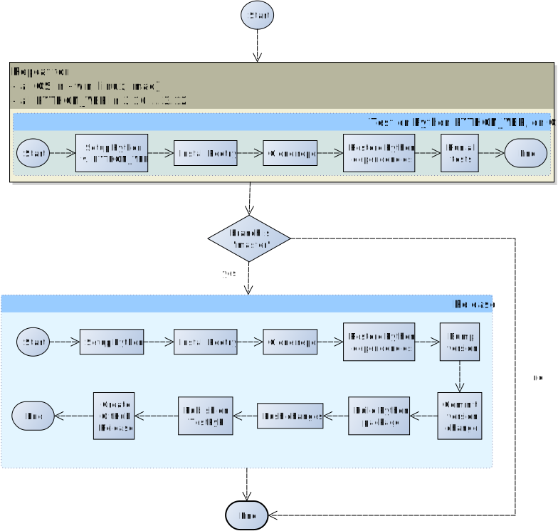

 
+++

title = "Continuous Integration"
description = "Make things work, keep them working, move fast"
outputs = ["Reveal"]

+++

# Continuous Integration

{}

---

# Continuous Integration

The practice of integrating code with a main development line **continuously**
<br>
_Verifying_ that the build remains intact
* Requires *build automation* to be in place
* Requires *testing* to be in place
* Pivot point of the *DevOps* practices
* Historically introduced by the extreme programming (XP) community
* Now widespread in the larger DevOps community


---

# The Integration Hell

* Traditional software development takes several months for *“integrating”* a couple of years of development
* The longer there is no integrated project, the higher the **risk**


$\Rightarrow$


---

## Microreleases and protoduction

* High frequency integration may lead to high frequency releases
    * Possibly, *one per commit*
    * Of course, *versioning* must be appropriate...

Traditionally, **protoduction** is jargon for a *prototype that ends up in production*

<table>
  <tbody>
    <tr>
      <td>
        
      <td/>
      <td>

* Traditionally used with a *negative* meaning
    * It implied software
        * *unfinished*,
        * *unpolished*,
        * *badly designed*
    * Very common, unfortunately
* This is different in a continuously integrated environment
    * *Incrementality* is fostered
    * Partial features are *up to date* with the mainline

      <td/>
    </tr>
  </tbody>
</table>

---

## Intensive operations should be elsewhere
* The build process should be *rich* and *fast*
* Operations requiring a long time should be *automated*
    * And run somewhere else than devs' PCs

<p>

</p>

---

## Continuous integration concept


---

## Continuous integration software

### Software that promotes CI practices should:

* Provide *clean environments* for compilation/testing
* Provide a *wide range* of environments
    * Matching the relevant specifications of the actual targets
* High degree of *configurability*
* Possibly, *declarative configuration*
* A *notification system* to alert about failures or issues
* Support for *authentication* and deployment to external services

---

## Continuous integration software

**Plenty** of technologies on the market

- [Circle CI](https://circleci.com/)
- [Travis CI](https://travis-ci.com/)
- [Werker](https://wercker.com/)
- [done.io](https://done.io/)
- [Codefresh](https://codefresh.io/)
- [Codeship](https://codeship.com/)
- [Bitbucket Pipelines](https://bitbucket.org/product/features/pipelines)
- [GitHub Actions](https://github.com/features/actions)
- [GitLab CI/CD Pipelines](https://docs.gitlab.com/ee/ci/pipelines/)
- [JetBrains TeamCity](https://www.jetbrains.com/teamcity)

> We will use __GitHub Actions__: GitHub integration, _free for FOSS_, multi-os OSs supported

---

# Core concepts

Naming and organization is variable across platforms, but *in general*:

* One or more **pipelines** can be associated to **events**
  * For instance, a *new commit*, an update to a *pull request*, or a *timeout*
* Every pipeline is composed of a **sequence** of **operations**
* Every **operation** could be composed of _sequential_ or _parallel_ **sub-operations**
* How many hierarchical levels are available depends on the specific platform
  * GitHub Actions: *workflow* $\Rightarrow$ *job* $\Rightarrow$ *step* 
  * Travis CI: *build* $\Rightarrow$ *stage* $\Rightarrow$ *job*  $\Rightarrow$ *phase*
* Execution happens in a **fresh system** (virtual machine or container)
  * Often containers inside virtual machines
  * The specific point of the hierarchy at which the VM/container is spawned depends on the CI platform

---

## Pipeline design

In essence, designing a CI system is designing a software construction, verification, and delivery *pipeline*
with the abstractions provided by the selected provider.

1. **Think** of all the operations required starting from one or more *blank* VMs
    * OS configuration
    * Software installation
    * Project checkout
    * Compilation
    * Testing
    * Secrets configuration
    * Delivery
    * ...
2. **Organize** them in a dependency graph
3. **Model** the graph with the provided CI tooling

Configuration can grow complex, and is usually stored in a YAML file
<br>
(but there are exceptions, JetBrains TeamCity uses a Kotlin DSL).

---

## Pipeline design (abstract example)


- Rectangles represent *operations*

---

## GitHub Actions: Structure

* **Workflows** react to events, launching *jobs*
    * Multiple workflows run in parallel, unless explicitly restricted
* **Jobs** of the same workflow run a sequence of *steps*
    * Multiple jobs run in parallel, unless a dependency among them is explicitly declared
    * Concurrency limits can be imposed across workflows
    * They can communicate via outputs
* **Steps** of the same job run *sequentially*
    * They can communicate via outputs

---

## GitHub Actions (practical example)



- Small rectangles represent *steps*
- Azure boxes represent *jobs*
- The whole is a *workflow*

---

## GitHub Actions: Configuration

- Workflows are configured in [YAML files]() located in the _default branch_ of the repository 
  + in the `.github/workflows/` folder.

- One configuration file $\Rightarrow$ one workflow

- For security reasons,
workflows may need to get manually activated in the *Actions* tab of the GitHub web interface.

---

## GitHub Actions: Runners

- Executors of GitHub actions are called *runners* 
  + virtual machines (hosted by GitHub)
    * with the GitHub Actions runner application installed.

> **Note**: the GitHub Actions application is open source and can be installed locally,
> creating "*self-hosted runners*". Self-hosted and GitHub-hosted runners can work together.

- Upon their creation, runners have a default environment
  + which depends on their *operating system*

- Documentation available at [https://docs.github.com/en/actions/using-github-hosted-runners/about-github-hosted-runners#preinstalled-software](https://docs.github.com/en/actions/using-github-hosted-runners/about-github-hosted-runners#preinstalled-software)

---

## Convention over configuration

Several CI systems inherit the "*convention over configuration*" principle.

> GitHub actions **does not** adhere to the principle:
> if left unconfigured, the runner does nothing
> (it does not even clone the repository locally).

- __Probable reason__: Actions is an *all-round* repository automation system for GitHub,
  + not just a "plain" CI/CD pipeline
  + $\Rightarrow$ it can react to many different events, not just changes to the git repository history

---

## GHA: basic workflow structure

Minimal, simplified workflow structure:

```yaml
# Mandatory workflow name
name: Workflow Name
on: # Events that trigger the workflow
jobs: # Jobs composing the workflow, each one will run on a different runner
    Job-Name: # Every job must be named
        # The type of runner executing the job, usually the OS
        runs-on: runner-name
        steps: # A list of commands, or "actions"
            - # first step
            - # second step
    Another-Job: # This one runs in parallel with Job-Name
        runs-on: '...'
        steps: [ ... ]
```

---

## Workflow minimal example

[Consider `check.yml` file on the `calculator` repository](https://github.com/unibo-dtm-se/calculator/blob/master/.github/workflows/check.yml):

```yaml
name: CI/CD
on:
  push:
    paths-ignore:
      - '.gitignore'
      - 'CHANGELOG.md'
      - 'LICENSE'
      - 'README.md'
  pull_request:
  workflow_dispatch:
jobs:
  test:
    strategy:
      fail-fast: false
      matrix:
        os:
          - ubuntu-latest
          - windows-latest
          - macos-latest
        python-version:
          - '3.10'
          - '3.11'
          - '3.12'
    runs-on: ${{ matrix.os }}
    name: Test on Python ${{ matrix.python-version }}, on ${{ matrix.os }}
    timeout-minutes: 45
    steps:
      - name: Setup Python
        uses: actions/setup-python@v5
        with:
          python-version: ${{ matrix.python-version }}

      - name: Install poetry
        run: pip install poetry
      
      - name: Checkout code
        uses: actions/checkout@v4

      - name: Restore Python dependencies
        run: poetry install

      - name: Test
        shell: bash
        run: poetry run python -m unittest discover -v -s tests

  release:
    needs: test
    if: github.ref == 'refs/heads/master'
    runs-on: ubuntu-latest
    name: Release on PyPI and GitHub
    permissions:
      contents: write
    steps:
      - name: Checkout code
        uses: actions/checkout@v4
        with:
          fetch-depth: 0
          token: ${{ secrets.GITHUB_TOKEN }}

      - name: Install poetry
        run: pip install poetry

      - name: Restore Python dependencies
        run: poetry install

      - name: Bump version
        shell: bash
        run: poetry run python bump_version.py --apply | tee CHANGELOG.md

      - name: Commit version change
        shell: bash
        run: |
          git config user.name "${{ github.actor }}"
          git config user.email "${{ github.actor }}@users.noreply.github.com"  
          git add pyproject.toml
          git commit -m "chore(release): v.$(poetry version --short) [skip ci]"

      - name: Build Python Package
        run: poetry build

      - name: Push changes
        run: git push

      - name: Publish on TestPyPI
        run: poetry publish --repository pypi-test --username __token__ --password ${{ secrets.TEST_PYPI_TOKEN }}

      - name: Create GitHub Release
        shell: bash
        run: |
          RELEASE_TAG=$(poetry version --short)
          gh release create $RELEASE_TAG dist/* -t v$RELEASE_TAG -F CHANGELOG.md
        env:
          GITHUB_TOKEN: ${{ secrets.GITHUB_TOKEN }}
```

---

## Checking out the repository

By default, GitHub actions' *runners do **not** check out the repository*
* Actions may not need to access the code
    * e.g., Actions automating issues, projects

It is a *common* and *non-trivial* operation (the checked out version must be the version originating the workflow), thus GitHub provides an action:



Since actions typically do not need the entire history of the project, by default the action checks out *only the commit that originated the workflow* (`--depth=1` when cloning)
* *Shallow cloning* has better *performance*
* $\Rightarrow$ It may break operations that rely on the entire history!
    * e.g., the git-sensitive semantic versioning system

Also, *__tags__ don't get checked out*

---

## Writing outputs

Communication with the runner happens via *[workflow commands](https://docs.github.com/en/actions/using-workflows/workflow-commands-for-github-actions)*
<br>
The simplest way to create outputs for actions is to print on standard output a message in the form:
<br>
`"{name}={value}"`
<br>
and redirect it to the end of the file stored in the `$GITHUB_OUTPUT` environment variable:
`echo "{name}={value}" >> $GITHUB_OUTPUT`



---

## Build matrix

Most software products are meant to be *portable*
* Across operating systems
* Across different frameworks and languages
* Across runtime configuration

A good continuous integration pipeline should test *all the supported combinations**
* or a sample, if the performance is otherwise unbearable

The solution is the adoption of a **build matrix**
* Build variables and their allowed values are specified
* The CI integrator generates the *cartesian product* of the variable values, and launches a build for each!
* Note: there is no built-in feature to exclude some combination
    * It must be done manually using `if` conditionals

---

## Build matrix in GHA



---

## Private data and continuous integration

We would like the CI to be able to
* Sign our artifacts
* Delivery/Deploy our artifacts on remote targets

Both operations **require private information to be shared**

Of course, private data *can't be shared*
* Attackers may steal the identity
* Attackers may compromise deployments
* In case of open projects, attackers may exploit *pull requests*!
    * Fork your project (which has e.g. a secret environment variable)
    * Print the value of the secret (e.g. with `printenv`)

How to *share a secret* with the build environment?

---

## Secrets

Secrets can be stored in GitHub at the repository or organization level.

GitHub Actions can access these secrets from the context:
* Using the `secrets.<secret name>` context object
* Access is allowed only for workflows generated by local events
    * Namely, no secrets for pull requests

Secrets can be added from the web interface (for mice lovers), or via the GitHub API.

```ruby
#!/usr/bin/env ruby
require 'rubygems'
require 'bundler/setup'
require 'octokit'
require 'rbnacl'
repo_slug, name, value = ARGV
client = Octokit::Client.new(:access_token => 'access_token_from_github')
pubkey = client.get_public_key(repo_slug)
key = Base64.decode64(pubkey.key)
sodium_box = RbNaCl::Boxes::Sealed.from_public_key(key)
encrypted_value = Base64.strict_encode64(sodium_box.encrypt(value))
payload = { 'key_id' => pubkey.key_id, 'encrypted_value' => encrypted_value }
client.create_or_update_secret(repo_slug, name, payload)
```

---

# Stale builds

1. Stuff *works*
2. *Nobody touches it* for months
3. Untouched stuff is now *borked*!

<br/>

* Connected to the issue of **build reproducibility**
    * The higher the build *reproducibility*, the higher its *robustness*
* The default runner configuration may change
* Some tools may become unavailable
* Some dependencies may get unavailable

**The sooner the issue is known, the better**

$\Rightarrow$ *Automatically run the build every some time* even if nobody touches the project
* How often? Depends on the project...
* **Warning**: GitHub Actions disables `cron` CI jobs if there is no action on the repository, which makes the mechanism less useful

---

## Additional checks and reportings

There exist a number of recommended services that provide additional QA and reports.

Non exhaustive list:
* [Codecov.io](https://codecov.io/)
    * Code coverage
    * Supports Jacoco XML reports
    * Nice data reporting system
* [Sonarcloud](https://sonarcloud.io/)
    * Multiple measures, covering reliability, security, maintainability, duplication, complexity...
* [Codacy](https://www.codacy.com/)
    * Automated software QA for several languages
* [Code Factor](https://www.codefactor.io/)
    * Automated software QA

---

## High quality FLOSS checklist

The [Linux Foundation](https://www.linuxfoundation.org/) [Core Infrastructure Initiative](https://www.coreinfrastructure.org/) created a checklist for high quality FLOSS.

**[CII Best Practices Badge Program https://bestpractices.coreinfrastructure.org/en](https://bestpractices.coreinfrastructure.org/en)**


* *Self-certification*: no need for bureaucracy
* Provides a nice *TODO list* for a high quality product
* Releases a *badge* that can be added e.g. to the project homepage

---

## Automated evolution

A full-fledged CI system allows reasonably safe *automated evolution of software*
<br>
At least, in terms of *dependency updates*

Assuming that you can *effectively intercept issues*,
here is a possible workflow for **automatic** dependency updates:

1. *Check* if there are new updates
2. *Apply* the update in a new branch
3. *Open* a pull request 
4. *Verify* if changes break anything
    * If they do, manual intervention is required
5. *Merge*

---

## Automated evolution

**Bots** performing the aforementioned process for a variety of build systems exist.

They are usually integrated with the repository hosting provider

* Whitesource Renovate (Multiple)
    * Also updates github actions and Gradle Catalogs
* Dependabot (Multiple)
* Gemnasium (Ruby)
* Greenkeeper (NPM)
