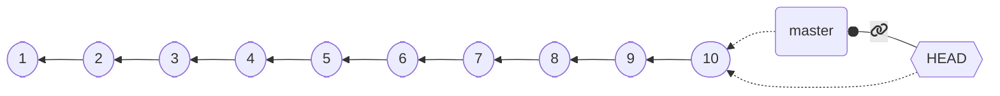

+++

title = "Distributed version control basics"
description = "Distributed version control systems, basics of Git"
outputs = ["Reveal"]

+++

# Distributed version control basics

{}

---

## Tracking changes

Did you ever need to *roll back* some project or assignment to a previous version?

How did you track the *history* of the project?

### Classic way

1. find a naming convention for files/folders
2. make a copy every time there is some relevant progress
3. make a copy every time an ambitious but risky development begins

**Inefficient!**
* Consumes a lot of resources
* Requires time
* How to tell what was in some previous releases?
* How to cherry-pick some changes?

---

## Fostering collaborative workflows

Did you ever need to develop some project or assignment *as a team*?

How did you organize the work to *maximize the productivity*?

### Classic ways

* *One screen, many heads*
  * a.k.a. one works, the other ones sleep
* *Locks*: "please do not touch section 2, I'm working on that"
  * probability of arising conflicts close to 100%
* *Realtime-sharing* (like google docs or overleaf)
  * okay in many cases for text documents (but with a risk of frankestein-ization)
  * disruptive with code (inconsistencies are much less tolerable in formal languages)

---

## Version control systems

Tools meant to support the development of projects by:
* Tracking the project *history*
* Allowing *roll-backs*
* Collecting *meta-information* on the changes
  * Authors, dates, notes...
* *Merging* information produced at different stages
* (in some cases) *facilitate parallel workflows*
* Also called Source Content Management (SCM)

**Distributed**: *Every copy* of the repository contains
(i.e., every developer locally have)
*the entire history*.

**Centralized**: A *reference copy* of the repository contains the whole history;
developers work on a subset of such history


---

## Short history

* **Concurrent Versioning System (CVS)** (1986): client-server (*centralized* model, the truth is on the server), operates on single files or repository-level, history stored in a hidden directory, uses delta compression to save space.
* **Apache Subversion (SVN)** (2000): successor to CVS, still largely used (especially in businesses that struggle to renovate their processes). *Centralized* model (similar to CVS). Improved binary file management. Improved concurrency for the operation, still cumbersome for parallel workflows.
* **Mercurial** and **Git** (both April 2005): *decentralized* version control systems (DVCSs), no "special" copy of the repository, each client stores the whole history. Highly scalable. Foster parallel work by allowing easy branching and merging. Very similar conceptually (when two succesful tools emerge at the same time with a similar model independently, it is an indication that the underlying model is "the right one" for the context).

**Git** is now the dominant DVCS (although Mercurial is still in use, e.g., for Python, Java, Facebook).

---

## Google trends to today

<!-- write-here "shared-slides/git/git-trends.md" -->

<!-- end-write -->

---

## Intuition: the history of a project

1. Create a new project


---

2. Make some changes


---

3. Then more and more, until the project is ready


At a first glance, the history of a project *looks like* a **line**.

---

## Except that, in the real world...

> Anything that can go wrong will go wrong
> <br><cite>$1^{st}$ Murphy's law</cite>

> If anything simply cannot go wrong, it will anyway
> <cite>$5^{th}$ Murphy's law</cite>

---

# ...things go wrong


---

## Rolling back changes

Go *back in time* to a previous state where things work


---

## Get the previous version and fix

Then fix the mistake


If you consider rollbacks, history is a **tree**!

---

# Collaboration: diverging

Alice and Bob work together for some time, then they go home and work separately, in parallel

They have a *diverging history*!


---

# Collaboration: reconciling


If you have the possibility to *reconcile diverging developments*, the history becomes a **graph**!

Reconciling diverging developments is usually referred to as **merge**

---

## DVCS concepts and terminology: *Repository*

Project **meta-data**. Includes the whole project history
* information on how to *roll back* changes 
* *authors* of changes
* *dates*
* *differences* between different points in time
* and so on

Usually, stored in a hidden folder in the *root folder* of the project

---

## DVCS concepts and terminology: *Working Tree*

(or *worktree*, or *working directory*)

the collection of **files** (usually, inside a *root folder*) that constitute the project,
excluding the *meta-data*.

---

## DVCS concepts and terminology: *Commit*

A **saved status** of the project.
* Collects the *changes* required to transform the previous (*parent*) commit into the current (*differential tracking*)
* Creates a *snapshot* of the status of the worktree (snapshotting).
* Records metadata: *parent commit*, *author*, *date*, a *message* summarizing the changes, and a *unique identifier*.
* A commit with no parent is an *initial commit*.
* A commit with multiple parents is a *merge commit*.


---

## DVCS concepts and terminology: *Branch*

A **named sequence of commits**


If no branch has been created at the first commit, a default name is used.

---

## DVCS concepts and terminology: *Commit references*

To be able to go *back in time* or *change branch*, we need to **refer to commits**
* Commit references are also referred to as `tree-ish`es
* Every commit has a **unique identifier**, which is a valid reference
* A **branch name** is a valid commit reference (points to the *last commit of that branch*)


---

2. second commit


---


---


Oh, no, there was a mistake in commit `4`! We need to roll back!

---

## *checkout of C4*


* No information is lost, we can get back to `6` whenever we want to.
* what if we commit now?

---

## Branching!


* Okay, but there was useful stuff in `4`, I'd like to have it into `new-branch`

---

## Merging!

<!-- ```mermaid
%%{init: { 'gitGraph': { 'mainBranchName': 'default-branch', 'showCommitLabel': true}} }%%
gitGraph
  commit id: "1"
  commit id: "2"
  commit id: "3"
  commit id: "4" type: REVERSE
  branch new-branch
  checkout default-branch
  commit id: "5"
  checkout new-branch
  commit id: "7"
  merge default-branch id: "8" tag: "HEAD"
  checkout default-branch
  commit id: "6" tag: "default-branch"
  checkout new-branch
``` -->



**Notice that:**
* we have two branches
* `8` is a merge commit, as it has two parents: `7` and `5`
* the situation is the same regardless that is a *single developer going back on the development* or *multiple developers working in parallel*!
* this is possible because *every copy of the repository contains the entire history*!

---

## Reference DVCS: Git

De-facto reference distributed version control system

* *Distributed*
* Born in *2005* to replace BitKeeper as SCM for the Linux kernel
  * Performance was a major concern
  * Written in C
* Developed by Linus Torvalds
  * Now maintained by others
* *Unix-oriented*
  * Tracks Unix file permissions
* Very *fast*
  * At conception, 10 times faster than Mercurial¹, 100 times faster than Bazaar

¹ Less difference now, Facebook vastly improved Mercurial

---

## Funny historical introduction



---

## Approach: terminal-first

**Git is a command line tool**

Although graphical interfaces exsist, it makes no sense to learn a GUI:
* they are more prone to future changes than the CLI
* they add a level of interposition between you and the tool
* unless they are incomplete, they expose *more complexity* than what we can deal with in this course
    * use them at your own risk
* learning the CLI first will give you a clear understaing of how *all* GUIs work

---

## Configuration

Configuration in Git happens at two level
* **global**: the default options, valid system-wide
* **repository**: the options specific to a repository. They have *precedence* over the global settings

### Strategy

Set up the global options reasonably,
then override them at the repository level, if needed.

### `git config`

The `config` subcommand sets the configuration options
* when operated with the `--global` option, configures the tool globally
* otherwise, it sets the option for the *current repository*
  * (there must be a valid repository)
* Usage: `git config [--global] category.option value`
  * sets `option` of `category` to `value`

---

## Configuration: main options

As said, `--global` can be omitted to override the global settings locally

### Username and email: `user.name` and `user.email`

A name and a contact are always saved as metadata, so they need to be set up

* `git config --global user.name "Your Real Name"`
* `git config --global user.email "your.email.address@your.provider"`

### Default editor

Some operations pop up a text editor.
It is convenient to set it to a tool that you know how to use
(to prevent, e.g., being "locked" inside `vi` or `vim`).
Any editor that you can invoke from the terminal works.

* `git config --global core.editor nano`

### Default branch name

How to name the default branch.
Two reasonable choices are `main` and `master`

* `git config --global init.defaultbranch master`

---

## Initializing a repository

### `git init`
* Initializes a new repository *inside the current directory*
* Reified in the `.git` folder
* The location of the `.git` folder marks the root of the repository
  * Do not nest repositories inside repositories, it is fragile
  * Nested projects are realized via *submodules* (not discussed in this course)
* **Beware of the place where you issue the command!**
  * First use `cd` to locate yourself inside the folder that contains (or will containe the project)
    * (possibly, first create the folder with `mkdir`)
  * **Then** issue `git init`
  * if something goes awry, you can delete the repository by deleting the `.git` folder.

---

## Staging

Git has the concept of *stage* (or *index*).
* Changes must be added to the stage to be committed.
* Commits save the *__changes__ included in the stage*
  * Files changed after being added to the stage neet to be re-staged
* `git add <files>` moves the current state of the files into the stage as *changes*
* `git reset <files>` removes currently staged *changes* of the files from stage
* `git commit` creates a new *changeset* with the contents of the stage


---

## Observing the repository status

It is extremely important to understand *clearly* what the current state of affairs is
* Which *branch* are we working on?
* Which *files* have been *modified*?
* Which *changes* are already *staged*?

`git status` prints the current state of the repository, example output:

```git
❯ git status
On branch master
Your branch is up to date with 'origin/master'.

Changes to be committed:
  (use "git restore --staged <file>..." to unstage)
        modified:   content/_index.md
        new file:   content/dvcs-basics/_index.md
        new file:   content/dvcs-basics/staging.png

Changes not staged for commit:
  (use "git add <file>..." to update what will be committed)
  (use "git restore <file>..." to discard changes in working directory)
        modified:   layouts/shortcodes/gravizo.html
        modified:   layouts/shortcodes/today.html
```

---

## Committing

* Requires an **author** and an **email**
  * They can be configured *globally* (at the *computer level*):
    * `git config --global user.name 'Your Real Name'`
    * `git config --global user.email 'your@email.com'`
  * The global settings can be *overridden* at the *repository level*
    * e.g., you want to commit with a different email between work and personal projects
    * `git config user.name 'Your Real Name'`
    * `git config user.email 'your@email.com'`
* Requires a **message**, using appropriate messages is **extremely important**
  * If unspecified, the commit does not get performed
  * it can be specified inline with `-m`, otherwise Git will pop up the *default editor*
    * `git commit -m 'my very clear and explanatory message'`
* The *date* is recorded automatically
* The *commit identifier* (a cryptographic hash) is generated automatically

---

## Default branch

At the first commit, there is no branch and no `HEAD`.

Depending on the version of Git, the following behavior may happen upon the first commit:
* Git creates a *new branch* named `master`
  * *legacy behavior*
  * the name is inherited from the default branch name in *Bitkeeper*
* Git creates a *new branch* named `master`, but warns that it is a deprecated behavior
  * although coming from the Latin "*magister*" (teacher) and not from the "master/slave" model of asymmetric communication control, many recently prefer `main` as seen as more inclusive
* Git refuses to commit until a default branch name is specified
  * *modern behavior*
  * Requires configuration: `git config --global init.defaultbranch default-branch-name`

---

## Ignoring files

In general, we do not want to track *all* the files in the repository folder:
* Some files could be *temporary* (e.g., created by the editor)
* Some files could be *regenerable* (e.g., compiled binaries and application archives)
* Some files could contain *private* information

Of course, we could just not `add` them, but the error is around the corner!

It would be much better to just tell Git to ignore some files.

This is achieved through a *special `.gitignore` file*.
  * the file must be named `.gitignore`, names like `foo.gitignore` or `gitignore.txt` won't work
    * A good way to create/append to this file is via `echo whatWeWantToIgnore >> .gitignore` (multiplatform command)
  * it is a list of paths that git will ignore (unless `git add` is called with the `--force` option)
  * it is possible to add exceptions

---

## `.gitignore` example

```ignore-list
# ignore the bin folder and all its contents
bin/
# ignore every pdf file
*.pdf
# rule exception (beginning with a !): pdf files named 'myImportantFile.pdf' should be tracked
!myImportantFile.pdf
```

---

<!-- write-here "shared-slides/git/newlines.md" -->

<!-- end-write -->

---

# Exercise (pt. 1)

## Let's recreate the [`modular-calculator`](https://github.com/unibo-dtm-se/modular-calculator) repository

1. Download the code as a ZIP and extract it somewhere

2. Create a new directory elsewhere, and make it a Git repository with `git init`

3. Ensure that your username and email are set up correctly, either globally or locally

4. Add the `.gitignore` and the `.gitattributes` files, and commit them
  + consider using [gitignore.io](https://www.toptal.com/developers/gitignore/)
  + consider using several commits

5. Add the files from the `modular-calculator` repository to the stage and commit them
  + consider using several commits

> What criterion to decide which and how many files to include per commit?

---

## Rule of thumb for commits

* **Atomicity**: a commit should be a *single* change
  * it should be possible to __describe__ it in a _single sentence_
  * it should be possible to __revert__ it without affecting other changes

* **Coherence**: a commit should contain *coherent* changes
  * it should move the repository from a *consistent* state to another *consistent* state

* **Frequency**: commits should be *small* and *frequent*
  * it is better to have *many* small commits than *few* large ones

> Commit toghether edits that are related to the same *conceptual* change

---

## Dealing with removal and renaming of files

* The removal of a file is a legit *change*
* As we discussed, `git add` adds a *change* to the stage
* **the change can be a removal!**

`git add someDeletedFile` is a correct command, that will stage the fact that `someDeletedFile` does not exist anymore, and its deletion must be registered at the next `commit`.

* File *renaming* is *equivalent to file deletion and file creation* where, incidentally, the new file has the same content of the deleted file
* To stage the rinomination of file `foo` into `bar`:
  * `git add foo bar`
  * it records that `foo` has been deleted and `bar` has been created
  * Git is smart enough to understand that it is a name change, and will deal with it *efficiently*

---

# Exercise (pt. 2)

## Make the `calculator.gui` module a package

6. Create a new directory `gui` inside the `calculator` directory

7. Move the `gui.py` file inside the `gui` directory, and rename it to `__init__.py`

8. Add all the files to the stage and look at the status

9. Commit the changes

---

## Visualizing the history

Of course, it is useful to visualize the history of commits.
Git provides a dedicated sub-command:

`git log`

* opens a *navigable interactive view* of the history from the `HEAD` commit (the current commit) backwards
  * Press <kbd>Q</kbd>
* *compact* visualization: `git log --oneline`
* visualization of *all branches*: `git log --all`
* visualization of a lateral *graph*: `git log --graph`
* compact visualization of all branches with a graph: `git log --oneline --all --graph`

---

### example output of `git log --oneline --all --graph`

```text
* d114802 (HEAD -> master, origin/master, origin/HEAD) moar contribution
| * edb658b (origin/renovate/gohugoio-hugo-0.94.x) ci(deps): update gohugoio/hugo action to v0.94.2
|/  
* 4ce3431 ci(deps): update gohugoio/hugo action to v0.94.1
* 9efa88a ci(deps): update gohugoio/hugo action to v0.93.3
* bf32a8b begin with build slides
* b803a65 lesson 1 looks ready
* 6a85f8f ci(deps): update gohugoio/hugo action to v0.93.2
* b474d2a write more on the introductory lesson
* 8a7105e ci(deps): update gohugoio/hugo action to v0.93.1
* 6e40642 begin writing the first lesson
```

---

## Referring to commits: `<tree-ish>`es

In git, a reference to a commit is called `<tree-ish>`. Valid `<tree-ish>`es are:
* Full *commit hashes*, such as `b82f7567961ba13b1794566dde97dda1e501cf88`.
* *Shortened commit hashes*, such as `b82f7567`.
* *Branch names*, in which case the reference is to the last commit of the branch.
* `HEAD`, a special name referring to the current commit (the head, indeed).
* *Tag names* (we will discuss what a tag is later on).

---

## Relative references

It is possible to build *relative references*, e.g., "get me the commit before this `<tree-ish>`",
by following the commit `<tree-ish>` with a tilde (`~`) and with the number of parents to get to:
* `<tree-ish>~STEPS` where `STEPS` is an integer number produces a reference to the `STEPS-th` parent of the provided `<tree-ish>`:
  * `b82f7567~1` references the *parent* of commit `b82f7567`.
  * `some_branch~2` refers to the *parent of the parent* of the last commit of branch `some_branch`.
  * `HEAD~3` refers to the *parent of the parent of the parent* of the current commit.

* In case of merge commits (with multiple parents), `~` selects the first one
* Selection of parents can be performed with caret in case of multiple parents (`^`)
  * We won't go in depth here, but:
    * The [`git rev-parse` reference on specifying revision](https://git-scm.com/docs/git-rev-parse#_specifying_revisions) is publicly available
    * A [much more readable explanation can be found on Stack overflow](https://stackoverflow.com/a/2222920/1916413)

---

## Visualizing the differences

We want to see which *differences* a commit introduced, or what we modified in some files of the work tree

Git provides support to visualize the changes in terms of *modified lines* through `git diff`:
* `git diff` shows the difference between the *stage* and the *working tree*
  * namely, what you would stage if you perform a `git add`
* `git diff --staged` shows the difference between `HEAD` and the *working tree*
* `git diff <tree-ish>` shows the difference between `<tree-ish>` and the *working tree* (*stage excluded*)
* `git diff --staged <tree-ish>` shows the difference between `<tree-ish>` and the *working tree*, *including staged changes*
* `git diff <from> <to>`, where `<from>` and `<to>` are `<tree-ish>`es, shows the differences between `<from>` and `<to>`

---

### `git diff` Example output:

```diff
diff --git a/.github/workflows/build-and-deploy.yml b/.github/workflows/build-and-deploy.yml
index b492a8c..28302ff 100644
--- a/.github/workflows/build-and-deploy.yml
+++ b/.github/workflows/build-and-deploy.yml
@@ -28,7 +28,7 @@ jobs:
           # Idea: the regex matcher of Renovate keeps this string up to date automatically
           # The version is extracted and used to access the correct version of the scripts
           USES=$(cat <<TRICK_RENOVATE
-          - uses: gohugoio/hugo@v0.94.1
+          - uses: gohugoio/hugo@v0.93.3
           TRICK_RENOVATE
           )
           echo "Scripts update line: \"$USES\""
```

The output is compatible with the Unix commands `diff` and `patch`

Still, *binary files are an issue*! Tracking the right files is paramount.

---

# Exercise (pt. 3)

## Visualize the differences among any two commits

10. Use `git log --oneline` to find the hashes of two commits

11. Use `git diff HEAD <to>` to visualize the differences between the last commit and any prior commit of your choice
  + try with both the tree-ish of the chosen commit and the `~` notation

---

## Navigating the history

Navigation of the history concretely means to move the head (in Git, `HEAD`) to arbitrary points of the history

In Git, this is performed with the `checkout` commit:
* `git checkout <tree-ish>`
  * Unless there are changes that could get lost, *moves* `HEAD` to the provided `<tree-ish>`
  * Updates all tracked files to their version at the provided `<tree-ish>`

The command can be used to selectively checkout a file from another revision:
* `git checkout <tree-ish> -- foo bar baz`
  * Restores the status of files `foo`, `bar`, and `baz` from commit `<tree-ish>`, and adds them to the stage (unless there are uncommitted changes that could be lost)
  * Note that `--` is surrounded by whitespaces, it is not a `--foo` option, it is just used as a separator between the `<tree-ish>` and the list of files
    * the files could be named as a `<tree-ish>` and we need disambiguation

---

# Exercise (pt. 4)

## Restore a file from the history

12. Use `git log --oneline` to find the hash of the last commit where the file `gui.py` was present

13. Use `git checkout <tree-ish> -- gui.py` to restore the file `gui.py` from the chosen commit

14. Use `git status` to check the status of the file

---

## Detached head

Git does **not** allow *multiple heads per branch*
(other DVCS do, in particular Mercurial):
for a commit to be valid, `HEAD` must be at the "end" of a branch (on its last commit), as follows:



When an old commit is checked out this condition doesn't hold!

If we run `git checkout HEAD~4`:


The system enters a special workmode called *detached head*.

When **in detached head**, Git allows to make **commits**, but they **are lost**!

(Not really, but to retrieve them we need `git reflog` and `git cherry-pick`, that we won't discuss)

---

# Exercise (pt. 5)

## Enter the detached head state

15. Use `git log --oneline` to find the hash of some previous commit of choice

16. Use `git checkout <tree-ish>` to enter the detached head state

17. Try to edit some file and commit the changes

18. Check the current status with `git status`

19. Use `git checkout master` to return to the last commit of the `master` branch

20. Use `git log --oneline` to find the hash of the commit you made in the detached head state

---

<!-- write-here "shared-slides/git/branching-merging.md" -->

<!-- end-write -->

---

<!-- write-here "shared-slides/git/tagging-basics.md" -->

<!-- end-write -->

---

<!-- write-here "shared-slides/git/branch-deletion.md" -->

<!-- end-write -->

---

<!-- write-here "shared-slides/git/remote-operations.md" -->

<!-- end-write -->

---

## Best practices

* The **CLI** is your *truth*
  * Beware of the GUIs
* Prepare an *ignore list* early
  * And *maintain it*
  * And maybe prepare it manually and don't copy/paste it
* When you have untracked files, *decide whether you want to track them or ignore them*
* Be very careful with *what* you track
* Prepare an *attribute file*
* *Pull* before pushing

---

<!-- write-here "shared-slides/git/git-hosting-github.md" -->

<!-- end-write -->

---

<!-- write-here "shared-slides/git/workflows-flow-fork.md" -->

<!-- end-write -->