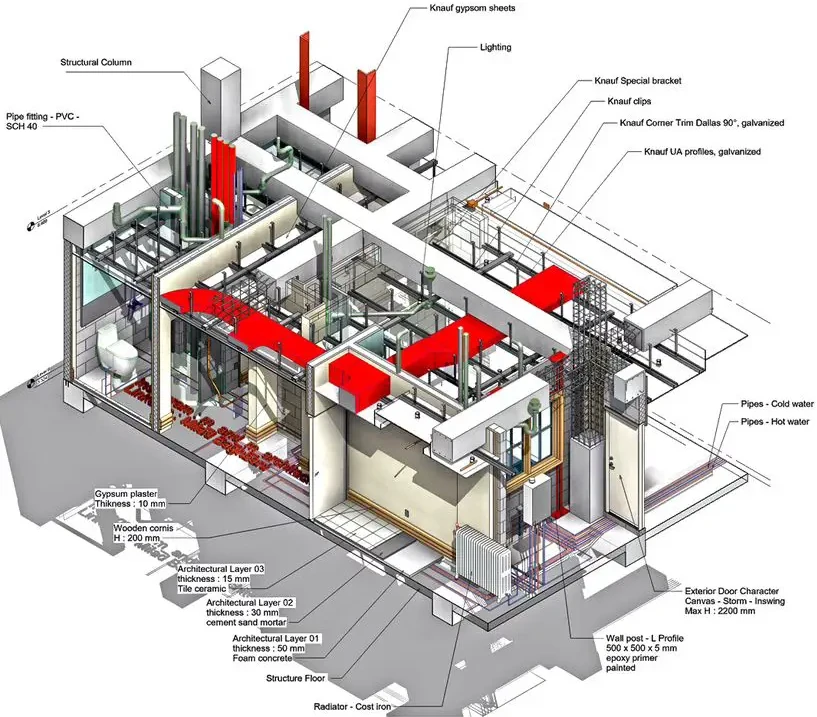

+++

title = "Software Modelling with UML"
description = "Crash course on software modelling via UML"
outputs = ["Reveal"]

+++

# Software Modelling with UML

{}

---

## Modelling in Engineering

_Architects_ and _civil engineers_ create __models__ of the things they are going to build

{}
{}

Model of a Bridge
{}
{}

Model of a Building
{}
{}

---

## Model in Statistics / Machine Learning

In _statistics_ (and _machine learning_) a __model__ is a _mathematical representation_ of a real-world process
  (commonly attained by _fitting_ a parametric _function_ over a _sample_ of _data_ describing the process)

e.g.: __$f(x) = \beta_0 + \beta_1 x $__ where __$f$__ is the amount of minutes played, and __$x$__ is the age

---

## What is a model?

(cf. <https://plato.stanford.edu/entries/models-science/>)

> A __model__ is a _simplified_ _representation_ of something complex

### What are models useful for?

- __Understanding__ of the real world, via _simplification_ and _abstraction_ (i.e., by removing details)
    + think about the many [models of the atom](https://en.wikipedia.org/wiki/History_of_atomic_theory) (Bohr, Rutherford, etc.), or the wooden miniature of a bridge

- __Explain__ a _phenomenon_ by fitting the model onto the _observed_ data, to reconstruct the process
    + think about the [attachment theory](https://en.wikipedia.org/wiki/Attachment_theory) in psychology

- __Predicting__ the _dynamic_ behaviour of a system (possibly, before/without building the system)
    + think about the [weather forecast](https://en.wikipedia.org/wiki/Weather_forecasting), or, again, the wooden miniature of a bridge

---

## Models are simplifications

(cf. <https://en.wikipedia.org/wiki/All_models_are_wrong>)

> "_All_ models are __wrong__, but _some_ are __useful__" — George Box

- Each model is _stressing some aspects_ of the real world, and _ignoring others_
- Focus on the _purpose_ and the _context_ of a model:
    * if the goal is __understanding__, the model should be _simple_ and _intuitive_
    * if the goal is __prediction__, the model should be _accurate_ and _precise_

### Example

- __Newton's Laws__: they are not fully correct (Einstein’s relativity refined them)
    * but they are still useful for _engineering_ and _daily_ physics

---

## Why do engineers model systems?

- Models allow engineers to _design_ and _study_ a system __before__ building it

- Building is commonly more _expensive_ and _time-consuming_ than _modelling_

- Models can __verify__ (to some extent) the system they want to create, _before_ fully building it

- Models allow designers to __take design decisions__ _early_, and _cheaply_

- Models can be used to __represent__ and __communicate__ the design of a system
    + useful for _collaboration_ and _documentation_...
    + ... which in turn allow new people to _join_ the project

---

## What about _software_?

- Writing _software_ _implies_ __modelling__ the world and __representing__ it in a formal way
    + so, in a sense, the _source code_ is a _model_ of the _world_ (or, at least, of the _problem_)

- Yet, the _source code_ of a project can easily grow in __complexity__
    + think about _large projects_ with __millions of LoC__:
        1. how can a person keep them _all_ in their _mind_?
        2. how could that person _transfer_ all that _knowledge_ to _others_?

- Indeed, as software projects tend to grow complex, the aforementioned motivations for modelling apply to _software_ as well
    + we need _more abstract_ (than code) and _visual_ ways to __represent__ _software systems_

> Software systems are commonly modelled using the __Unified Modelling Language__ (UML)

---

## The Unified Modelling Language (UML)

(cf. <https://en.wikipedia.org/wiki/Unified_Modeling_Language>)

- __General-purpose__, _graphical_, modeling _language_ in the field of software engineering
    + intended to provide a _(semi)-formal_ way to _visualize_ the design of a software system

- UML is a __standard__ ([ISO/IEC 19501:2005](https://www.iso.org/standard/32620.html)) managed by the [Object Management Group](https://www.omg.org/) (OMG) since 1997

- Actually, nowadays, most practitioners do _not_ properly use UML, but instead produce _informal diagrams_
    + more or less inspired by UML, but __not__ _strictly_ _following_ the _standard_

- In any case, the focus is on giving a __graphical__ language to represent various aspects of a software system

---

## What can UML represent?

- UML can represent _many_ aspects of a software system, via as many _sorts_ of __diagrams__
    + broadly categorized in __structural__ and __behavioural__ diagrams

{}
{}

{}
{}
- __Class__ Diagrams: overview on the _classes_ and their _relationships_
- __Sequence__ Diagrams: _interactions_ between _objects_ in a _time sequence_
- __Activity__ Diagrams: _flow_ of _control_ in a _process_
- __State__ Diagrams: _transitions_ between _states_ of an _object_
- __Component__ Diagrams: architectural _components_ and their _relationships_
- __Deployment__ Diagrams: _physical_ _deployment_ of _artifacts_ on _nodes_
- __Use Case__ Diagrams: _actors_ and _use cases_ they _interact_ with
{}
{}

---

# Class Diagrams

---

## Class Diagrams Overview


@startuml
class Class {
    - __another_private_field
    # _overridden_protected_method
    + public_field: int
    + property: str
    + method(arg)
}

abstract AbstractClass {
    - __private_field: dict
    # _protected_field: set
    + {abstract} abstract_method()
}

interface Interface {
   + method(arg)
   + concrete_method()
}

class SubClass {
    +overridden_method()
    +additional_method()
}

enum Enum {
    +OPTION_ONE
    +OPTION_TWO
    +OPTION_THREE
}

class Container {
    - __items
    + add(item)
    + remove(item)
    + clear()
}

class Item

class Composed {
    + component1
    + component2
}

class Component

class Related {
    + method(Associated)
}

class Associated {
    + method() -> Related
}

AbstractClass <|-- Class: extends
Class <|-- SubClass: extends
Interface <|.. Class: implements
Container "1" o-- "0..*" Item: aggregation
Composed "1" *-- "2" Component: composition
Related "1" -- "1..*" Associated : relation / association
@enduml


---

## Class Diagram Example

TODO review: this is generated, need to review


@startuml
' Abstract class for library items
abstract class LibraryItem {
    - __id: str
    + title: str
    + author: str
    + {abstract} get_info() -> str
}

' Interface for borrowable items
interface Borrowable {
    + borrow(member: Member) -> bool
    + return_item() -> bool
}

' Concrete classes
class Book extends LibraryItem {
    - __isbn: str
    + genre: str
    + get_info() -> str
}

class Magazine extends LibraryItem {
    - __issue_number: int
    + category: str
    + get_info() -> str
}

' Library should also be borrowable
Library <|.. Borrowable
Book <|.. Borrowable

' Container class for library items
class Library {
    - __items: list[LibraryItem]
    + add_item(item: LibraryItem) -> None
    + remove_item(item: LibraryItem) -> None
    + find_item(title: str) -> LibraryItem
}

' Association: Shelf contains books & magazines but can be empty
class Shelf {
    + section: str
}
Shelf "1" -- "0..*" LibraryItem : stores

' Library aggregates library items
Library "1" o-- "0..*" LibraryItem : manages

' Member class
class Member {
    - __member_id: str
    + name: str
    + borrow(item: Borrowable) -> bool
    + return_item(item: Borrowable) -> bool
}

' Loan relationship
class Loan {
    + due_date: str
    + renew() -> bool
}

Member "1" -- "0..*" Loan : borrows
Loan "1" -- "1" LibraryItem : for item

' Composition: A library item is composed of front and back pages
class Page {
    + content: str
}
LibraryItem "1" *-- "2" Page : has pages
@enduml
