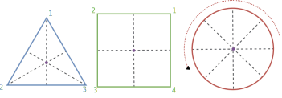

+++

title = "Object-Oriented Programming"
description = "Crash course on object-oriented programming in Python"
outputs = ["Reveal"]

+++

# Object-Oriented Programming (OOP)

{}

---

## Many programming paradigms

(cf. <https://en.wikipedia.org/wiki/Programming_paradigm>)

- **Imperative programming**: programs are made by __instructions__ that change the state of the program.
- **Procedural programming**: programs are made by __blocks__ of code that can be reused.
- **Functional programming**: programs are made by __functions__ that transform data.
- **Logic programming**: programs are made by __rules__ that define relationships between data.
- **Object-oriented programming**: programs are made by __objects__ that interact with each other.

{}
> Mainstream programming languages are actually _blending_ multiple paradigms
- e.g., Python is considered imperative, functional, and object-oriented
{}

---

## Why object-oriented programming?

(cf. <https://en.wikipedia.org/wiki/Object-oriented_programming>)

- **By far** the _most used_ programming paradigm nowadays, both in industry and academia
- **Fundamental** for understanding _modern_ programming languages, and their _libraries_
- Most commonly, the __design__ phase of SE involves designing _objects_, and their _behaviours_, and their _interactions_

--- 

## Three dimensions of software design

- **Structure**: how is the software _organised_ (decomposed) into _components_? how is _information_ encoded into _data_?
- **Behaviour**: what does each component _do_? how does it transform _data_ (from input to output)?
- **Interaction**: how/when do the many software components _communicate_ or _cooperate_ to form a system? 

{}
> OOP nicely addresses all three dimensions for non-distributed systems
{}

---

## Key principles of OOP

- __Everything__ is an _object_

- A __program__ is a _bunch of objects_ telling each other what to do by __sending messages__

- Every object can have its own __memory__ (state) composed by other objects

- Every object is an _instance_ of a __class__

- Every object has an __interface__, which defines what messages it can receive
    + and so what the __type__ of the object is

---

## Key principles of OOP, in practice

- An object is a _container_ of __attributes__. These can be of 3 sorts:
    * __fields__, i.e. _variables_ that store object-specific _data_ 
        + (these constitute the aforementioned memory/state)
    * __methods__, i.e. _functions_ that can read/write the other members of the object 
        + (these constitute the aforementioned "messages that can be received" by the object)
    * __properties__, i.e. methods that can be accessed _as if_ they were fields

- Classes are _blueprints_ for objects
    + they describe what _attributes_ an object will have
    + each __member__ of a class defines an _attribute_ that _all_ objects of that class will have

- Objects are __created__ as _instances_ of classes
    + each class has a _constructor_, i.e. a magic function which creates an _instance_ of the class
    + the constructor is in charge of _initializing_ the object's _attributes_

- Objects can __use__ _other objects_, by _calling_ their methods or _accessing_ their fields or properties
    + (this is what the aforementioned "sending messages" is about)
    + the _data_ stored in objects' fields are indeed _other objects_
    + the _methods_ of an object are functions which can accept as _arguments_, and return them as _results_ 
    
---

## Example: the `Light` class

{}
{}
### Class definition
```python
class Light:
    def __init__(self, initially_on: bool):
        self.state = initially_on

    @property
    def is_off(self) -> bool:
        return not self.state

    @is_off.setter
    def is_off(self, value: bool):
        self.state = not value

    def switch(self):
        self.state = not self.state

    def to_string(self) -> str:
        return f"Light(state={'on' if self.state else 'off'})"
```
### Usage
```python
l = Light(True)
print(l.to_string()) # Light(state=on)
l.switch()
print(l.to_string()) # Light(state=off)
l.state = True
print(l.to_string()) # Light(state=on)
l.is_off = True
print(l.to_string()) # Light(state=off)
print(l.is_off) # True
```
{}
{}
### Aspects to notice

Object of type `Light` have:

-  a __field__ `state` _storing_ a _boolean_
    + which is `True` if that light is on, `False` otherwise  

- a _settable_ __property__ `is_off` corresponding to the opposite of `state`

- a __method__ `switch` that toggles the `state` of the light

- a constructor `__init__` that initializes the `state` of the light to its initial value (`initially_on`)
    + this is invoked via the name of the class, e.g. `Light)`

{}
{}

--- 

## What is `self`?

- You can think about a class as group of functions, which all have an _implicit_ first argument, `self`
    + this is a reference to the _instance_ of the class that is being manipulated
    + it is _not_ passed explicitly when calling the method

- Via `self`, you can access the _other attributes_ of an object, from within a method of that object
    + e.g., `self.state` in the `switch` method of the `Light` class

- The name `self` is a convention, but you can use any name you want
    + but it is _strongly_ recommended to stick to `self` for readability
    + the following class is equivalent to the `Light` class above, by simply renaming `self` to `this`:
        ```python
        class Light:
            def __init__(this, initially_on: bool):
                this.state = initially_on

            @property
            def is_off(this) -> bool:
                return not this.state

            # etc.
        ```

- You can imagine that variable self is _automatically_ passed to the method when it is called
    + e.g., `l.switch()` is equivalent to `Light.switch(l)`

---

{}

## Examples of entities which can be modelled 

- A memory cell
    + Example method: "assign the current value to value X"
- A counter
    + Example method: "increment"
- A calculator
    + Example methods: "input digit X", "calculate", "store"
- A geometric figure in a CAD program
    + Example method: "translate in the XY plane by (dx, dy)"
- A button
    + Example method: "press"
- A database
    + Example method: "insert a new record R"

---

## Example 1: Memory Cell

```python
class MemoryCell:
    def __init__(self, initial_value: int):
        self.value = 0
        self.assign(initial_value)

    def assign(self, value: int):
        if not in range(0, 256):
            raise ValueError("Value must in the [0, 255] range")
        self.value = value
```

---

## Example 2: Counter

```python
class Counter:
    def __init__(self, initial_value: int = 0):
        self.value = initial_value

    def increment(self, delta: int = 1):
        self.value += delta

    def decrement(self, delta: int = 1):
        self.increment(-delta)
```

---

## Example 3: Calculator

```python
class Calculator:

    def __init__(self):
        self.expression = ""

    def __ensure_is_digit(self, value: int | str):
        if isinstance(value, str):
            value = int(value)
        if value not in range(10):
            raise ValueError("Value must a digit in [0, 9]: " + value)
        return value

    def __append(self, value):
        self.expression += str(value)
    
    def digit(self, value: int | str):
        value = self.__ensure_is_digit(value)
        self.__append(value)
    
    def input(self, symbol):
        self.__append(symbol[0])

    def clear(self):
        self.expression = ""
    
    def compute_result(self) -> int | float:
        try:
            from math import sqrt, cos, sin
            result = eval(self.expression)
            if isinstance(result, Number):
                self.expression = str(result)
                return result
            else:
                raise ValueError("Result is not a number: " + str(result))
        except Exception as e:
            expression = self.expression
            self.expression = ""
            raise ValueError("Invalid expression: " + expression) from e
```

{}

---

## Encapsulation and Information Hiding

### What: [Encapsulation](https://en.wikipedia.org/wiki/Encapsulation_(computer_programming))

> The idea of presenting a _consistent interface_ [of an object, to its users] that is __independent__ of its _internal implementation_

### How: [Information Hiding](https://en.wikipedia.org/wiki/Information_hiding)

> A means to achieve encapsulation, by __restricting/controlling__ access to the _internal_ details of an object

- Commonly achieved by separating how an object is __used__ from how it is _implemented_
    + e.g., by providing a _public_ interface, and _private_ implementation details

- Commonly involves enforcing some __invariants__ on the object's state
    + e.g., by ensuring that some attributes are _always_ in a certain range...
    + ... or that some attributes are _always_ consistent with each other

---

## Why Encapsulation Matters?

### Encapsulation helps to
- protect data from accidental modification
- ensure controlled access through defined methods
- improve maintainability by allowing internal implementation changes without affecting external usage
- create modular, reusable, and scalable code

### Example in real life
- a car’s accelerator pedal: you control speed without directly modifying the engine parameters

--- 

{}

## Example: Encapsulation in the `Light` class

Let's suppose that
- the intensity of the light bulb must be implemented as a __byte__ (`0` to `255`) where:
    + 0 means the light is off
    + 255 means the light is at its maximum intensity
- yet we may want the intensity to be _perceived_ as a __percentage__ (`0.0` to `100.0`) by the user
- the user may also want to have a _read-only_ __property__ to know if the light _is on_ (intensity > 0)
- the user should __not__ be able to go _beyond_ the `0—100%` range when setting the intensity
- switching the light on/off should work as follows:
    1. if the intensity is > 0, it should be set to 0
    2. if the intensity is 0, it should be set to the last value it had before being switched off
    3. the first time the light is switched on, intensity should be set to `100%`

---

## Example: Encapsulation in the `Light` class

```python
class Light:
    def __init__(self, initially_on: bool):
        self.__intensity: int = int(initially_on * 255)
        self.__last_intensity: int = 255
    
    @property
    def is_on(self) -> bool:
        return self.__intensity > 0

    @property
    def intensity(self) -> float:
        return self.__intensity / 255 * 100
    
    @intensity.setter
    def intensity(self, value: float):
        if not 0 <= value <= 100:
            raise ValueError("Intensity must be in the [0, 100] range")
        self.__intensity = int(value / 100 * 255)

    def switch(self):
        if self.__intensity > 0:
            self.__last_intensity = self.__intensity
            self.__intensity = 0
        else:
            self.__intensity = self.__last_intensity

    def to_string(self) -> str:
        return f"Light(intensity={self.__intensity})"
```

### Usage

```python
l = Light(initially_on=False)
print(l.to_string()) # Light(intensity=0)
l.intensity = 50
print(l.to_string()) # Light(intensity=127)
l.switch()
print(l.to_string()) # Light(intensity=0)
print(l.is_on)       # False
print(l.intensity)   # 0.0
l.switch()
print(l.to_string()) # Light(intensity=127)
l.intensity = 150    # ValueError: Intensity must be in the [0, 100] range
print(l.__intensity) # AttributeError: 'Light' object has no attribute '__intensity'
```

---
 
## Aspects to notice

- The `intensity` and `last_intensity` attributes are _private_ (i.e., their names start with `__`)
    + this means that they are _not_ accessible from outside the class
    + this is a way to enforce _information hiding_

- The technical detail "intensity is represented as a byte" is _hidden_ from the user
    + the user only sees the intensity as a percentage

- The invariant "intensity must be in the [0, 100] range" is _enforced_ by the setter of the `intensity` property
    + if the user tries to set an intensity outside this range, a `ValueError` is raised
    + as that's the _only_ way to set the intensity, the invariant is _always_ respected

{}

---

## Identity and Equality

### Identity

- Two objects are _identical_ if they are the _same_ object in memory
    + i.e., if they have the _same_ memory address

- This is checked using the `is` operator
    + e.g., `a is b` returns `True` if `a` and `b` are the _same_ object

### Equality

- Two objects are _equal_ if they have the _same_ _value_
    + i.e., if their attributes are _recursively equal_

- This is checked using the `==` operator
    + yet, the operator only works if the object's class has a `__eq__` method which defines what equality means for that class

---

## Example: Complex Numbers

```python
class Complex:
    def __init__(self, real: float, imag: float):
        self.re = float(real)
        self.im = float(imag)

    def __eq__(self, other):
        return other is not None and hasattr(other, 're') and self.re == other.re and hasattr(other, 'im') and self.im == other.im
```

### Usage

{}
{}
```python
a = Complex(1, 2) # (1 + i * 2)
b = a
c = Complex(1, 2) # (1 + i * 2)
d = Complex(2, 1) # (2 + i * 1)
```
{}
{}
```python
print(a is a) # True
print(a is b) # True
print(a is c) # False
print(a is d) # False
```
{}
{}
```python
print(a == a) # True
print(a == b) # True
print(a == c) # True
print(a == d) # False
```
{}    
{}

---

## How to write good `__eq__` methods

1. No object is equal to `None` (`x == None` should always return `False`)
    - always check if the other object is `None`, returning `False` if it is
        + this is to avoid `NoneType` errors

2. Check whether the _other_ object is an instance of the same class of the current object
    - this is to avoid `AttributeError` errors
    - e.g., `isinstance(other, CurrentClass)` or `type(other) == type(self)` or `isinstance(other, type(self))`

2. Alternatively, check whether the _other_ object has the same attributes as the current object
    - this is to avoid `AttributeError` errors
    - e.g., `hasattr(other, 'attribute')` for each attribute of the current object that you want to compare

3. Compare the attributes of the _other_ object with the attributes of the current object
    - this is to define what equality means for the class
    - e.g., `self.attribute == other.attribute` for each attribute of the current object that you want to compare

---

## Example: Sets of Complex Numbers

```python
a = Complex(1, 2) # (1 + i * 2)
b = a
c = Complex(1, 2) # (1 + i * 2)
d = Complex(2, 1) # (2 + i * 1)

s = {a, b, c, d}
print(len(s)) # TypeError: unhashable type: 'Complex'
```

---

## Hashable objects

(cf. <https://www.pythonmorsels.com/what-are-hashable-objects/>)

- Long and complex discussion

- Put simply, you need objects to be __hashable__ in order for them to be used within a `set` or a `dict`

- An object is hashable if it has a `__hash__` method that returns a _semi-unique_ hash value for that object
    + a __hash value__ is an integer that is used to quickly compare objects
    + if two objects are equal, their hash values _must_ be the same
    + if two objects are _not_ equal, their hash values _should_ be different (but __collisions__ may occur)

### Rules of thumb for implementing the `__hash__` method

- Always implement the `__hash__` method if you implement the `__eq__` method (and _vice versa_)
- HOWTO: pass a __tuple__ to the `hash()` function, containing all and only the attributes that you compared in the `__eq__` method
    + e.g., `hash((self.attribute1, self.attribute2))`

---

## Example: Hashable Complex Numbers

```python
class Complex:
    def __init__(self, real: float, imag: float):
        self.re = float(real)
        self.im = float(imag)

    def __eq__(self, other):
        return other is not None and hasattr(other, 're') and self.re == other.re and hasattr(other, 'im') and self.im == other.im

    def __hash__(self):
        return hash((self.re, self.im))
```

### Usage

{}
{}
```python
a = Complex(1, 2) # (1 + i * 2)
b = a
c = Complex(1, 2) # (1 + i * 2)
d = Complex(2, 1) # (2 + i * 1)
```
{}
{}
```python
s = {a, b, c, d}
print(len(s)) # 2
print(s) # {<__main__.Complex object at 0x78d202e09520>, <__main__.Complex object at 0x78d202e09580>}
```
{}    
{}

What's `<__main__.Complex object at 0x78d202e09520>`?

---

## Representing objects as strings

- By default, Python represents objects as `<package-name.ClassName object at 0x78d202e09520>`
    + this is the _memory address_ of the object in _hexadecimal_ notation

- Better would be to represent objects as strings that are _meaningful_ to the user
    + e.g., `Complex(1, 2)` instead of `<__main__.Complex object at 0x78d202e09520>`

- There are two more _magic methods_ to be implemented in Python classes, for the sake of string representation
    + `__str__`: returns a _user-friendly_ string representation of the object
    + `__repr__`: returns a _developer-friendly_ string representation of the object

- If `__str__` is not implemented, Python will use `__repr__` as a fallback
    + if `__repr__` is not implemented, Python will use the default representation
        * so better to implement them both, or at least just `__repr__`

- `__str__` is used by the `print()` and the `str()` functions, as well as in _f-strings_
    + e.g., `print(obj)` is equivalent to `print(str(obj))`, which is equivalent to `print(obj.__str__())`
    + e.g., `f"{obj}"` is equivalent to `f"{str(obj)}"`, which is equivalent to `f"{obj.__str__()}"`

- `__repr__` is used by the `repr()` function, as well as when the object is represented as part of a collection
    + e.g., `repr(obj)` is equivalent to `obj.__repr__()`
    + e.g., `f"{obj!r}"` is equivalent to `f"{obj.__repr__()}"`
    + e.g., `print([obj1, obj2, ...])` is equivalent to `print('[', obj1.__repr__(), ', ', obj2.__repr__(), ', ...]')`

---

## Repr vs. Str

Long and complex discussion, see: <https://realpython.com/python-repr-vs-str>

### Rules of thumb

1. `__repr__` should return a string that is _unambiguous_ and _complete_
    + i.e., it should be possible to _reconstruct_ the object from the string
    + e.g., `Complex(1, 2)` instead of `<__main__.Complex object at 0x78d202e09520>`

2. `__str__` should return a string that is _readable_ and _informative_
    + i.e., it should be _meaningful_ to the user
    + e.g., `1 + i * 2` instead of `Complex(1, 2)`

---

## Example: Presentable and Hashable Complex Numbers

```python
class Complex:
    def __init__(self, real: float, imag: float):
        self.re = float(real)
        self.im = float(imag)

    def __eq__(self, other):
        return other is not None and hasattr(other, 're') and self.re == other.re and hasattr(other, 'im') and self.im == other.im

    def __hash__(self):
        return hash((self.re, self.im))

    def __repr__(self):
        return f"Complex({self.re}, {self.im})"
    
    def __str__(self):
        sign = '+' if self.im >= 0.0 else '-'
        im = abs(self.im)
        im = str(im) if im != 1.0 else ""
        return f"{self.re} {sign} i{im}" if self.im != 0.0 else str(self.re)
```

### Usage

{}
{}
```python
a = Complex(2, 2)
b = Complex(-1, 1)
c = Complex(1, -1)
d = Complex(-2, -2)
e = Complex(3, 0)
```
{}
{}
```python
print(a) # 2 + i2
print(b) # -1 + i
print(c) # 1 - i
print(d) # -2 - i2
print(e) # 3
```
{}    
{}
```python
s = {a, b, c, d, e}
print(len(s)) # 5
print(s) # {Complex(-2.0, -2.0), Complex(-1.0, 1.0), Complex(1.0, -1.0), Complex(3.0, 0.0), Complex(2.0, 2.0)}
```
{} 
{}

---

## Immutable vs. Mutable Objects (pt. 1)

- Objects are __immutable__ if their _state_ cannot be _changed_ after they are _created_
    + e.g., `int`, `float`, `str`, `tuple`, `frozenset`

- Objects are __mutable__ if their _state_ can be _changed_ after they are _created_
    + e.g., `list`, `dict`, `set`

- Immutability is a _good_ thing, as it makes objects _easier_ to reason about, and _safer_ to use
    + e.g., you can pass an immutable object to a function without worrying that it will be changed by that function

- Yet, immutability can be _inconvenient_ in some cases
    + e.g., data needs to be _updated_ in place, rather than _replaced_ by a new object

--- 

## Immutable vs. Mutable Objects (pt. 2)

> When designing a class, you should decide whether it should be _immutable_ or _mutable_ design

### How to achieve immutability

1. The attributes of an _immutable_ object should be _read-only_
    + i.e., they should be _set_ only in the constructor, and _never_ changed afterwards

2. The attributes of an _immutable_ object should be _immutable_ themselves
    + e.g., if an attribute is a `list`, it should be replaced by a `tuple`

3. State-changing methods should apply the __copy-on-write__ pattern
    + i.e., they should _not_ change the object's state, but return a _new_ object with the _updated_ state

### Suggestions

- Make classes _immutable_ by default, and _mutable_ only when necessary
    + this is a _good_ practice, as it makes the class _safer_ to use

- Alternatively, support both mutability and immutability
    + e.g., implement methods via the __copy-on-write__ pattern, but provide an optional parameter to _activate_ in-place updates

---

## Example: Immutable Complex Numbers

(cf. <https://en.wikipedia.org/wiki/Complex_number>)

```python
class Complex:
    def __init__(self, real: float, imag: float):
        self.re = float(real)
        self.im = float(imag)

    def add(self, other):
        return Complex(self.re + other.re, self.im + other.im)

    def subtract(self, other):
        return Complex(self.re - other.re, self.im - other.im)

    def multiply(self, other):
        return Complex(self.re * other.re - self.im * other.im, self.re * other.im + self.im * other.re)

    def divide(self, other):
        if other.re == 0 and other.im == 0:
            raise ZeroDivisionError("Cannot divide by zero: " + str(self))
        denominator = other.re ** 2 + other.im ** 2
        return Complex((self.re * other.re + self.im * other.im) / denominator, (self.im * other.re - self.re * other.im) / denominator)

    def __eq__(self, other):
        return other is not None and hasattr(other, 're') and self.re == other.re and hasattr(other, 'im') and self.im == other.im

    def __hash__(self):
        return hash((self.re, self.im))

    def __repr__(self):
        return f"Complex({self.re}, {self.im})"
    
    def __str__(self):
        sign = '+' if self.im >= 0.0 else '-'
        im = abs(self.im)
        im = str(im) if im != 1.0 else ""
        return f"{self.re} {sign} i{im}" if self.im != 0.0 else str(self.re)
```

### Usage

```python
a = Complex(3, 2)
b = Complex(-1, 1)

print(a.add(b))      # 2.0 + i3.0
print(a.subtract(b)) # 4.0 + i
print(a.multiply(b)) # -5.0 + i
print(a.divide(b))   # -0.5 - i2.5
```

---

## Example: Mutable Complex Numbers

```python
class Complex:
    def __init__(self, real: float, imag: float):
        self.re = float(real)
        self.im = float(imag)

    def add(self, other):
        self.re += other.re
        self.im += other.im

    def subtract(self, other):
        self.re -= other.re
        self.im -= other.im

    def multiply(self, other):
        re = self.re * other.re - self.im * other.im
        im = self.re * other.im + self.im * other.re
        self.re, self.im = re, im

    def divide(self, other):
        if other.re == 0 and other.im == 0:
            raise ZeroDivisionError("Cannot divide by zero: " + str(self))
        denominator = other.re ** 2 + other.im ** 2
        re = (self.re * other.re + self.im * other.im) / denominator
        im = (self.im * other.re - self.re * other.im) / denominator
        self.re, self.im = re, im

    def __eq__(self, other):
        return other is not None and hasattr(other, 're') and self.re == other.re and hasattr(other, 'im') and self.im == other.im

    def __hash__(self):
        return hash((self.re, self.im))

    def __repr__(self):
        return f"Complex({self.re}, {self.im})"
    
    def __str__(self):
        sign = '+' if self.im >= 0.0 else '-'
        im = abs(self.im)
        im = str(im) if im != 1.0 else ""
        return f"{self.re} {sign} i{im}" if self.im != 0.0 else str(self.re)
```

(notice the lack of return statements)

### Usage

```python
a = Complex(3, 2)
b = Complex(-1, 1)

print(a.add(b))          # None
print(f'a={a}, b={b}')   # a=2.0 + i3.0, b=-1.0 + i
print(a.subtract(b))     # None
print(f'a={a}, b={b}')   # a=3.0 + i2.0, b=-1.0 + i
print(a.multiply(b))     # None
print(f'a={a}, b={b}')   # a=-5.0 + i, b=-1.0 + i
print(a.divide(b))       # None
print(f'a={a}, b={b}')   # a=3.0 + i2.0, b=-1.0 + i
```

(notice the lack of return values, and that `b` never changes while `a` does)

---

## Example: Immutable-by-default Complex Numbers

```python
class Complex:
    def __init__(self, real: float, imag: float):
        self.re = float(real)
        self.im = float(imag)

    def __update_or_create_new(self, re, im, in_place):
        if in_place:
            self.re, self.im = re, im
        else:
            return Complex(re, im)

    def add(self, other, in_place: bool = False):
        re = self.re + other.re
        im = self.im + other.im
        return self.__update_or_create_new(re, im, in_place)

    def subtract(self, other, in_place: bool = False):
        re = self.re - other.re
        im = self.im - other.im
        return self.__update_or_create_new(re, im, in_place)

    def multiply(self, other, in_place: bool = False):
        re = self.re * other.re - self.im * other.im
        im = self.re * other.im + self.im * other.re
        return self.__update_or_create_new(re, im, in_place)

    def divide(self, other, in_place: bool = False):
        if other.re == 0 and other.im == 0:
            raise ZeroDivisionError("Cannot divide by zero: " + str(self))
        denominator = other.re ** 2 + other.im ** 2
        re = (self.re * other.re + self.im * other.im) / denominator
        im = (self.im * other.re - self.re * other.im) / denominator
        return self.__update_or_create_new(re, im, in_place)

    def __eq__(self, other):
        return other is not None and hasattr(other, 're') and self.re == other.re and hasattr(other, 'im') and self.im == other.im

    def __hash__(self):
        return hash((self.re, self.im))

    def __repr__(self):
        return f"Complex({self.re}, {self.im})"
    
    def __str__(self):
        sign = '+' if self.im >= 0.0 else '-'
        im = abs(self.im)
        im = str(im) if im != 1.0 else ""
        return f"{self.re} {sign} i{im}" if self.im != 0.0 else str(self.re)
```

### Usage

```python
a = Complex(3, 2)
b = Complex(-1, 1)

print(a.add(b))                         # 2.0 + i3.0
print(f'a={a}, b={b}')                  # a=3.0 + i2.0, b=-1.0 + i
print(a.subtract(b, in_place=True))     # None
print(f'a={a}, b={b}')                  # a=4.0 + i, b=-1.0 + i
print(a.multiply(b))                    # -5.0 + i3.0
print(f'a={a}, b={b}')                  # a=4.0 + i, b=-1.0 + i
print(a.divide(b, in_place=True))       # None
print(f'a={a}, b={b}')                  # a=-1.5 - i2.5, b=-1.0 + i
```

---

## Software Systems as Objects can interact with each other

- OOP software designer will model _interactions_ between objects

- To do so, they will design classes that _use_ other classes

- The __"single responsibility principle"__ suggests that each class should have _exactly one_ responsibility
    + so, if a class needs to interact with another class, it should _delegate_ that responsibility to the other class

- Good design is art: designers learn how _decompose_ a problem into smaller, more manageable sub-problems...
    + ... assigning each sub-problem to a class, and _orchestrating_ the interactions between classes

---

## Example: The Complex Calculator

Let's say we want to design a __calculator__ that can compute arithmetic expressions of complex numbers
1. we design a class for representing _complex numbers_ (done!), encapsulating the _arithmetic operations' logic_
2. we design a class for representing a _complex calculator_ (to do), encapsulating the _orderly execution of expressions_
    + this one should use the former but not vice versa

```python
class ComplexCalculator:
    def __init__(self):
        self.__memory = []
    
    def __memorize(self, value):
        self.__memory.append(value)

    def clear(self):
        self.__memory.clear()

    def number(self, value: int | float | Complex):
        if not isinstance(value, Complex):
            value = Complex(value, 0)
        self.__memorize(value)
    
    def operation(self, operator: str):
        if operator not in {'+', '-', '*', '/*'}:
            raise ValueError("Invalid operator: " + operator)
        self.__memorize(operator)

    def compute_result(self) -> Complex:
        if len(self.__memory) == 0:
            raise ValueError("Nothing to compute")
        result = self.__memory[0]
        for i in range(1, len(self.__memory), 2):
            operator = self.__memory[i]
            operand = self.__memory[i + 1]
            match operator:
                case '+':
                    result = result.add(operand)
                case '-':
                    result = result.subtract(operand)
                case '*':
                    result = result.multiply(operand)
                case '/':
                    result = result.divide(operand)
        self.clear()
        self.number(result)
        return result
```

### Usage

```python
c = ComplexCalculator()
c.number(3)
c.operation('+')
c.number(Complex(2, 1))
print(c.compute_result()) # 5.0 + i1.0
c.operation('*')
c.number(Complex(1, 1))
print(c.compute_result()) # 4.0 + i6.0
```

---

# Advanced OOP Topics

- __Operator Overloading__ to support _arithmetic_ and _comparison_ operations
- __Static__ vs. __Class__ vs. __Instance__ methods (vs. __Module__ functions)
- __Inheritance__ to support _re-use_ and _specialization_ of classes
- __Polymorphism__ to support _flexibility_ and _encapsulation_

---

## Operator Overloading

- When creating _your own data types_ (i.e. classes, in Python), you can define how they _behave_ with __arithmetic operators__
    + e.g., you already did that, by defining the `__eq__` method for the `Complex` class to support the `==` operator

- Redefining the behavior of an operator for a class is called __operator overloading__
    + e.g., you can define the `+` operator for the `Complex` class to support the addition of two complex numbers

- Notice that you _cannot_ add _new_ operators to the language, but just __redefine__ the behavior of the _existing_ operators

- Not all programming languages support operator overloading, and the ones who do it, do it with different _syntaxes_, yet the idea is similar
    + in Python, operator overloading is supported by _magic methods_ to be implemented in the class definition

> __Beware__: when reading code in a language which supports operator overloading, you should _not_ assume that you know what an operator does, unless you know the _types_ of the operands, and have __read the documentation__ of those types

---

## Operator Overloading in Python (pt. 1)

Python supports operator overloading via _magic methods_
<br> (complete specification here: <https://docs.python.org/3/reference/datamodel.html#special-method-names>)

{}
{}
- `+` $\leftrightarrow$ `def __add__(self, other)`
    * `a + b` $\leftrightarrow$ `a.__add__(b)`

- `-` $\leftrightarrow$ `def __sub__(self, other)`
    * `a - b` $\leftrightarrow$ `a.__sub__(b)`

- `*` $\leftrightarrow$ `def __mul__(self, other)`
    * `a * b` $\leftrightarrow$ `a.__mul__(b)`

- `/` $\leftrightarrow$ `def __truediv__(self, other)`
    * `a / b` $\leftrightarrow$ `a.__truediv__(b)`

- `//` $\leftrightarrow$ `def __floordiv__(self, other)`
    * `a // b` $\leftrightarrow$ `a.__floordiv__(b)`

- `%` $\leftrightarrow$ `def __mod__(self, other)`
    * `a % b` $\leftrightarrow$ `a.__mod__(b)`
{}
{}
- `==` $\leftrightarrow$ `def __eq__(self, other)`
    * `a == b` $\leftrightarrow$ `a.__eq__(b)`

- `!=` $\leftrightarrow$ `def __ne__(self, other)`
    * `a != b` $\leftrightarrow$ `a.__ne__(b)`

- `<` $\leftrightarrow$ `def __lt__(self, other)`
    * `a < b` $\leftrightarrow$ `a.__lt__(b)`

- `<=` $\leftrightarrow$ `def __le__(self, other)`
    * `a <= b` $\leftrightarrow$ `a.__le__(b)`

- `>` $\leftrightarrow$ `def __gt__(self, other)`
    * `a > b` $\leftrightarrow$ `a.__gt__(b)`

- `>=` $\leftrightarrow$ `def __ge__(self, other)`
    * `a >= b` $\leftrightarrow$ `a.__ge__(b)`

- `**` $\leftrightarrow$ `def __pow__(self, other)`
    * `a ** b` $\leftrightarrow$ `a.__pow__(b)`
{}
{}

---

## Operator Overloading in Python (pt. 2)

Python supports operator overloading via _magic methods_
<br> (complete specification here: <https://docs.python.org/3/reference/datamodel.html#special-method-names>)


{}
{}
- `&` $\leftrightarrow$ `def __and__(self, other)`
    * `a & b` $\leftrightarrow$ `a.__and__(b)`

- `|` $\leftrightarrow$ `def __or__(self, other)`
    * `a | b` $\leftrightarrow$ `a.__or__(b)`

- `^` $\leftrightarrow$ `def __xor__(self, other)`
    * `a ^ b` $\leftrightarrow$ `a.__xor__(b)`

- `<<` $\leftrightarrow$ `def __lshift__(self, other)`
    * `a << b` $\leftrightarrow$ `a.__lshift__(b)`

- `>>` $\leftrightarrow$ `def __rshift__(self, other)`
    * `a >> b` $\leftrightarrow$ `a.__rshift__(b)`

- `~` $\leftrightarrow$ `def __invert__(self)`
    * `~a` $\leftrightarrow$ `a.__invert__()`

{}
{}
- Get item $\leftrightarrow$ `def __getitem__(self, i)`
    * `a[i]` $\leftrightarrow$ `a.__getitem__(i)`

- Set item $\leftrightarrow$ `def __setitem__(self, i, x)`
    * `a[i] = x` $\leftrightarrow$ `a.__setitem__(i, x)`

- Del item $\leftrightarrow$ `def __delitem__(self, i)`
    * `del a[i]` $\leftrightarrow$ `a.__delitem__(i)`

- Length $\leftrightarrow$ `def __len__(self)`
    * `len(a)` $\leftrightarrow$ `a.__len__()`

- Contains $\leftrightarrow$ `def __contains__(self, x)`
    * `x in a` $\leftrightarrow$ `a.__contains__(x)`

- Unary `-` $\leftrightarrow$ `def __neg__(self)`
    * `-a` $\leftrightarrow$ `a.__neg__()`

- Unary `+` $\leftrightarrow$ `def __pos__(self)`
    * `+a` $\leftrightarrow$ `a.__pos__()`
{}

{}

---

## Example: 2D Points in Python

```python
class Point2D:
    def __init__(self, x, y):
        self.x = float(x)
        self.y = float(y)
        
    def __str__(self):
        return f"({self.x}, {self.y})"
    
    def __repr__(self):
        return f"Point2D({self.x}, {self.y})"
    
    def __eq__(self, other):  # equality: p1 == p2
        return other is not None and all(hasattr(a, other) for a in ['x', 'y']) and self.x == other.x and self.y == other.y
    
    def __hash__(self):
        return hash((self.x, self.y))

    def __abs__(self): # magnitude: abs(p)
        return math.sqrt(self.x ** 2 + self.y ** 2)

    def __neg__(self): # negation: -p
        return Point2D(-self.x, -self.y)
    
    def __add__(self, other) -> 'Point2D': # addition: p1 + p2
        if not isinstance(other, Point2D):
            other = Point2D(other, other) # if other is a scalar, convert it to a point of equal coordinates
        return Point2D(self.x + other.x, self.y + other.y)
    
    def __sub__(self, other) -> 'Point2D': # subtraction: p1 - p2
        return self + (-other) # implemented via addition and negation
    
    def __mul__(self, other): # multiplication: p1 * p2 or p1 * s
        if isinstance(other, Point2D):
            return self.x * other.x + self.y * other.y # dot product
        return Point2D(self.x * other, self.y * other) # scalar product
    
    def __truediv__(self, other: float) -> 'Point2D': # division: p1 / s
        return self * (1 / other) # implemented via multiplication

    def distance(self, other: 'Point2D') -> float:
        return abs(self - other) # implemented via subtraction and magnitude
    
    def angle(self, other: 'Point2D') -> float:
        diff = other - self
        return math.atan2(diff.y, diff.x) # requires import math
```

### Usage

```python
p1 = Point2D(1, 2)
p2 = Point2D(3, 4)

print(p1 + p2)         # (4.0, 6.0)
print(p1 - p2)         # (-2.0, -2.0)
print(p1 * p2)         # 11.0
print(p1 * 2)          # (2.0, 4.0)
print(p1 / 2)          # (0.5, 1.0)
print(p1.distance(p2)) # 2.8284271247461903
print(p1.angle(p2))    # 0.7853981633974483
```

---

## Static vs. Class vs. Instance Methods vs. Module Functions (pt. 1)

- So far, functions written inside classes were related to the _instances_ of the class
    + they are called "instance" methods are they are called on and for the instances, and they had the `self` parameter

        ```python
        class MyClass:
            def instance_method(self, formal_arg):
                ...
        
        obj = MyClass()
        obj.instance_method("actual arg")
        # notice that the function is called on **an instance** of the class
        ```

- One may also define __static__ methods, which are _not_ related to the _instances_ of the class
    + they are called "static" methods as they work the same for all instances, 
    + they are tagged by the `@staticmethod` decorator
    + they do _not_ have the `self` parameter

        ```python
        class MyClass:
            @staticmethod
            def static_method(formal_arg): # notice the lack of the `self` parameter
                ...
        
        MyClass.static_method("actual arg")
        # notice that the function is called on **the class itself**
        ```

---

## Static vs. Class vs. Instance Methods vs. Module Functions (pt. 2)

- One may also define __class__ methods, which are like static methods, but they have a reference to the class itself
    + they are tagged by the `@classmethod` decorator
    + they have the `cls` parameter, which is a reference to the class itself

        ```python
        class MyClass:
            @classmethod
            def class_method_1(cls, formal_arg): # notice the `cls` parameter
                ...
            
            @classmethod
            def class_method_2(cls, formal_arg): # notice the `cls` parameter
                return cls.class_method_1(formal_arg) # the cls parameter is usefull to call other class methods
        
        MyClass.class_method_2("actual arg")
        # notice that the function is called on **the class itself**, as if it were a static method
        ```

- One may also define __module__ functions, which are _not_ related to any class
    + they are just functions defined in a module, _not_ inside a class
    + they are called "module" functions as they are defined at the module level

        ```python
        class MyClass:
            ...

        def module_function(arg: MyClass):
            ...
        
        module_function(MyClass())
        # notice that the function is called with no prefix
        # notice that the function can still use classes defined above them as data types
        ```

--- 

## Where to put the function/method?

1. If a function operates at the _instance_ level, and it is generally potentially useful for each instance, it should be an _instance_ method
    + this is automatically true if the functionality can be provided by some magic method
        * e.g. string conversion, equality, hashing, arithmetic operations, etc.

2. If the function involves a _variable amount of instances_ of a class _at once_, it should be a _static_ method
    + e.g. getting the center of a bunch of points, or the average of a bunch of complex number, etc.

3. If the function could be static, but it needs to use other class methods, it should be a _class_ method
    + e.g. a class method that calls another class method, or a class method that creates an instance of the class, etc.

4. If the function uses the class to do something which is not general, but application specific, it could be a _module_ function
    + e.g. a function accepts $N$ points to create a polygon
    + in this case, you may also consider to design another class to encapsulate the functionality

---

## Example: Ordering 2D Points Anti-Clockwise w.r.t. their Centroid (pt. 1)



This can be supported via 2 class functions:
- `Point2D.centroid(points: list[Point2D]) -> Point2D`: computes the centroid of a list of points
- `Point2D.sort_anti_clockwise(points: list[Point2D]) -> list[Point2D]`: orders a list of points anti-clockwise w.r.t. their centroid

---

## Example: Ordering 2D Points Anti-Clockwise w.r.t. their Centroid (pt. 2)

```python
class Point2D:
    # rest of the class is unchanged

    @staticmethod
    def centroid(points: list['Point2D']) -> 'Point2D':
        return sum(points, Point2D(0, 0)) / len(points)

    @classmethod
    def sort_anti_clockwise(cls, points: list['Point2D']) -> list['Point2D']:
        centroid = cls.centroid(points)
        def angle_wrt_center(p):
            return (p - centroid).angle(Point2D(1, 0))
        points = list(points)
        points.sort(key=angle_wrt_center)
        return points
```

### Usage

```python
triangle = [Point2D(1, -1), Point2D(-1, -1), Point2D(0, 1)]
print(Point2D.centroid(triangle))             # (0.0, -0.3333333333333333)
print(Point2D.sort_anti_clockwise(triangle))  # [Point2D(0.0, 1.0), Point2D(-1.0, -1.0), Point2D(1.0, -1.0)]

rectangle = [Point2D(-2, 1), Point2D(2, 1)]
rectangle = rectangle + [-p for p in rectangle]
print(Point2D.centroid(rectangle))            # (0.0, 0.0)
print(Point2D.sort_anti_clockwise(rectangle)) # [Point2D(2.0, 1.0), Point2D(-2.0, 1.0), Point2D(-2.0, -1.0), Point2D(2.0, -1.0)]
```

---

## The __Inheritance__ Mechanism

- Inheritance is a way to __reuse__ and _specialize_ classes, without _repeating_ code
    + a class can _inherit_ the attributes and methods of another class
    + the _inherited_ class is called the _base_, _parent_, or __super__ class
    + the _inheriting_ class is called the _derived_ or _child_ class, or __subclass__

- Inheritance is a way to __factorize__ common attributes and methods into a _base_ class
    + the _base_ class is a __generalization__ of the _derived_ class
    + the _derived_ class is a __specialization__ of the _base_ class

- Inheritance is a way to __extend__ the functionality of a class
    + the _derived_ class can __reuse__ old attributes of the _base_ class (without re-writing them)
    + the _derived_ class can __add__ new attributes to the _base_ class
    + the _derived_ class can __override__ the attributes of the _base_ class

- Inheritance creates a __sub-typing__ relationship between classes, which are subject to the [Liskov Substitution Principle](https://en.wikipedia.org/wiki/Liskov_substitution_principle)
    + i.e., an instance of a _derived_ class should be able to __substitute__ an instance of the _base_ class in any context 
        * (vice versa is not necessarily true)

### Examples

- `Animal` is a _base_ class, `Dog` and `Cat` are _derived_ classes
- `Shape` is a _base_ class, `Circle` and `Rectangle` are _derived_ classes
- `Vehicle` is a _base_ class, `Car` and `Bicycle` are _derived_ classes

---

## The __Inheritance__ Mechanism in Python

- In Python, a class can inherit from _one_ or _more_ classes
    + e.g., `class Derived(Base1, Base2, ...):`

- If no _base_ class is specified, the class _implicitly_ inherits from the `object` class
    + e.g., `class Derived:` is equivalent to `class Derived(object):`

- All classes are (either _directly_ or _indirectly_) derived from the `object` class
    + this is the _root_ of the class hierarchy in Python
    + i.e., all classes are __subtypes__ of the `object` class
        * recall that "everything is an object"

- Inside _derived_ classes, one can:
    + _reuse_ the attributes and methods of the _base_ class
    + _redefine_ (a.k.a. __override__) the attributes and methods of the _base_ class
    + _reuse_ the _old_ version of a method of the _base_ class, by calling `super()` instead of `self`

- Some classes are __abstract__, meaning that they are _incomplete_ and should not be instantiated
    + they are just meant to factorize common attributes and methods for the _derived_ classes

---

{}

## Dummy Example: The `Animal` Class Hierarchy (v. 1)

```python
class Animal:
    def __init__(self, name: str):
        self.__name: str = name       # private field

    @property
    def name(self) -> str:            # public, read-only property
        return self.__name

    def speak(self):
        raise NotImplementedError("Subclasses must override this method")
```

{}
{}
```python
class Dog(Animal):
    def speak(self):
        print(f"[{self.name}]", "Woof!")
```
{}
{}
```python
class Cat(Animal):
    def speak(self):
        print(f"[{self.name}]", "Meow!")
```
{}
{}
```python
class Crocodile(Animal):
    def speak(self):
        print(f"[{self.name}]", "...")
```
{}
{}

```python
animals = [Dog("Rex"), Cat("Garfield"), Crocodile("Dingodile")]
for animal in animals:
    animal.speak()

# [Rex] Woof!
# [Garfield] Meow!
# [Dingodile] ...
```

Notice that all three classes:
- __inherit__ a _constructor_ from the base class, accepting the _name_ of the animal as a parameter
- __inherit__ the `name` property from the base class
- __inherit__, but __cannot access__, the `__name` field from the base class 
- __override__ the `speak` method from the base class
- _conventionally_ print the name of the animal before the sound it makes

---

## Private vs. Protected

- __Private__ attributes and methods are _not_ accessible from outside the class
    + they cannot be accessed from outside the class, _not even_ from the _derived_ classes
    + they are _inherited_ __but not accessible__ from the _derived_ classes

- __Private__ attributes are the ones whose names start (and does _not_ end) with `__`
    + e.g., `self.__name`
    + not to be confused with [magic methods](https://realpython.com/python-magic-methods/), whose names start _and end_ with `__`
        * e.g., `def __init__(self):`
        * these are _not_ private, but rather _special_, methods: override them only if you know what you are doing

- __Protected__ attributes and methods are _not_ accessible from outside the class, _but_ are accessible from the _derived_ classes
    + they are _inherited_ and _accessible_ from the _derived_ classes
    + they are the ones whose names start with `_`
    + e.g., `self._name`

- __Protected__ attributes can be used to factorize some functionality in a _base_ class, and _reuse_ it __only__ in the _derived_ classes

- __Public__ attributes and methods are _accessible_ from outside the class
    + non-private and non-protected attributes and methods are _public_ by default

---

## Dummy Example: The `Animal` Class Hierarchy (v. 2)

```python
class Animal:
    def __init__(self, name: str):
        self.__name: str = name              # private field

    @property
    def name(self) -> str:                   # public, read-only property 
        return self.__name

    def _say_something(self, sound: str):    # protected method
        print(f"[{self.name}]", sound)

    def speak(self):
        raise NotImplementedError("Subclasses must override this method")
```

{}
{}
```python
class Dog(Animal):
    def speak(self):
        self._say_something("Woof!") 
```
{}
{}
```python
class Cat(Animal):
    def speak(self):
        self._say_something("Meow!")
```
{}
{}
```python
class Crocodile(Animal):
    def speak(self):
        self._say_something("...")
```
{}
{}

(the classes' behaviour is unchanged, see slide of [v. 1](#example-animal))

### Aspects to notice
- the base class `Animal` now has a _protected_ method `_say_something` to factorize the printing of the name before the sound...
- ... which is _reused_ by the _derived_ classes `Dog`, `Cat`, and `Crocodile`
- in this way the convention about printing the name before the sound is _made explicit_

---

## Dummy Example: The `Animal` Class Hierarchy (v. 3)

```python
class Animal:
    def __init__(self, name: str, sound: str):
        self.__name: str = name      # private field
        self.__sound: str = sound    # private field

    @property
    def name(self) -> str:           # public, read-only property 
        return self.__name

    def speak(self):
        print(f"[{self.name}]", self.__sound)
```

{}
{}
```python
class Dog(Animal):
    def __init__(self, name: str):
        super().__init__(name, sound="Woof!")
```
{}
{}
```python
class Cat(Animal):
    def __init__(self, name: str):
        super().__init__(name, sound="Meow!")
```
{}
{}
```python
class Crocodile(Animal):
    def __init__(self, name: str):
        super().__init__(name, sound="Meow!")
```
{}
{}

(the classes' behaviour is unchanged, see slide of [v. 1](#example-animal))

### Aspects to notice
- the `speak` method is now implemented once and for all in the base class `Animal`...
- ... and not overridden by the _derived_ classes `Dog`, `Cat`, and `Crocodile`
- the _base_ class `Animal` now has a _constructor_ that accepts the _name_ and the _sound_ of the animal
    + the sound is _memorized_ in a _private_ field, and _printed_ by the `speak` method
- derived classes `Dog`, `Cat`, and `Crocodile` _override_ the _constructor_ to _initialize_ the _sound_ of the animal
    + each derived class _specializes_ and _fixes_ the _sound_ of the animal, while the name is still _parametric_
- derived classes' overridden _constructors_ call the _base_ class' _constructor_ using `super()`

---

{}

## Another example: The `Shape` Class Hierarchy (pt. 1)

- A `Shape` is a geometric figure, characterized by its _surface_ and _perimeter_
    * both _surface_ and _perimeter_ are __scalar values__ (i.e. `float`), but how to compute them depends on the _shape_ itself

- A `Circle` is a particular case of `Shape` characterized by its _center_ and _radius_
    * the _center_ is a `Point2D`, the _radius_ is a `float`
    * the _surface_ of a circle is $\pi r^2$, the _perimeter_ is $2 \pi r$

- A `Polygon` is a particular case of `Shape` characterized by its _vertices_
    * the vertices are a _list_ of `Point2D` instances, in _anti-clockwise_ order

- A `Triangle` is a particular case of `Polygon` characterized by having _3 vertices_
    * we may name the edges as `a`, `b`, `c`
    * the _surface_ of a triangle is computed via the [Heron's formula](https://en.wikipedia.org/wiki/Heron%27s_formula)
    * the _perimeter_ of a triangle is the _sum_ of the _lengths_ of its sides

- A `Rectangle` is a particular case of `Polygon` characterized by having _4 vertices_ which are _pairwise aligned_
    * the vertices can be labelled as: `bottom_left`, `bottom_right`, `top_left`, `top_right`
    * a rectangle would also have a `width` and a `height`, which can be computed from the vertices
    * the _surface_ of a rectangle is the _product_ of its `width` and `height`
    * the _perimeter_ of a rectangle is twice the _sum_ of its `width` and `height`

- A `Square` is a particular case of `Rectangle` characterized by having _equal_ `width` and `height`
    * _surface_ and _perimeter_ are computed the same way as for a `Rectangle`

---

## Another example: The `Shape` Class Hierarchy (pt. 2)

```python
class Shape:
    def surface(self) -> float:
        raise NotImplementedError()

    def perimeter(self) -> float:
        raise NotImplementedError()
    

class Circle(Shape):
    def __init__(self, center: Point2D, radius: float):
        self.center = center
        self.radius = float(radius)
        
    def surface(self) -> float:
        return math.pi * self.radius ** 2
    
    def perimeter(self) -> float:
        return 2 * math.pi * self.radius
    
    def __repr__(self):
        return f"Circle(center={self.center}, radius={self.radius})"
    
    def __eq__(self, other):
        return isinstance(other, Circle) and self.center == other.center and self.radius == other.radius

    def __hash__(self):
        return hash((self.center, self.radius))
    

class Polygon(Shape):
    def __init__(self, points: list):
        self.vertices = tuple(point if isinstance(point, Point2D) else Point2D(*point) for point in points)
        if len(self.vertices) < 3:
            raise ValueError("A polygon must have at least 3 vertices")
    
    def __repr__(self):
        return f"Polygon(vertices=[{', '.join(str(p) for p in self.vertices)}])"
    
    def __eq__(self, other):
        return isinstance(other, Polygon) and self.vertices == other.vertices
    
    def __hash__(self):
        return hash(self.vertices)
    

class Triangle(Polygon):
    def __init__(self, fst: Point2D, snd: Point2D, trd: Point2D):
        super().__init__(Point2D.sort_anti_clockwise([fst, snd, trd]))

    @property
    def a(self):
        fst, snd = self.vertices[:2]
        return fst.distance(snd)
    
    @property
    def b(self):
        snd, trd = self.vertices[1:]
        return snd.distance(trd)
    
    @property
    def c(self):
        fst, trd = self.vertices[::2]
        return fst.distance(trd)
        
    def __repr__(self):
        return super().__repr__().replace("Polygon", "Triangle")
    
    def perimeter(self):
        return self.a + self.b + self.c
    
    def surface(self):
        # cf. https://en.wikipedia.org/wiki/Heron%27s_formula
        p = self.perimeter() / 2
        return math.sqrt(p * (p - self.a) * (p - self.b) * (p - self.c))


class Rectangle(Polygon):
    def __init__(self, a: Point2D, b: Point2D):
        bl = Point2D(min(a.x, b.x), min(a.y, b.y))
        tr = Point2D(max(a.x, b.x), max(a.y, b.y))
        super().__init__([bl, Point2D(tr.x, bl.y), tr, Point2D(bl.x, tr.y)])

    @property
    def bottom_left(self):
        return self.vertices[0]
    
    @property
    def bottom_right(self):
        return self.vertices[1]
    
    @property
    def top_right(self):
        return self.vertices[2]
    
    @property
    def top_left(self):
        return self.vertices[3]
    
    @property
    def width(self):
        return self.top_right.x - self.bottom_left.x
    
    @property
    def height(self):
        return self.top_right.y - self.bottom_left.y
    
    def __repr__(self):
        return f"Rectangle(bottom_left={self.bottom_left}, top_right={self.top_right})"
    
    def perimeter(self):
        return 2 * (self.width + self.height)
    
    def surface(self):
        return self.width * self.height
    

class Square(Rectangle):
    def __init__(self, corner: Point2D, side: float):
        super().__init__(corner, corner + side)
    
    def __repr__(self):
        return f"Square(bottom_left={self.bottom_left}, top_right={self.top_right})"

    @property
    def side(self):
        return self.width
```

### Usage

```python
c = Circle(Point2D(1, 1), 2)
print(c, c.surface(), c.perimeter()) 
# should print: Circle(center=(1.0, 1.0), radius=2.0) 12.566370614359172 12.566370614359172

t = Triangle(Point2D(1, -1), Point2D(-1, -1), Point2D(0, 1))
print(t, t.surface(), t.perimeter()) 
# should print: Triangle(vertices=[(0.0, 1.0), (-1.0, -1.0), (1.0, -1.0)]) 2.0 6.47213595499958

r = Rectangle(Point2D(2, -1), Point2D(-2, 1))
print(r, r.surface(), r.perimeter()) 
# should print: Rectangle(bottom_left=(-2.0, -1.0), top_right=(2.0, 1.0)) 8.0 12.0

s = Square(Point2D(-1, -1), 2)
print(s, s.surface(), s.perimeter()) 
# should print: Square(bottom_left=(-1.0, -1.0), top_right=(1.0, 1.0)) 4.0 8.0
```

---

## Another example: The `Shape` Class Hierarchy (pt. 3)

- We may write even less code:
    * there exist a formula to compute the _surface_ of a `Polygon` given its _vertices_ (cf. [Shoelace formula](https://en.wikipedia.org/wiki/Shoelace_formula))
    * there exist a formula to compute the _perimeter_ of a `Polygon` given its _vertices_ (just sum up the lengths of the edges) 

- We may implement the `surface` and `perimeter` methods in the `Polygon` class
    + so that they do not need to be re-implemented in each sub-class

```python
class Shape: # unchanged

class Circle(Shape): # unchanged

class Polygon(Shape):
    # rest of the class is unchanged

    def perimeter(self) -> float:
        result = self.vertices[-1].distance(self.vertices[0])
        for i in range(1, len(self.vertices)):
            result += self.vertices[i - 1].distance(self.vertices[i])
        return result
    
    def surface(self) -> float:
        result = 0
        for i in range(len(self.vertices)):
            current = self.vertices[i]
            next = self.vertices[(i + 1) % len(self.vertices)]
            result += abs(current.y + next.y) * abs(current.x - next.x)
        return result / 2

class Triangle(Polygon): 
    # no need to re-implement the surface and perimeter methods

class Rectangle(Polygon):
    # no need to re-implement the surface and perimeter methods

class Square(Rectangle):
    # no need to re-implement the surface and perimeter methods
```

(the usage example should work exactly as in the previous slide)

{}

---

## Polymorphism 

(cf. <https://en.wikipedia.org/wiki/Polymorphism_(computer_science)>)

> [In programming languages __theory__] The use of _one_ symbol to represent multiple different types

> [In __OOP__] The provisioning of a single _interface_ to for using different _data types_ in the same way
- this allows to clearly __separate__ _interfaces_ ("what" the software should do) from _implementations_ ("how" how to do it)
   * which is useful, because there are often _multiple_ ways to do the same thing, which may be _better suited_ for different contexts
- this is yet another way by which OOP supports _information hiding_
- this technically builds on top of _inheritance_

---

## Why do we need to separate _interfaces_ from _implementations_?

> Put simply, _interfaces_ are _abstract_, _general_, and __stable__; 
> <br> whereas _implementations_ are _concrete_, use-case _specific_, and subject to _change_

### Examples

- The _steering wheel_, _accelerator_, and _brake_ are the same in both _gasoline_ and _electric_ cars, but the engine is different
- Complex numbers may come in the _polar_ or _Cartesian_ form, but the _arithmetic operations_ available are the _same_
- There are hundreds of _network hardware_/software devices, but most developers only need to study a few _networking protocols_ (e.g. TCP)
- There are many ways to sort a list, but you only need to know the `sort` method of the `list` class
    + the day one new super-quick algorithm is invented, Python implementers will change the `sort` method, but your code will still work

---

{}

## Example: Separating the _interface_ from the _implementation_ (pt.1)

### Interface

```python
class Complex:
    @property
    def re(self) -> float: ... # a read-only property to get the real part

    @property
    def im(self) -> float: ... # a read-only property to get the imaginary part

    @property
    def modulus(self) -> float: ... # a read-only property to get the modulus

    @property
    def phase(self) -> float: ... # a read-only property to get the phase

    def to_polar(self) -> "Complex": ... # a method to convert to polar form
    
    def to_cartesian(self) -> "Complex": ... # a method to convert to Cartesian form
    
    def conjugate(self) -> "Complex": ... # a method to get the conjugate

    def __add__(self, other: "Complex") -> "Complex":  ... # addition
    
    def __neg__(self) -> "Complex": ... # negation
    
    def __sub__(self, other: "Complex") -> "Complex": ... # subtraction

    def __mul__(self, other: "Complex") -> "Complex": ... # multiplication
    
    def __truediv__(self, other: "Complex") -> "Complex": ... # division
    
    def __abs__(self) -> float: # magnitude
    
    @classmethod
    def polar(cls, modulus: float, phase: float) -> "Complex": ... # class method to create a polar complex number

    @classmethod
    def cartesian(cls, modulus: float, phase: float) -> "Complex": ... # class method to create a Cartesian complex number
    
    def __eq__(self, other): ... # equality

    def __hash__(self): ... # hashing
    
    def __repr__(self): ... # string representation
```

### The interface is all we need to know how to use the type

```python
z = Complex.polar(2, math.pi / 4)
print(z)                 # 2.0 * e^i0.7853981633974483
print(z.modulus)         # 2.0
print(z.phase)           # 0.7853981633974483
print(z.to_cartesian())  # 1.4142135623730951 + i1.4142135623730951
print(z.re)              # 1.4142135623730951
print(z.im)              # 1.4142135623730951
print(z is z.to_polar()) # True
print(z.conjugate())     # 1.4142135623730951 - i1.4142135623730951
print(z + z)             # 2.8284271247461903 + i2.8284271247461903
print(z - z)             # 0.0
print(z * z)             # 4.0 * e^i1.5707963267948966
print(z / z)             # 1.0
print(abs(z))            # 2.0
print(z + z == z * Complex.cartesian(2, 0)) # True
```

---

## Example: Separating the _interface_ from the _implementation_ (pt.2)

### Implementation (Base Class)

```python
class Complex:
    def __init__(self, fst: float, snd: float):  # constructor accepts two scalar coordinates...
        self.__coords = (float(fst), float(snd)) # ... to be memorized in the __coords field

    @property
    def re(self) -> float: # read-only property to get the first coordinate
        return self.__coords[0] # (good for Cartesian class, to be overridden in the Polar class)

    @property
    def im(self) -> float: # read-only property to get the second coordinate
        return self.__coords[1] # (good for Cartesian class, to be overridden in the Polar class)

    @property
    def modulus(self) -> float: # read-only property to get the modulus
        return self.__coords[0] # (good for Polar class, to be overridden in the Cartesian class)

    @property
    def phase(self) -> float: # read-only property to get the phase
        return self.__coords[1] # (good for Polar class, to be overridden in the Cartesian class)

    def to_polar(self) -> "Complex": 
        return self # (good for Polar class, to be overridden in the Cartesian class)
    
    def to_cartesian(self) -> "Complex": 
        return self # (good for Cartesian class, to be overridden in the Polar class)

    # subsequent methods are good for both implementations and can be inherited with no change
    
    def conjugate(self) -> "Complex": 
        return self.cartesian(self.re, -self.im)

    def __add__(self, other: "Complex") -> "Complex": 
        return self.cartesian(self.re + other.re, self.im + other.im)
    
    def __neg__(self) -> "Complex": 
        return self.cartesian(-self.re, -self.im)
    
    def __sub__(self, other: "Complex") -> "Complex": 
        return self + (-other)

    def __mul__(self, other: "Complex") -> "Complex": 
        return self.polar(self.modulus * other.modulus, self.phase + other.phase)
    
    def __truediv__(self, other: "Complex") -> "Complex": 
        return self.polar(self.modulus / other.modulus, self.phase - other.phase)
    
    def __abs__(self) -> float: 
        return self.modulus
    
    @classmethod
    def polar(cls, modulus: float, phase: float) -> "Complex":
        return PolarComplex(modulus, phase)

    @classmethod
    def cartesian(cls, modulus: float, phase: float) -> "Complex": 
        return CartesianComplex(modulus, phase)
    
    def __eq__(self, other):
        return isinstance(other, Complex) and \
            ((self.re == other.re and self.im == other.im) or \
            (self.modulus == other.modulus and self.phase == other.phase))

    def __hash__(self):
        return hash(self.__coords)
    
    def __repr__(self): # represents as string which reports the name of the base class and the coordinates
        return f"{type(self).__name__}({', '.join(str(c) for c in self.__coords)})"
```

### Implementation (Derived Classes)

{}
{}
```python
class CartesianComplex(Complex):
    def __init__(self, re: float, im: float): # constructor accepts two scalar coordinates...
        super().__init__(re, im)              # ... to be interpreted as Cartesian coordinates

    @property
    def modulus(self) -> float: # overrides the modulus property
        return math.hypot(self.re, self.im) # computes the modulus from the coordinates

    @property
    def phase(self) -> float: # overrides the phase property
        return math.atan2(self.im, self.re) # computes the phase from the coordinates
    
    def to_polar(self):
        self.polar(self.modulus, self.phase) # converts to polar form

    def __str__(self): # represents as string in the Cartesian form
        sign = '+' if self.im >= 0.0 else '-'
        im = abs(self.im)
        im = str(im) if im != 1.0 else ""
        return f"{self.re} {sign} i{im}" if self.im != 0.0 else str(self.re)
```
{}
{}
```python
class PolarComplex(Complex):
    @staticmethod
    def __normalize_angle(angle: float) -> float: # normalizes the angle to the [-pi, pi] range
        return (angle + math.pi) % (2 * math.pi) - math.pi

    def __init__(self, modulus: float, phase: float): # constructor accepts two scalar coordinates...
        phase = PolarComplex.__normalize_angle(phase)
        super().__init__(modulus, phase)              # ... to be interpreted as polar coordinates

    @property
    def re(self) -> float: # overrides the re property
        return self.modulus * math.cos(self.phase) # computes the real part from the coordinates

    @property
    def im(self) -> float: # overrides the im property
        return self.modulus * math.cos(self.phase) # computes the imaginary part from the coordinates
    
    def to_cartesian(self):
        return self.cartesian(self.re, self.im) # converts to Cartesian form
    
    def __str__(self): # represents as string in exponential notation
        sign = '' if self.phase >= 0.0 else '-'
        return f"{self.modulus} * e^{sign}i{abs(self.phase)}" if self.phase != 0.0 else str(self.modulus)
```
{}
{}

---

## Example: Separating the _interface_ from the _implementation_ (pt.3)

### Rationale

> __Interface__ $\approx$ type _name_ + _public attributes_' signatures (i.e. _names_ + _types_ or formal arguments) 

1. We first design an _interface_ that is good for _all_ relevant _use cases_
    + here we put all _common attributes_ that we can foresee will be shared by _all_ implementations
    + just focus on their _name_, _purpose_, and _type_
    + e.g.: `Complex` has 
        1. `re`, `im`, `modulus`, `phase` read-only _properties_
        2. _arithmetic operations_, supported via magic methods (`+`, `-`, `*`, `/`, etc.), plus the `conjugate` one
        3. equality, hashing, and string representation 
        4. methods to _convert_ back and forth between _Cartesian_ and _polar_ forms (`to_polar()` and `to_cartesian()`)
        5. class methods to _create_ instances from _Cartesian_ and _polar_ coordinates (`Complex.polar()` and `Complex.cartesian()`)

2. We then identify all potential implementations:
    1. `PolarComplex`: which implements the _polar_ form of a complex number
        - it is good for _multiplications_ and _divisions_
        - it only memorizes the _modulus_ and the _phase_ of the complex number (computing the _real_ and _imaginary_ parts on-the-fly)
        - represents the complex number in _exponential_ notation ($z = m \cdot e^{i \phi}$)
    2. `CartesianComplex`: which implements the _Cartesian_ form of a complex number
        - it is good for _additions_, _subtractions_, and _conjugations_
        - it only memorizes the _real_ and _imaginary_ parts of the complex number (computing the _modulus_ and the _phase_ on-the-fly)
        - represents the complex number in the _rectangular_ form ($z = x + i y$)

3. We define a _base_ class, _partially_ implementing the aforementioned interface with _shared_ code

4. We define _derived_ classes, _completing_ the implementation of the interface with _specific_ code

{}

--- 

## [TODO] Exercise: 2D Matrix Library

- Design and implement a _Python module_ for performing __2D matrix computations__

- In particular the module should provide a `Matrix` class with the following _interface_:
    + a _constructor_ that accepts _either_ the number of rows and columns, _or_ a list of lists of _float_ numbers
    + a _property_ `shape` returning a tuple with the number of rows and columns
    + a _method_ `transpose` that returns the _transpose_ of the matrix
    + a _property_ `is_square` returning `True` has the same amount of rows and columns, `False` otherwise
    + magic methods for _addition_, _subtraction_, and _multiplication_
    + magic methods for _equality_ and _hashing_
    + magic methods for _string representation_
    + magic methods for getting and setting the _element_ at a given row and column
    + a method for getting _a slice_ of the matrix (given the row and column ranges)

- Further __sub-classes__ should be defined for _specific_ types of matrices, such as:
    + _sparse_ matrices (where _most_ elements are zero) and _only_ non-zero elements are stored (e.g. in a dictionary)
    + _dense_ matrices, where _all_ elements are stored in a list of lists
    + _symmetric_ matrices, where the _transpose_ is the same as the matrix itself, so that only the _upper_ or _lower_ triangle is stored
    + _diagonal_ matrices, where only the _diagonal_ elements are stored

---

## Test your understanding with Further readings

### Built-In Data Structures

- [Python's Official Documentation — Data Structures](https://docs.python.org/3/tutorial/datastructures.html)
- [Lists vs Tuples in Python](https://realpython.com/python-lists-tuples/)
- [Sets in Python](https://realpython.com/python-sets/)
- [Dictionaries in Python](https://realpython.com/python-dicts/)
- [Iterators and Iterables in Python: Run Efficient Iterations](https://realpython.com/python-iterators-iterables/)
- [How to Use Generators and yield in Python](https://realpython.com/introduction-to-python-generators/)

### Design Patterns

- [Design Patterns](https://refactoring.guru/design-patterns/what-is-pattern) (and subsequent pages)
- [Python Design Patterns](https://python-patterns.guide/)
- [A collection of design patterns and idioms in Python](https://github.com/faif/python-patterns)

---

{}