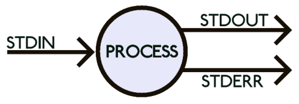
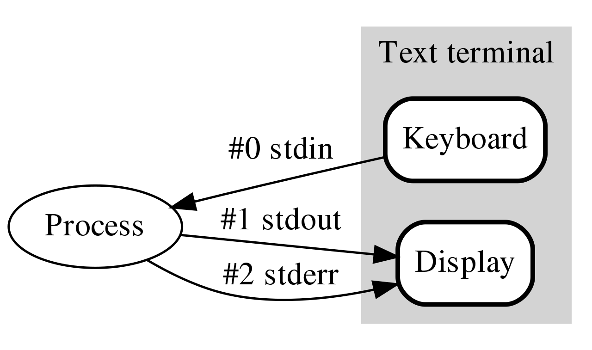

+++

title = "Preliminary notions for Software Development"
description = "Quick recap of notions and technical skills for the course"
outputs = ["Reveal"]

+++

# Preliminary notions for Software Development

{}

---

## Motivation and goals

- In order to put everybody on the same page...

- ... we are going to recall some basic notions and technical aspects related to software development, namely:
    - the command line
    - the anatomy of a software project in Python
    - the role of modelling in SE
    - ubiquitous (w.r.t. SE) notions such as interfaces and runtimes

- plus, we will provide practical examples about key concepts such as
    - automated testing
    - deployment, packaging, and release
    - maintenance

---

# The command-line

(a.k.a. the shell, the terminal, the console)

---

## First contact with the terminal

1. Open your terminal application
    - Either "PowerShell", "Command Prompt", "Terminal" on Windows
    - "iTerm" or "Terminal" on macOS
    - "Konsole" or "Terminal" on Linux

> The terminal is a text-based interface to the operative system (OS).
> Each terminal application is executing a __shell__ program

> The shell is a program that has a simple job: __REPL__ (Read, Evaluate, Print, Loop)
> 1. it __reads__ a _command_ from the user
> 2. it __evaluates__ the command
> 3. it __prints__ the result
> 4. it __loops__ back to step 1, unless the user explicitly asks to __exit__

2. Write a few simple commands and observe the effect
    - `ls` (or `dir` on Windows): should list the files in the current directory
    - `echo "Hello World"`: should print "Hello World" on the screen
    - `exit`: should close the shell (and the terminal application, if it's the only shell)

---

## Why the terminal?

Mostly, to look hacker-ish in the eyes of normal people 😎

(just kidding)

<br>

- The terminal is a powerful tool for software development

- It allows developers to interact with the OS in a precise, minimal, and efficient way

- Most operations in software development can, and often should, be performed from the terminal

> The terminal may accept commands:
> - __interactively__, from the user
> - from a __script__, which is a file containing commands to be executed by a shell

---

## Developers are inherently lazy

Developers' mindset:

> If a __person__ can do it _manually_ via the shell, then a __script__ can do it _automatically_

> If a __script__ can do it _automatically_, then that's the way of doing it

- these are the basic principles behind __automation__
- a part from _time-saving_ and _precision_ in execution, automation enables __reproducibility__ of the process
    1. experts can _distill_ their _operational knowledge_ into scripts
    2. scripts can be _called_ (i.e. invoked, executed) by non-experts

---

## To automate or not to automate?

Beware, 'cause scripts are __software__ too, and they require engineering:


<https://xkcd.com/1319/>

<br>

- There is an implict __trade-off__ between 
    1. the time _spent_ to automate a task (i.e. __coding__)
    2. and the time _saved_ w.r.t. doing the task __manually__

This is not really the case of everyday programming tasks, but let's keep this in mind

---

## Why the terminal in this course?

+ We are going to use the terminal for:
    - running Python scripts
    - managing Python projects (version tracking, tests, releases, etc.)

+ Understaing how to do stuff via the terminal is a _reusable_ __skill__
    - while IDE and GUIs evolve quickly, and every team has its own preferences...
    - command line tools are very stable and widely adopted

+ We encourage you to read the following lectures from The MIT's ["Missing Semester of Your CS Education"](https://missing.csail.mit.edu/):
    1. [The shell](https://missing.csail.mit.edu/2020/course-shell/)
    2. [Shell tools](https://missing.csail.mit.edu/2020/shell-tools/)
    3. [Commnad-line environment](https://missing.csail.mit.edu/2020/command-line/)

---

## Stuff you need to know about the shell (pt. 1)

- There exist essentially two sorts of shells:
    1. the Unix-like shells (e.g., `bash`, `zsh`, `fish`, `ksh`, `csh`, `tcsh`, etc.) used by Linux and macOS
        - and, to some extent, by Windows
    2. the Windows shells (e.g., `cmd`, `PowerShell`) which are different from the Unix-like ones, and from each other

> Whenever working with the terminal, first thing to do is to understand _which_ shell you are using
>    1. if you're on Linux, you're probably using `bash` or `zsh`
>    2. if you're on macOS, you're probably using `zsh` or `bash`
>    3. if you're on Windows, you're probably using
>        - `cmd` if you opened the Command Prompt application
>        - `PowerShell` is you opened the PowerShell application
>        - `bash` if are using the Windows Subsystem for Linux (WSL) or Git Bash

---

## Stuff you need to know about the shell (pt. 2)

- Whenver you open a shell, the shell is "in" a directory, which is called the __current working directory__ (CWD)
    - by default, commands _operate_ on the CWD (i.e. they read and write files in the CWD)
    - that directory should be shown _somewhere_ in the shell's _prompt_
    - if not shown, you can always _ask_ the shell to show it, via some command

- If one wants to operate on a _file_ in a _different directory_...
    + ... they have to _change_ the CWD
        - this is done via the `cd` command (change directory)

    + ... without changing the CWD, they have to _specify_ the __path__ to the file
        - this is done via the _absolute_ or _relative_ __path__ to the file

---

## Stuff you need to know about the shell (pt. 3)

A __path__ is a string that represents the location of a file or a directory in the __file system__

> __Beware__: path-separator is different among Windows (`\`) and other OS (`/`), 
>
> and __we only use `/` in the slides__

- A __relative path__ is a path that is relative to the CWD 
    - e.g., `./file.txt` refers to a file named `file.txt` in the CWD
    - e.g., `../file.txt` refers to a file named `file.txt` in the __parent directory__ of the CWD
    - e.g., `./dir/file.txt` refers to a file named `file.txt` in a sub-directory of CWD, named `dir`

- An __absolute path__ is a path that starts from the __root__ of the file system
    - on __Unix__-like systems, the _root is `/`_
        * e.g. `/home/giovanni/file.txt` refers to a file named `file.txt` in `giovanni`'s home directory on __Linux__
        * e.g. `/Users/giovanni/file.txt` refers to a file named `file.txt` in `giovanni`'s home directory on __macOS__
    - on __Windows__, there are _several roots_, one per __drive__ (e.g., `C:`, `D:`, etc.)
        * e.g. `C:\Users\giovanni\file.txt` refers file `file.txt` in `giovanni`'s home directory, _on drive `C:`_
        * e.g. `D:\Data\Photos\profile.jpg` refers file `profile.jpg` in the `Data\Photos` directory, _on drive `D:`_

---

<!-- write-here "shared-slides/terminal-cheatsheet.md" -->

<!-- end-write -->

---

## Stuff you need to know about the shell (pt. 4)

- Most commands have __arguments__
    + roughly, whatever you can write _after the command name_ is an argument


- If you think of commands as _functions_, then arguments are the _parameters_ of the function
    + and the command is the _function name_
    + and the printed output is the _return value_
    + simply, no parentheses are required by default for "invoking" the function

- Consider the `ls` command
    + `ls` lists the files in the CWD, _as an inline list_
    + `ls -l` lists the files in the CWD, _as a detailed list_
    + `ls -l /path/to/dir` lists the files in the `/path/to/dir` directory, _as a detailed list_

---

## How the hell can I memorise all these commands?

You should not.

- Just try to grasp the basic idea of how shells work

- Just memorise that __there exist a way to do `X`__ via the shell
    + and all relevant `X`s

- You will eventually memorise the syntax of most frequent commands

- For the rest, you can always look up the documentation
    + or the Web, or ask someone, there including ChatGPT or StackOverflow
        + but please, __do not copy&paste code that you do not understand__

- Most commands support asking for help when one does not remeber the syntax
    - e.g. `COMMAND_NAME --help` or `COMMAND_NAME -h` mostly used on Unix-like systems
    - e.g. `man COMMAND_NAME` mostly used on Unix-like systems (man is for _"manual"_)
    - e.g. `COMMAND_NAME /?` mostly used on Windows
    - e.g. `Get-Help COMMAND_NAME` mostly used on Windows

> Do not waste your memory, learn how to look up the documentation instead

---

## About interactive commands (pt. 1)

+ Some commands are __interactive__
    + when you start them, they to _not_ __terminate immediately__
    + instead, they _wait for user input_

+ In this case we say that the command is just _starting_ a __process__
    + "process" is a technical term for a _program that is running_
    + an __app__ is commonly a process attached to a __graphical user interace__ (_GUI_) shown on the screen

+ There is _no difference_ among __interactive__ and __non__-_interactive_ processes, _for the shell_
    1. a command is used to _start_ the process
    2. the command will _stay alive_, 
        + and possibly consume the user's _input_
        + and possibly produce some _output_
    3. for some reason, the process may eventually __terminate__
        + e.g., because of some input from the user, some error, or some condition met
    4. when that the case, __control__ is returned to _the shell_ 
        + which will ask for more commands, as usual

---

## About interactive commands (pt. 2)

+ Upon termination, each command returns a __status code__ (i.e. a _non-negative integer_)
    + `0` means _"everything went fine"_
    + any other number means _"something went wrong"_ (each number is a different _error code_)
    + so the shell always knows if the _last command was successful_ or not

+ When using the shell _interactively_:
    + pay attention to whether _the last command you wrote_ was __successful__ or not

+ When programmin the shell _in a script_:
    + you can check the status code of the last command via the special variable `$?`
    + you can use the `if` statement to check the status code and act accordingly

---

## About interactive processes (pt. 1)

In the eyes of the OS, any process can be modelled as follows:



- i.e. a black box
    + consuming a _stream_ of _input data_ from the __standard input__ channel (`stdin`)
    + producing a _stream_ of _output data_ to the __standard output__ channel (`stdout`)
    + and, possibly, producing a _stream_ of _error data_ to the __standard error__ stream (`stderr`)

- more channeles may be opened by the process, e.g. when _reading_ / _writing_ __files__

> a __stream__ is an _unlimited_ sequence of _bytes_ (or _characters_)

+ this may represent __anything__ having a digital representation (e.g. a file, a network connection, a device, etc.)

---

## About interactive processes (pt. 2)

Most commonly, for __interactive__ processes, the situation is as follows:

<!--  -->



+ all three streams are connected to the terminal by default
    + so the process _reads_ input from the keyboard
    + and _writes_ output to the terminal
    + and _writes_ errors to the terminal (sometimes, errors are _colored_ differently)

---

## About interactive processes (pt. 3)

### Example: the `nano` command

> `nano` is a simple, interactive, text editor for the terminal

1. Open a shell, and run the following command
    ```bash
    nano myfile.txt
    ```

2. This should transform the terminal into a text editor, editing the file `myfile.txt`
    - you can write some text in there, e.g. `Hello World`

3. Then, press <kbd>Ctrl</kbd>+<kbd>O</kbd> to save the file
    - you will be asked to confirm the file name, press <kbd>Enter</kbd>

4. Then, press <kbd>Ctrl</kbd>+<kbd>X</kbd> to exit the editor

5. You should be back to the shell, and the file `myfile.txt` should have been created
    - you can verify that, via the `ls` command

---

## The Python command

- Python is a programming language, namely, the reference programming language we use in the course

- We will operate Python stuff via the terminal, using the `python` __command__

- The command's behaviour is very different depending on which and how many arguments are passed:
    + `python` _with no arguments_ starts an __interactive__ _Python shell_
        * i.e. yet another shell, but using the _Python syntax_
    + `python FILENAME` starts a _Python process_ that _executes_ the _Python code_ in the __file__ `FILENAME`
    + `python -m MODULE` starts a _Python process_ that _executes_ the __module__ named `MODULE`
        * we'll see what a _module_ is, later in the course
    + `python -c "CODE"` starts a _Python process_ that _executes_ the _Python code_ in the __string__ `"CODE"`
        * e.g. `python -c "print('Hello World')"`

+ Use `python --help` to inspect the _help_ of the `python` command, and see all the options

+ When using Python, always remember to check the _version_ of the Python interpreter you are using
    + `python --version` or `python -V`

---

# Code and code organization

(in Python)

---

## Running example (pt. 1)

Let's say we are going to build a simple _calculator_ app, in Python

Using [Kivy](https://kivy.org/) for the GUI, we may easily build the following app:



---

## Running example (pt. 2)

The source code for such application is available here:

<https://github.com/unibo-dtm-se/compact-calculator>

### TO-DO list
1. Download the code by clicking on the _green "Code" button_, and then __"Download ZIP"__
2. Unpack the archive in a directory of your choice
3. Open the directory in some lightweight IDE like __VS Code__
    + possibly exploit the __integrated terminal__
4. Inspect the content of the directory (e.g. via the terminal, using the `ls -la` command)
    + you should notice 4 files:
        - `.python-version` (hidden on Unix) _textual_ declaration of the _Python version_ __required__ by the application
        - `calculator.py`: the _source code_ of the application
        - `requirements.txt`: a file containing the _dependencies_ of the application
        - `README.md`: a file containing the some _notes_ about of the application

---

## Running example (pt. 3)

4. Notice that the `calculator.py` file is a _Python script_ that contains _only_ __46 lines of code__

5. Have a look to the source code of the `calculator.py` file
    + do you recognize any structure in the code?
    + do you have any clue about what's going on in the code?

6. Let's try to run the application
    1. open a terminal in the directory of the application (the VS Code is fine)
    2. run the following command
        ```bash
        python calculator.py
        ```
    3. you may observe the following output in the terminal:
        ```
        Traceback (most recent call last):
        File "/path/to/your/directory/calculator.py", line 1, in <module>
            from kivy.app import App
        ModuleNotFoundError: No module named 'kivy'
        ```

7. The issue here is that our application __depends on__ some _third-party_ __library__, namely [Kivy](https://kivy.org/)
    + __third-party__ $\approx$ _not written by us_ + _not included Python_ by default

---

## Running example (pt. 4)

8. The solution is pretty simple: let's _install_ the missing __dependency__
    + we can do that via the `pip` command, which is the _Python package manager_
        ```bash
        pip install kivy
        ```

9. After the installation, we can try to run the application again
    ```bash
    python calculator.py
    ```

    this time, the application should start, and you should see the calculator Window

10. play a bit with the application
    + ensure it works as expected
    + finally, close the Window, and notice that control is returned to the terminal

11. either in the terminal (`ls -la`), or in the GUI, you may notice a new _sub-directory_ named `__pycache__`
    + with a file named `calculator.cpython-3XXX`__`.pyc`__ (or similar) in it
        * that is a __compilation__ _cache_ file, generated by the Python interpreter, for our application

---

## Many hidden concepts in this example

1. the notion of __library__
    + i.e. a _collection_ of __pre-cooked software__ be _reused_ in _different_ applications

2. the notion of __dependency__
    + i.e. a piece of _software_ that is _required_ by another piece of software to _run_

3. the notion of __runtime__
    + i.e. the _environment_ in which a _piece_ of software is _executed_

4. the notion of __package manager__
    + i.e. a _tool_ that _automates_ the __installation__ of _dependencies_ into a _runtime_

5. the notion of __compilation__
    + i.e. the _process_ of _translating_ a _source code_ into a _machine code_ that can be _executed_

--- 

## Compilation vs. Interpretation of Programs

- A program is a __set of instructions__ that a _computer_ can __execute__

- Computers nowadays follow the [Von Neumann architecture](https://en.wikipedia.org/wiki/Von_Neumann_architecture)
    + put it simply, they follow a _list_ of __instructions__, from some __instruction language__
        * modern CPU producers (Intel, AMD, ARM, etc.) constuct CPU which comply to well known instruction sets (e.g. `x86`, `amd64`, `arm`, etc.)
        — different architectures have different instruction sets

- Programming languages are meant to be __understood__ by _humans_ (_not_ by computers)

- To make a _computer_ understand a _program_, the _program_ must be __translated__ into _machine code_
    + i.e. a list of instructions in the _instruction language_ of that computer's _CPU_

- The __translation__ procedure is _hardware-dependent_, and it may vary _among OS_
    + to generalise, we say the translation procedure is __platform-dependent__

- There are two main ways to _translate_ a _program_ into _machine code_:
    1. __compilation__: the program is translated into an _executable_, via some __compiler__, and then executed
    2. __interpretation__: the program is read by an __interpreter__ (i.e. an _executable_), which _executes_ it

- The result is the same (the program is executed, i.e. the computer follows the instructions)
    + but the _implications_ are different

--- 

## Compilation vs. Interpretation of Programs (pt. 2)
    
- Compilation implies:
    1. a __compiler__ should be created _for each_ target platform
    2. each software project should be __compiled__, _for each_ target platform, _before_ being executed
    3. execution is potentially _faster_, as the _machine code_ is _optimised_ for the target CPU  
        * but higher speed is not guaranteed, and it may be _negligible_ in many cases
        * but many application do not require high-speed execution
    4. the compiler may spot some _errors_ in the program __before__ it is executed

- Interpretation implies:
    1. an __interpreter__ should be created _for each_ target platform
    2. the software can be executed __as is__ on all supported platforms
        + one less step in the workflow!
    3. execution is potentially _slower_, as the interpreter translates code _on the fly_
        + but the write-test-debug cycle is potentially _faster_
    4. the programmer may only spot _errors_ in the program __after__ it is executed

- Historically, _programming languages_ have been __categorised__ as _either compiled or interpreted_
    + C, C++, Rust, Go, etc. are _compiled_ languages
    + Ruby, JavaScript, etc. are _interpreted_ languages

--- 

## Compilation vs. Interpretation of Programs (pt. 3)    

- Nowadays, the _distinction_ is _blurred_
    + many languages are _both_ compiled and interpreted, there including _Python_, and _Java_
        1. on the surface, they are _interpreted_
        2. but the interpreter _compiles_ the code _on the fly_...
        3. and __saves__ the compiled version for later _re-use_

- As always, mixing opposite approaches may lead to the _best of both worlds_
    + e.g. the _interpreter_ may spot errors in the program before it is executed
    + e.g. in then interpretation and compilation are mixed, the _interpreter_ can _optimise_ the _machine code_ in a very fine grained way

- The idea of __saving__ a _hard-to-achieve_ result for _later re-use_ is called __caching__
    + and it is common trick in _software development_

- The CPython interpreter (i.e. the _reference_ Python implementaton) adopts a strategy of this sort
    + the __.pyc__ files you met before, are the __cache files__ produced by the Python interpreter
        + upon _first_ __succesful__ execution of a script

---

## Libraries (pt. 1)

- Basically no programmer ever writes an entire application __from scratch__
    + virtually all programmers _re-use_ someone else's code to do their job

- One key principle in SE has always been:
> Don't reinvent the wheel

- SE is essentially about how to write _good_ code, which works well, and __can be reused in the future__
    1. let's design software to be _general_
    2. let's write the code to _work well_
    3. let's give it a _name_ and clearly _document_ how it works (input, output, etc.)
    4. let's make it _reusable_, i.e. _referenceable_ (__callable__) by other software

- Collections of _reusable_ code are called __libraries__

---

## Libraries (pt. 2)

- All programming languages have a _standard library_...
    + i.e. a collection of _reusable_ code that comes with the language, by default
        + e.g. the `math` module in Python, the `java.util` package in Java, etc.
        + BTW, Python has one of the _richest_ standard libraries among programming languages
    + most commonly, _any two versions_ of a programming language would have a _different_ standard library
        + the syntax of the language may not even change
    
- ... plus some mechanism to _install_ and _import_ __third-party__ libraries
    + e.g., in Python, the `pip` command is used to install third-party libraries
    + e.g., in Python, the `import` statement is used to import libraries in the script
        + upon import, the difference among _standard_ and _third-party_ libraries is _irrelevant_

- The consequences of this "library" idea are manifold
    + what libraries are available for Python program to use?
    + what third-party libraries can one install?
    + what's the impact of using a third-party library for my application?
    + how can one write a library that can be reused by others?
        + why should one do that?

--- 

## Runtime (pt. 1)

- The __runtime__ is the __environment__ in which a _piece_ of software is _executed_
    + not to be confused with __run-time__, which is the _time_ when the _software_ is _executed_
    
    

> __Runtime__ of a program $\approx$ jargon for "the _set of_ __libraries__ actually available for that program at run-time" 
+ this commonly includes:
    1. the _standard library_ of the interpreter executing the 
        + e.g. __Python 3.11__'s standard library for our _calculator_ application
    2. any _third-party_ library installed onto that interpreter
        + e.g. __Kivy__ for our _calculator_ application

---

## Dependencies (pt. 1)

- Developers _exploit libraries_ produced by others to _avoid_ __wasting time__ reinventing the wheel

- The reasoning is more or less as follows:
    1. one needs to realise some software for functionality **$F$**
    2. writing the code for **$F$** requires some effort **$E_{scratch} > 0$**
    3. there exist some library **$L$** which reduces the effort to **$0 < E_{use} < E_{scratch}$**
    4. installing the library requires some effort **$E_{install} > 0$**
    5. learning how to use the library requires some effort **$E_{learn} > 0$**
    6. in the likely case that **$E_{install} + E_{learn} + E_{use} < E_{scratch}$**, one should use the library

<br>

> A __dependency__ among some _software_ **$S$** and some _other software_ **$L$** 
>
> occurs when **$S$** _requires_ **$L$** to _work_

- __requires__ $\approx$ **$S$** needs **$L$** to be part of its runtime to be _executed_
- this is commonly the result of the reasoning above
- for instance, the _calculator_ application __depends on__ the _Kivy_ library, and on the _Python 3.11_ standard library

--- 

## Dependencies (pt. 2)

Some definitions related to the notion of __dependency__:

> __Transitive dependency__: if **$S$** depends on **$L$**, and **$L$** depends on **$M$**, then **$S$** _transitively_ depends on **$M$**
+ non-transitive dependencies are called __direct__ dependencies 

--- 

## Dependencies (pt. 3)

> __Dependency graph__ of a software **$S$**: the graph spawned by all the dependencies (direct or transitive) depedencies of **$S$**
+ e.g. the dependency graph of our _calculator_ application includes _Kivy_ and _Python 3.11_ standard library, and all transitive depedencies of _Kivy_:
    ```
    calculator.py
    ├── Python 3.11.7
    └── kivy 2.3.0
        ├── docutils *
        ├── kivy-deps-angle >=0.4.0,<0.5.0
        ├── kivy-deps-glew >=0.3.1,<0.4.0
        ├── kivy-deps-sdl2 >=0.7.0,<0.8.0
        ├── kivy-garden >=0.1.4
        │   └── requests *
        │       ├── certifi >=2017.4.17
        │       ├── charset-normalizer >=2,<4
        │       ├── idna >=2.5,<4
        │       └── urllib3 >=1.21.1,<3
        ├── pygments *
        └── pypiwin32 *
            └── pywin32 >=223
    ```

---

## Package managers and package reporitories

- To support the __extension__ of _runtimes_, and therefore the __addition__ of _dependencies_...

- ... most programming languages come with 2 related tools:
    1. a __package manager__, which is a (command-line)-_tool_ to _install_ and _manage_ _dependencies_, semi-automatically
    2. __package repositories__, which are _collections_ of _software_ and _metadata_ about that _software_, commonly accessible via the Web

- __Packgage__ $\approx$ a _piece_ of _software_ with a _name_ and a _version_, and a fixed structure eases _installation_ and _reuse_
    + each package manager/repository subtends a _package format_, and some installation or publication procedures

- Package managers commonly support specifying from which _repository_ a _dependency_ should be _installed_
    + yet, each programming language may have its own _default_ package repository

- In the Python world:
    - the [Python Package Index](https://pypi.org/) (__PyPI__) is the _default_ software repository, full of _open-source_ Python software
    - the `pip` command is the _default_ package manager, and it is _tightly_ integrated with PyPI
        - by default `pip install NAME` installs _the last version of_ the __package__ `NAME` from PyPI

---

## Dependency declaration

- It is a good practice to __document__ which _dependencies_ a _software_ relies upon
    + names and versions, possibly

- It is even a better practice to __automate__ the _installation_ of _dependencies_
    + so that they can be _restored_ in automatically in any new development / usage environment

- Other than package managers and repositories, automation requires __dependency declaration__
    + each package manager supports some __file format__ for this purpose

- In the Python world, there are __several conventions__ for dependency declaration
    + the most common is the `requirements.txt` file
        * which contains a list of _dependencies_ in the form `NAME==VERSION`
        * the `pip install -r requirements.txt` command installs all depndencis in the file
    + another common convention is to declare Python version in a `.python-version` file
        + the [`pyenv`](https://github.com/pyenv/pyenv) `install` command can _install_ corresponding version of Python

---

## Package managers into the wild

- The _Python_ world is _not_ the _only_ one where _package managers_ and _package repositories_ are _used_

- Most programming languages have their own _package manager_ and _package repository_
    + e.g. _Java_ has _Maven_ and _Gradle_, and _Maven Central_
    + _JavaScript_ has _npm_ and _npmjs.com_
    + _Rust_ has _Cargo_ and _crates.io_
    + _Go_ has _go_ and _pkg.go.dev_
    + _Ruby_ has _gem_ and _rubygems.org_
    + _C++_ has _vcpkg_ and _conan.io_
    + etc.

- In the Linux world, package managers/repositories are used at the OS level too
    + e.g. _Debian_ and _Ubuntu_ distributions use _apt_ and _Debian repositories_
    + _Red Hat_ and _Centos_ distributions use _yum_ and _Red Hat repositories_
    + _Arch Linux_ and its derived distriutions use _pacman_ and _Arch Linux repositories_
    + etc.

- On MacOS, the _Homebrew_ package manager is widely used (not shipped with the OS)

- On Windows, one can use _chocolatey_ or _scoop_ as package managers (not shipped with the OS)

--- 

## About release and deployment

- Notice that private companies may have their own _private_ package repositories
    
- Also notice that some private companies may want to _publish_ their _software_ to _public_ repositories
    + e.g. the _Play store_ or the _App store_ for mobile applications

- In all such cases, you may interpret the _release_ and _deployment_ activities as follows:

    1. __Release__: the activity of making a particular __version__ of some _package_ __available__ on a package manager

    2. __Deployment__: the process of __installing__ a particular version of a system onto the __production environment__
        + i.e. either the machine(s) of the end users, or the servers the end users interact with
        + this may be simple when the system is a _single package_, but it may be _complex_ when the system is a _collection_ of _interacting_ packages

---

## What about the actual code?

Let's delve into the [actual code](https://github.com/unibo-dtm-se/compact-calculator/blob/master/calculator.py) of the _calculator_ application

(focus on the comments)

```python
# Import a bunch of stuff from the Kivy library, used below
from kivy.app import App
from kivy.uix.boxlayout import BoxLayout
from kivy.uix.button import Button
from kivy.uix.label import Label

# Matrix of button names and their layout in the GUI
BUTTONS_NAMES = [
    ['7', '8', '9', '/'],
    ['4', '5', '6', '*'],
    ['1', '2', '3', '-'],
    ['.', '0', '=', '+'],
]

# Calculator *class*: template for all sorts of calculators. this is a particular case of App (i.e. a window, in Kivy)
class CalculatorApp(App):
    # Method to build the GUI of the calculator, accordinging to Kivy's conventions
    def build(self):
        # Definition & initialisation of the "expression" field of the calculator.
        # This fields stores a string, representing the expression to be evaluated when "=" is pressed
        self.expression = ""

        # Let's create a layout, i.e. a virtual container of the visual components the GUI.
        # The grid shall dispose components vertically (top to bottom), i.e. it contains *rows* of components
        grid = BoxLayout(orientation='vertical')

        # Let's create a label, which will serve as the display of the calculator
        self.display = Label(text='0', font_size=24, size_hint=(1, 0.75))
        # Let's add the label to the grid, as the first row
        grid.add_widget(self.display)

        # For each *list of* button names in the matrix of button names...
        for button_names_row in BUTTONS_NAMES:
            # ... let's create another virtual container for a *row* for components
            grid_row = BoxLayout()
            # ... then, for each button name in the list of button names...
            for button_name in button_names_row:
                # ... let's create a button, having the button name as text
                # (the button is configured to call method on_button_press when pressed)
                button = Button(text=button_name, font_size=24, on_press=self.on_button_press)
                # ... and let's add the button to the row
                grid_row.add_widget(button)
            # ... and let's add the row to the grid
            grid.add_widget(grid_row)

        # Finally, let's return the grid, what will be showed in the window
        return grid

    # Method to be called when a button is pressed
    def on_button_press(self, button):
        # If the button is the "=" button
        if button.text == '=':
            # Try to...
            try:
                # ... evaluate the expresion *as a Python expression*, convert the result to a string, 
                # and show that string on the calculator display
                self.display.text = str(eval(self.expression))
            # If an error occurs in doing the above (e.g. wrong expression)
            except SyntaxError:
                # ... set the display to "Error"
                self.display.text = 'Error'
            # Reset the calculator's expression
            self.expression = ""
        # If the button is any other button
        else:
            # Append the button's text to the calculator's expression
            self.expression += instance.text
            # Show the calculator's expression on the display
            self.display.text = self.expression


# If the script is executed as a standalone program (i.e. not imported as a module)
if __name__ == '__main__':
    # Let's create a new calculator application, and run it
    CalculatorApp().run()
```

* the whole application is contained in a single file, `calculator.py`, with a single class `CalculatorApp`
* the classe mixes _UI_ and _businness logic_ in a single place

---

## The issue with the current version of the code (pt. 1)

<!--  -->



<br>

- The system __is__ what the user _sees_ (i.e. the __view__)

- The code is __not__ modular: _view_, _controller_, and _model_ are _mixed_ together
    + the __view__ $\approx$ what is shown to the user
    + the __model__ $\approx$ what the application _does_ or _can do_
    + the __controller__ $\approx$ the _glue_ between the _view_ and the _model_
        - dictating how _changes_ in the _view_ are _reflected_ in the _model_

--- 

## The issue with the current version of the code (pt. 2)

- _Requirements may change_, e.g.: customers may ask for:
    + novel operations (e.g. square root, power, etc.) to be supported
        * implies changes in the model, the view, and the controller
    + a completely different view (e.g. a web interface)
        * implies rewriting the controller and the model, to just revrite the view
    + a completely different model (e.g. a programmer calculator, supporting bin, oct, hex, dec)
        * implies rewriting the view and the controller, to just rewrite the model

- It may be hard to __change__ the model, without breaking the view or the controller
    + the same apply for any other permutation of the three

- It may be hard to __test__ the model, without testing the view or the controller
    + the same apply for any other permutation of the three

- The application is, and *will always __only__ be*, a desktop application
    + unless complete rewrites are performed

---

## A good way to decompose code (pt. 1)



- A good way to decompose code is to follow the [__Model-View-Controller__](https://en.wikipedia.org/wiki/Model%E2%80%93view%E2%80%93controller) (__MVC__) pattern

- Different _portions_ of the code are _responsible_ for _different_ aspects of the application
    + some code is responsible for __modelling__ the (_admissible_) _functionalities_ of the application
    + some code is responsible for __presenting__ the (_view_ of the) application to the user
    + some code is responsible for __controlling__ the _interaction_ between the _user_ and the _application_
    + some code just _ties the pieces_ together

- The desktop application is just one of many options
    + as the GUI is just one of many possible views

---

## A good way to decompose code (pt. 2)

- The same _model_ could be __attached__ to several different _views_, via as many _controllers_
    + without needing to re-write, or re-test the _model_ at all

- The code of each portion could be _developed_ and _tested_ __independently__
    + possibly, at different paces, by different teams

- A bug in one portion of the code may be noticed before it affects the others

- It allows managers, developers, and users to _reason_ about
    + what the _application_ does (i.e. what functionalities it provides)
    + how the _application_ is _presented_ to users (multiple options may apply)
    + how the _user_ interacts with the _application_

