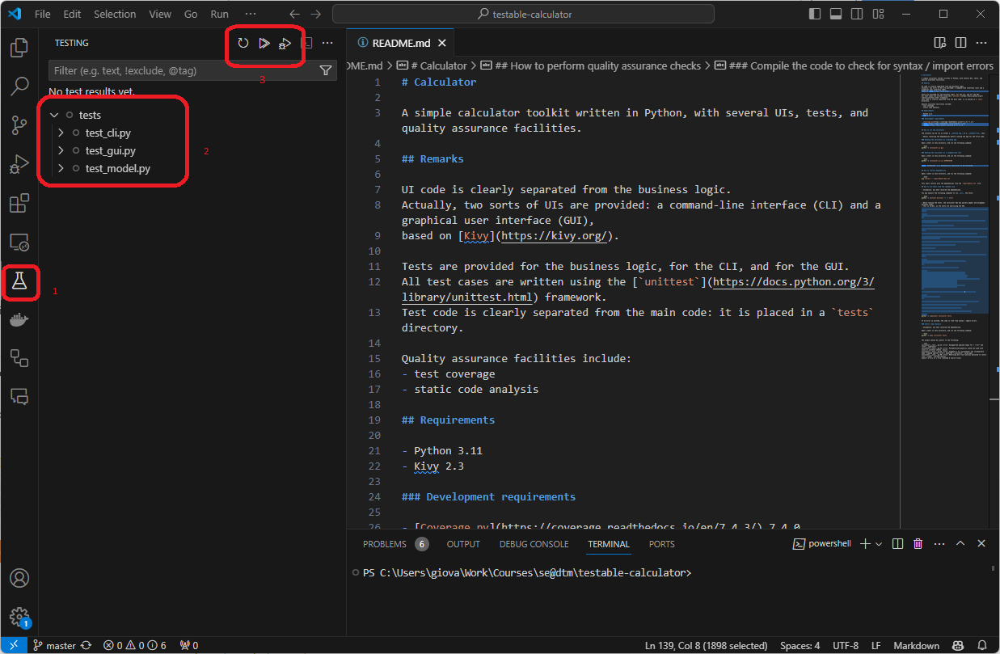
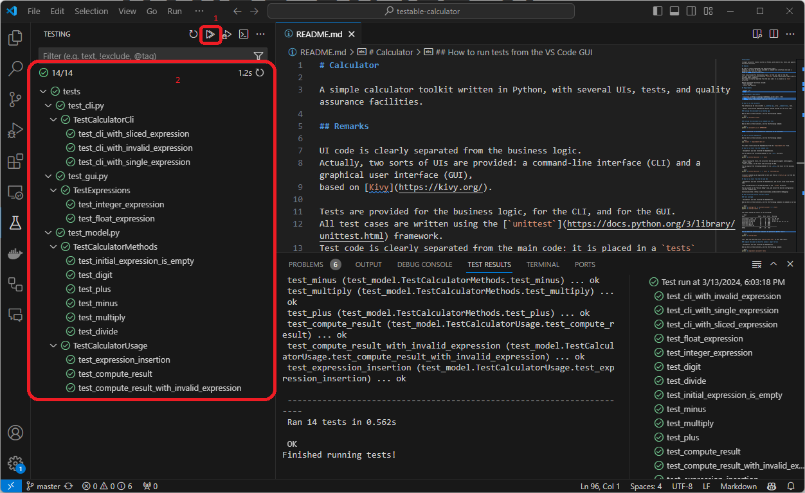
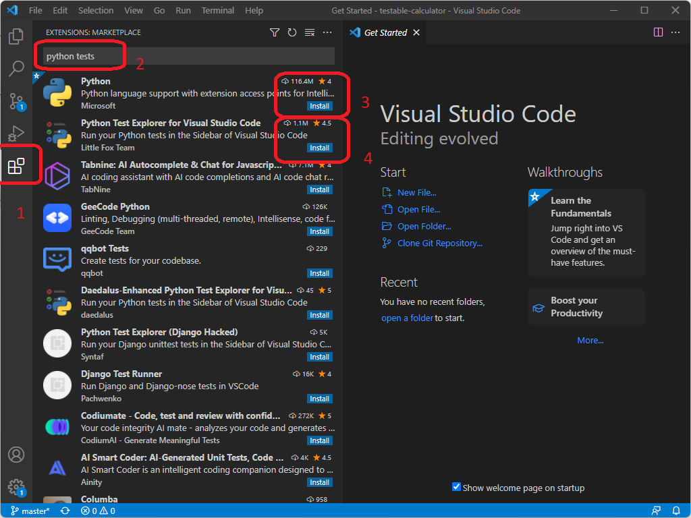
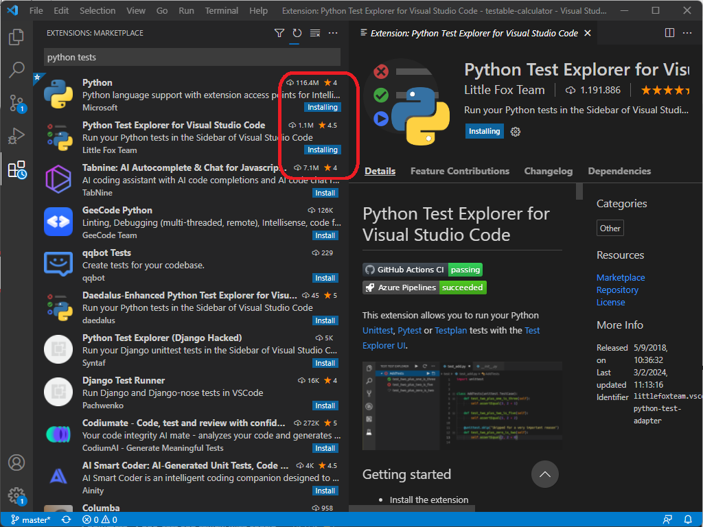
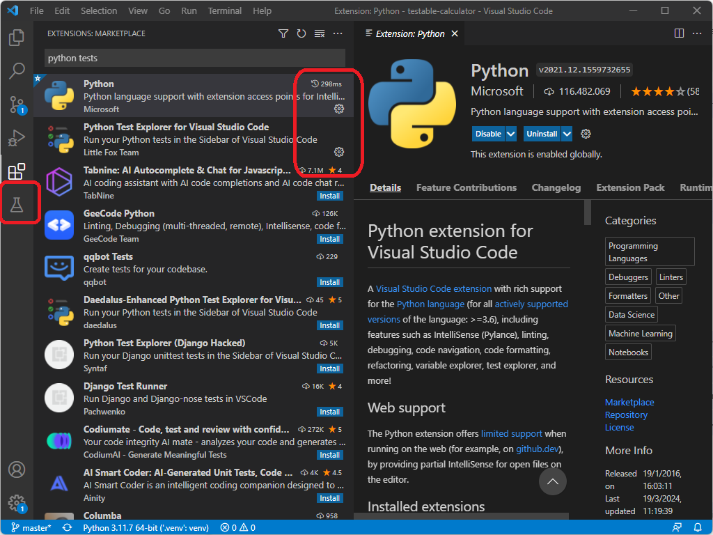
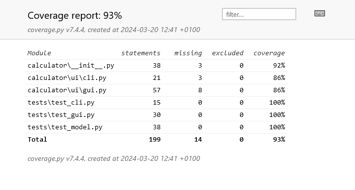

+++

title = "QA, reproducibility, TDD"
description = "QA, reproducibility, TDD"
outputs = ["Reveal"]

+++

# QA, reproducibility, TDD

{}

---

## Quality assurance

Would you drive a car that has _not_ been succefully passed its *quality control*?

<br>

As any engineered product, software should be *subject to __quality assurance__ control*.

<br>

> __Quality assurance__ (in SE) is the set of activities and practices aimed at ensuring that a software product _works_ and it is _of good quality_.

+ what does _"works"_ mean for software?
+ what does _"good quality"_ mean for software?

---

## Quality assurance: "works"

### What does _"works"_ mean for software?

> Insight: software works when it _meets the requirements_

- Recall that software requirements should come with clear _acceptance criteria_
    + __testing__ as the activity of _verifying_ that the software meets the acceptance criteria 

---

## Quality assurance: "good quality"

### What does _"good quality"_ mean for software?

> Insight: software is good when it is
>
> _easy for developers to evolve or maintain it_

- Recall that good software should have many _quality attributes_
    + __reproducible__ $\approx$ repeatable, with _predictable_ outcomes
    + __sustainable__ $\approx$ it's possible to _timely_ satisfy requirements with _controllable_ costs and efforts
    + __evolvable__ $\approx$ it's possible to _adapt_ the product to _new_ requirements in a sustainable way
    + __maintainable__ $\approx$ it's possible to _fix_, _improve_, or just keep the product _alive_ in a sustainable way
    + __scalable__ $\approx$ it's possible to _grow_ the product in terms of _size_, _complexity_, and _features_ in a sustainable way

- How to translate these attributes into _quality assurance_ practices?
    + as we will see, __testing__ may also serve this purpose

---

## Testing: criteria

Verify that the software meets quality criteria.

* **Functional** criteria:
  * Does *what* we expect it to do?
    * Does the software produce the expected results?
* **Non-functional** criteria:
  * Does it do it *how* we want it?
    * Is it secure?
    * Are performance acceptable?

---

## Automated vs. manual

Running an application manually is a form of testing: *exploratory testing*.
* Done **without a plan**

<br>

If there is a plan that can be followed step-by-step, then *there is a program that can do it for you*
* If a program can do it for you, the it *should* do it for you

---

## Testing scope (pt. 1)

As any engineering product, software can be tested at different levels of abstraction

* **Unit** testing: test *single software components*
  * Is this `class` (or `function` or `module`) behavior the expected one?
  * For a car: is the *tire* working correctly?
    * e.g. are shape, pression, etc. as expected?

* **Integration** testing: test *an entire subsystem*, i.e. the interplay among *multiple components*
  * Class `A` uses class `B` and `C`. Are they working together as expected?
  * For a car: if we attach the *wheels* to the *engine* via the *transmission*, does it work as expected?
    * e.g. we _turn on_ the engine, does the wheel _spin_?

* **End-to-end** (or **acceptance**) testing: test *an entire system* (may involve _aesthetics_/_usability_ criteria)
  * Is this whole __application__ functional, when used from the __UI__?
    * implies that _all_ components are correctly integrated
  * For a car: is it usable by a person to drive in the real world?
    * e.g. we _turn on_ the engine, does the car _move_?
    * e.g. can the user _change direction_ via the _steering wheel_?
    * e.g. is the _speed indicator_ reactive to the actual spees? is the _unit of measure_ what the user expects?

---

## Testing scope (pt. 2)

> A well-maintained engineering product _must_ have tests at __all granularity levels__

* But why?
  - after all, if the _end-to-end_ test passes...
  - ... then all the _unit_ and _integration_ tests should pass as well, right?

<br>

* Yes, but:
  - tests are not only about _verifying_ that the software works
  - they are particularly useful to _understand_ __why__ it _doesn't_ work

---

## Automated tests as sentinels

- Creating _automated_ test procedures makes the activity of _testing_ very __cheap__ (in terms of effort)
    - this allows developers to _test_ the software _often_ and _early_

- Being cheap, automated tests can serve as [canaries in cold mines](https://en.wikipedia.org/wiki/Sentinel_species)
    - i.e. __sentinels__ for the (early) detection of _problems_

- Test __failures__ are _precious_ during development
    - they help in localising the _source_ of the problem

> The more granular the tests, the easier it is to spot and fix problems

---

## Reproducibility

> Would you be comfortable with a car that passes the crash test `99.9%` of time, but on the `0.1%` of the cases fails _unexplicably_?

**Reproducibility** is **central** for testing

(true for any engineering, but in particular for software)

* *Tests should always provide the same results* when run on the same system
  * tests that *"work sometimes but sometimes not"* are called **flaky tests**
  * of course, running the same test procude on _different_ systems may produce different results
    * as well as different _versions_ of the _same_ system
* Tests should be **self-contained** (they should not depend on the results of previous tests)
* Testing procedures should be **deterministic** ($\approx$ no randomness)
  * _unpredicable_ events / scenarios (e.g. user inputs, lack of Internet connection) should be __simulated__
    * one cannot predict _when_ events will occur, but one must predict _what sorts_ of events / scenarios _may_ occur

---

{}

## Technicalities of writing tests

(we will focus on Python, but the concepts are general)

1. the _source code_ can now be conceinved as composed by _two parts_:
    * the __main__ code: where the actual software is implemented
    * the __test__ code: where the tests for the actual software are implemented

2. the __test__ code is usually placed in a separate folder, and it is usually named `tests/` (or `test/`)

3. the _dependencies_ of the project are now of _two sorts_:
    * the __main__ dependencies: the libraries required by the main code
    * the __development__ (_"dev"_) dependencies: the libraries required by the quality assurance procedures 
        - there exist several libraries which support testing, e.g. [`unittest`](https://docs.python.org/3/library/unittest.html) (included in Python), or [`pytest`](https://docs.pytest.org/en/stable/) (third-party)

4. developers may now want to _launch_ not only the software, but also _the tests_
    * ad-hoc _terminal commands_ or _IDE plugins_ are available for this purpose 

---

## Updated project structure

```bash
root_directory/
├── main_package/               # main package (i.e. directory for the main code)
│   ├── __init__.py
│   ├── sub_module.py
│   └── sub_package/ 
│       ├── __init__.py 
│       └── sub_sub_module.py 
├── tests/                      # directory for the test code
│   ├── test_module_1.py
│   ├── ...
│   └── test_module_N.py 
├── .python-version
├── README.md
├── requirements-dev.txt        # file to list *development* dependencies
└── requirements.txt            # file to list *main* dependencies
```

<br>

Important conventions:

1. __all__ the _test code_ should be placed in a directory named `tests/` (or `test/`)

2. the test code should be put into `.py` files whose name _starts with_ `test_`

3. `requirements.txt` is for the _main_ dependencies, `requirements-dev.txt` is for the _dev_ dependencies 


{}
`requirements.txt` example:
```txt
Kivy>=2.3.0
```
{}
{}
`requirements-dev.txt` example:
```txt
-r requirements.txt
pytest>=8.1.0
```
{}


---

## Nomenclature about testing

- __System under test__ (_SUT_): the component of the software that is being tested
    - e.g. a `class`, a `function`, a `module`

- __Test case__: a _class_ that contains the _test functions_ for a specific _SUT_
    - each test case corresponds to _one or more_ testing procedures for the _same SUT_
    - in case of multiple procedures, all must _share_ the same __set up__ or __tear down__ activities
        - i.e. activities to before or after _each_ testing procedure from the same test case

- __Test suite__: a _collection_ of _test cases_, commonly related to similar SUTs
    - it commonly consists of a module, e.g. a `test_*.py` file

- __Assertion__: a _boolean_ (i.e. either `True` or `False`) _check_ about the SUT
    - if the assertion is `True`, the assertion __passes__, and the test _proceeds_
    - if the assertion is `False`, the test __fails__, and it is _interrupted_

- __Test procedure__: a sequence of _actions_ and _assertions_ about some SUT
    - it _succeeds_ if _all_ the assertions are `True` __and no *unexpected* error occurs__
    - it _fails_ otherwise

---

## Writing tests in Python

We adopt [`unittest`](https://docs.python.org/3/library/unittest.html), a _built-in_ library for writing tests in Python
- it is _inspired_ by the [`JUnit`](https://junit.org) library for Java
- it is _not_ the only one: [`pytest`](https://docs.pytest.org/en/stable/) is a popular alternative (but it needs to be installed)

### Anatomy of a test suite in `unittest`

Let's assume this is the `test_my_system.py` test suite (full code [here](https://gist.github.com/gciatto/151182ff015df80df21e5d0a8a5e88b1))

⬇️

---

```python
import unittest


# first test case
class TestMySystemUnderOrdinaryConditions(unittest.TestCase):

    # initialization activities (most commonly, just initialises the SUT)
    def setUp(self):    
        # activities to be performed BEFORE EACH test procedure
        self.sut = MySystem() # sut instantiation

    # test procedure 1
    def test_initial_condition(self):
        self.assertEquals(self.sut.my_attribute, 123) # assertion (my_attribute is initially 123)
        self.assertEquals(self.sut.other_attribute, "foo") # assertion (other_attribute is initially "foo")
        self.assertTrue(self.sut.is_ready()) # assertion (function is_ready returns True)

    # test procedure 2
    def test_do_something(self):
        self.sut.do_something() # legitimate action
        self.assertEquals(self.sut.my_attribute, 124) # assertion (my_attribute is 124 after do_something)
        self.assertEquals(self.sut.other_attribute, "bar") # assertion (other_attribute is "bar" after do_something)
        self.assertFalse(self.sut.is_ready()) # assertion (function is_ready returns False after do_something)

    # test procedure 3
    def test_do_something_bad(self):
        with self.assertRaises(ValueError): # assertion (do_something_base raises ValueError)
            self.sut.do_something_bad() # illegitimate action

    # you can put as many test procedures as you want

    # cleaning up activities (most commonly omitted, i.e. nothing to do)
    def tearDown(self):
      # activities to be performed AFTER EACH test procedure
      self.sut.shutdown() # legitimate action


# second test case
class TestMySystemUnderSpecialConditions(unittest.TestCase):
    # put other test proceedures here


# you can put as many test cases as you want
```

---

## Technicalities of `unittest` tests suites

- Many _assertion functions_, cf.: <https://docs.python.org/3/library/unittest.html#assert-methods>

- Many options to _customise_/parametrise your test suites, cf. <https://docs.python.org/3/library/unittest.html>

- How to run tests:
    - from the terminal: `python -m unittest discover -v -s tests`
        - where `-v` stands for _verbose_ (i.e. more detailed output)
        - where `-s` stands for _start directory_ (i.e. the directory where the tests are, in this case `tests`)
    - from an IDE: usually there is a dedicated button
    - from _VS Code_: there is a [dedicated section](https://code.visualstudio.com/docs/python/testing#_configure-tests) which requires configuration

- Effect of running all tests with subcommand `discover`:
    - all the `test_*.py` __files__ in the `tests/` directory (and its sub-directories) are __loaded__
        + all _sub_-__classes__ of `unittest.TestCase` from those files are __instantiated__
            + all the __functions__ from those classes that start with `test_` are __executed__
                1. the `setUp` function is __executed__ *before each* test function
                2. the `tearDown` function is __executed__ *after each* test function

---

# Hands-on (pt. 1)

## Playing a bit with `unittest`

### Restoring dev dependencies

1. __Fork__ the following repository: https://github.com/unibo-dtm-se/testable-calculator

2. __Clone__ the forked repository on your machine
    + `git clone https://github.com/YOUR_GITHUB_USERNAME/testable-calculator

3. __Open VS Code__ into the `testable-calculator` directory
    + let's use VS Code's _integrated terminal_ from now on 

4. __Restore__ both dependencies and dev-dependencies
    + `pip install -r requirements-dev.txt`

---

# Hands-on (pt. 2)

## Playing a bit with `unittest`

### Running tests via the terminal

5. __Run__ the tests via the terminal
    + Minimalistic: `python -m unittest discover -s tests`

        ```text
        ..............
        ---------------------------------------------------------------------- 
        Ran 14 tests in 0.478s

        OK
        ```

        (each dot represents a successful test procedure... not really clear, right?)

    + Verbose: `python -m unittest discover -v -s tests` (notice option `-v`)

        ```text
        test_cli_with_invalid_expression (test_cli.TestCalculatorCli.test_cli_with_invalid_expression) ... ok
        test_cli_with_single_expression (test_cli.TestCalculatorCli.test_cli_with_single_expression) ... ok
        test_cli_with_sliced_expression (test_cli.TestCalculatorCli.test_cli_with_sliced_expression) ... ok
        [...]
        test_expression_insertion (test_model.TestCalculatorUsage.test_expression_insertion) ... ok

        ----------------------------------------------------------------------
        Ran 14 tests in 0.447s

        OK
        ```

        (one test per line: clearer)

---

# Hands-on (pt. 3)

## Playing a bit with `unittest`

### Running tests via VS Code


{}
Before:


{}
{}
After:


{}


(if you cannot find the _Test_ section, look at the next slide)

---

## What if you cannot find the _Test_ section? (pt. 1)


You probably have and _old version_ of VS Code, and you should __update__ it

<br>

⬇️ Meanwhile, you can follow this workaround ⬇️

---

## What if you cannot find the _Test_ section? (pt. 2)

1. Go to the _Extensions_ section of VS Code
    + you can do this by clicking on the _Extensions_ icon in the _Activity Bar_ on the side of the window

2. In the search bar of the _Extensions_ section, type `python tests`
    + the first result should be the __Python__ extension by _Microsoft_
    + the second result should be the __Python Test Explorer__ extension by _Little Fox Team_

        

---

## What if you cannot find the _Test_ section? (pt. 3)

3. Click on the __Install__ button of both extensions
    + while installing, VS Code may look like this

        

---

## What if you cannot find the _Test_ section? (pt. 4)

4. Once the installation is complete, you should see the _Test_ section in the _Activity Bar_ on the side of the window

    

---

# Hands-on (pt. 4)

## Playing a bit with `unittest`

### Inspecting a real unit test

6. Have a look to the [`tests/test_model.py`](https://github.com/unibo-dtm-se/testable-calculator/blob/master/tests/test_model.py) file and listen to the teacher explanation
    + it contains a test suite for the [`Calculator` class](https://github.com/unibo-dtm-se/testable-calculator/blob/master/calculator/__init__.py#L4)
    
    
⬇️

---

```python
import unittest
from calculator import Calculator


# test case testing what the effect of each method of the Calculator class is
# when executed on a fresh new Calculator instance
class TestCalculatorMethods(unittest.TestCase):
    def setUp(self):
        # here we create one "virgin" instance of the Calculator class (our SUT)
        self.calculator = Calculator()

    def test_initial_expression_is_empty(self):
        # here we ensure the expression of a virgin Calculator is empty 
        self.assertEqual("", self.calculator.expression)

    def test_digit(self):
        # here we ensure that the digit method effectively appends one digit to the Calculator expression
        self.calculator.digit(1)
        self.assertEqual("1", self.calculator.expression)

    def test_plus(self):
        # here we ensure that the plus method effectively appends one "+" symbol to the Calculator expression
        self.calculator.plus()
        self.assertEqual("+", self.calculator.expression)

    def test_minus(self):
        # here we ensure that the minus method effectively appends one "-" symbol to the Calculator expression
        self.calculator.minus()
        self.assertEqual("-", self.calculator.expression)
    
    def test_multiply(self):
        # here we ensure that the multiply method effectively appends one "*" symbol to the Calculator expression
        self.calculator.multiply()
        self.assertEqual("*", self.calculator.expression)
    
    def test_divide(self):
        # here we ensure that the divide method effectively appends one "/" symbol to the Calculator expression
        self.calculator.divide()
        self.assertEqual("/", self.calculator.expression)


# test case testing the usage of the Calculator class
class TestCalculatorUsage(unittest.TestCase):
    def setUp(self):
        # here we create one "virgin" instance of the Calculator class (our SUT)
        self.calculator = Calculator()

    def test_expression_insertion(self):
        # here we simulate the insertion of a simple expression, one symbol at a time...
        self.calculator.digit(1)
        self.calculator.plus()
        self.calculator.digit(2)
        # ... and we ensure the expression is as expected
        self.assertEqual("1+2", self.calculator.expression)

    def test_compute_result(self):
        # here we simulate the insertion of an expression "as a whole", 
        # by setting the expression attribute of a virgin Calculator
        self.calculator.expression = "1+2"
        # ... and we ansure the compute_result method evaluates the expression as expected
        self.assertEqual(3, self.calculator.compute_result())

    def test_compute_result_with_invalid_expression(self):
        # here we simulate the insertion of an invalid expression "as a whole"...
        self.calculator.expression = "1+"
        with self.assertRaises(ValueError) as context:
            # ... and we ensure the compute_result method raises a ValueError in such situation
            self.calculator.compute_result()
        # ... and we also ensure that the exception message carries useful information
        self.assertEqual("Invalid expression: 1+", str(context.exception))
```

---

# Hands-on (pt. 4)

## Playing a bit with `unittest`

### Failing tests

7. Try to run tests via the terminal and via VS Code
    + notice that in VS Code you can run tests _selectively_

8. Let's now simulate the scenario where tests are __failing__ (e.g. due to _buggy_ code)
    + edit the `Calculator` in file [`calculator/__init__.py`](https://github.com/unibo-dtm-se/testable-calculator/blob/master/calculator/__init__.py) to introduce a bug
        * e.g. change the `__init__` function as follows:
            ```python
            def __init__(self):
                self.expression = "0" # bug: the expression is not initially empty
            ```

9. Run the tests again: many tests should now fail
    + notice how the tests failure is _reported_ in the terminal and in VS Code
    + try to spot the _source_ of the problem, from the error _reports_


---

# Hands-on (pt. 5)

## Playing a bit with `unittest`

### Testing the GUI (+ integration with model)

6. Have a look to the [`tests/test_gui.py`](https://github.com/unibo-dtm-se/testable-calculator/blob/master/tests/test_gui.py) file and listen to the teacher explanation:
  + it contains a test suite for the [`CalculatorApp` class](https://github.com/unibo-dtm-se/testable-calculator/blob/master/calculator/ui/gui.py#L23)

7. Notice that tests are based on __custom__ _base class _([namely `CalculatorGUITestCase`](https://github.com/unibo-dtm-se/testable-calculator/blob/master/tests/test_gui.py#L6)),
which adds 
    - custom action (e.g. `press_button(button_name)`)
    - custom assertions (e.g. `assert_display(expected_text)`)
    - custom setup and teardown activities (showing / closing the GUI)

⬇️

---

```python
import unittest
from calculator.ui.gui import CalculatorApp

# this is not a test case! 
# it is a way to add custom actions, assertions, initialisation/clean-up activities to other test cases
class CalculatorGUITestCase(unittest.TestCase):

    # default initialization activity (create & start the GUI, i.e. our SUT)
    def setUp(self):
        self.app = CalculatorApp()  # create the GUI
        self.app._run_prepare()     # start the GUI

    # re-usable action: presses a button on the GUI, given the button's text
    def press_button(self, button_text):
        self.app.find_button_by(button_text).trigger_action()

    # re-usable assertion: checks the text displayed on the GUI is equal to the provided one
    def assert_display(self, expected_text):
        self.assertEqual(self.app.display.text, expected_text)   

    # default cleaning-up activity (stop the GUI)
    def tearDown(self):
        self.app.stop()
```

---

# Hands-on (pt. 5)

## Playing a bit with `unittest`

### Testing the GUI (+ integration with model)

6. Have a look to the [`tests/test_gui.py`](https://github.com/unibo-dtm-se/testable-calculator/blob/master/tests/test_gui.py) file and listen to the teacher explanation:
  + it contains a test suite for the [`CalculatorApp` class](https://github.com/unibo-dtm-se/testable-calculator/blob/9b3c7270696d1eae10b130120c53fb7eaa5342c5/calculator/ui/gui.py#L23)

7. Notice that tests are based on __custom__ _base class _([namely `CalculatorGUITestCase`](https://github.com/unibo-dtm-se/testable-calculator/blob/9b3c7270696d1eae10b130120c53fb7eaa5342c5/tests/test_gui.py#L6)),
which adds 
    - custom action (e.g. `press_button(button_name)`)
    - custom assertions (e.g. `assert_display(expected_text)`)
    - custom setup and teardown activities (showing / closing the GUI)

8. In particular, have a look to the [`TestExpressions`](https://github.com/unibo-dtm-se/testable-calculator/blob/9b3c7270696d1eae10b130120c53fb7eaa5342c5/tests/test_gui.py#L21) 
test case, and listen to the teacher explanation

⬇️

---

```python
# this is a test case! (based upon the aforementioned base class)
class TestExpressions(CalculatorGUITestCase):

    # test procedure: inserting and evaluating a simple integer expression
    def test_integer_expression(self):
        # insert symbols "1", "+", "2"
        self.press_button("1")
        self.press_button("+")
        self.press_button("2")
        # check the display shows "1+2"
        self.assert_display("1+2")
        # press the "=" button
        self.press_button("=")
        # check the display shows "3"
        self.assert_display("3")

    # test procedure: inserting and evaluating a simple float expression
    def test_float_expression(self):
        self.press_button("1")
        self.press_button(".")
        self.press_button("2")
        self.press_button("+")
        self.press_button("2")
        self.assert_display("1.2+2")
        self.press_button("=")
        self.assert_display("3.2")
```

---

##  Interesting things to notice (pt. 1)

- To enable testing the GUI, the `CalculatorApp` class's __public API__ has been extended with further functionalities:
    - `find_button_by(text)`: a function returning the button widget _with the given text_
    - `display`: an attribute referencing the _display_ widget (it's now public)



{}
Before:

class CalculatorApp {
    - _calc: Calculator
    - _display: Label
    + build(): BoxLayout
    + on_button_press(button: Button)
}

{}
{}
After:

class CalculatorApp {
    - _calc: Calculator
    + display: Label
    + build(): BoxLayout
    + on_button_press(button: Button)
    + find_button_by(text: str): Button
    - _browse_children(container): Iterable[Widget]
}

{}


### New entries

- `find_button_by(text: str)`: is necessary to make _simulate_ buttons pressure in the tests
- `_browse_children(container)`: is a _private_ functionality, necessary to implement `find_button_by`
- `display`: is necessary to make _assertions_ about the _displayed text_ in the tests

---

##  Interesting things to notice (pt. 2)

How these novel functionalities are implemented in practice is not that relevant, but here it is:

```python
class CalculatorApp(App):
    # returns a sort of list of all the widgets directly or indirectly contained in the given container
    def _browse_children(self, container):
        yield container
        if hasattr(container, 'children'):
            for child in container.children:
                yield from self._browse_children(child)
    
    # returns the first widget in the GUI which 1. is a button and 2. whose text is equal to the given one
    def find_button_by(self, text) -> Button:
        for widget in self._browse_children(self.root):
            if isinstance(widget, Button) and widget.text == text:
                return widget
            
    def build(self):
        # ... (unchanged)
        self.display = Label(text="0", font_size=24, size_hint=(3, 1))
        # ... (unchanged)

    # the rest of the class is unchanged
```

---

##  Interesting things to notice (pt. 3)

> __Take-away__: when writing _post-hoc_ tests (i.e., after the main code has been already written), 
> it is often necessary to _extend_ the __public API__ of the _SUT_ to make its internal state and functioning
> _observable_ and _controllable_ from the outside, and therefore __testable__

- to avoid this situation, it's paramount to __write tests *before* the main code__ is written
    + we'll see how

---

##  Interesting things to notice (pt. 4)

If you read them at the adequate abstraction level, each test case is __telling a story__ about the SUT

- e.g. `TestCalculatorMethods` is telling the story of the `Calculator` class
    + it's telling the story of how a `Calculator` object looks like when it is _freshly instantiated_
    + it's telling the story of how a `Calculator` object behaves when it is _used_ to _build_ an _expression_
    + it's telling the story of how a `Calculator` object behaves when it is _used_ to _evaluate_ an _expression_

- e.g. `TestExpressions` is telling the story of the `CalculatorApp` class (i.e. the _GUI_)
    + it's telling the story of how the GUI looks like when it is _freshly instantiated_
    + it's telling the story of how the GUI behaves when it is _used_ to _build_ an _expression_
    + it's telling the story of how the GUI behaves when it is _used_ to _evaluate_ an _expression_

> __Take-away__: the story you can picture in your mind when reading a test is a way to describe the _test plan_,
> the designer of the test suite was envisioning when writing the tests


{}

---

{}

# Exercise

## Write your own test suite

1. Focus on the `test_gui.py` file

2. Add one more test case for the GUI, say `TestLayout`, which ensures that:
    - the GUI has a display, and its initial text is `0`
    - the GUI contains all the buttons for the digits, the operations, and the special commands
        + namely: `0`, `1`, `2`, `3`, `4`, `5`, `6`, `7`, `8`, `9`, `+`, `-`, `*`, `/`, `=`, `C`, `.`

3. __Hints__:
    - you may want to _reuse_ the `CalculatorGUITestCase` class and its functionalities
    - you may want to add one more _custom assertion_, say `assert_button_exists`, to `CalculatorGUITestCase`
        + in order to check that a button with a given text is present in the GUI

<br>

_One possible solution is in the next slide_

⬇️ (please __resist the temptation__, and try to solve the exercise before looking at the solution) ⬇️

---

## One possible solution

(also available on [branch `exercises/01-test-layout` of the `testable-calculator` repository](https://github.com/unibo-dtm-se/testable-calculator/blob/exercises/01-test-layout/tests/test_gui.py#L44))

```python
class CalculatorGUITestCase(unittest.TestCase):
    # rest of the class is unchanged 

    def assert_button_exists(self, button_text):
        self.assertIsNotNone(self.app.find_button_by(button_text))


class TestLayout(CalculatorGUITestCase):
    buttons_to_test = {
        'C',
        '7', '8', '9', '/',
        '4', '5', '6', '*',
        '1', '2', '3', '-',
        '.', '0', '=', '+',
    }

    def test_initial_display(self):
        self.assert_display("0")

    def test_buttons(self):
        for button_text in self.buttons_to_test:
            with self.subTest(button=button_text):
                self.assert_button_exists(button_text)
```

- what's the purpose of `subTest`?
    + it easies the _debugging_ of the test suite, in case of _multiple_ failures
        * try launching tests from VS Code's UI

{}

---

## Test plan

- Testing should be **planned for in advance**

- A good test plan can _guide the development_, and should be ready *early* in the project

- To plan a test, one might try to convert the _requirements_'s acceptance criteria into _test cases_
    + this is mostly true for __system__ and, to some extent, _integration_ tests

- To plan _unit_ tests, one might try to create _test cases_ covering __each aspect of the public API__ of the _SUT_
    + e.g. for each _public_ class, a test case may cover all _public_ functions and attributes of that class

<br>

> When designing _cars_,
> the __crash testing__ procedure,
> the _engine test_ bench,
> and so on are prepared _well before_ the car prototype is ready!

---

## Test-Driven Development (TDD)

The practice of:
* converting *requirements to (executable) test* cases
* __preparing tests *before* development__
* __define the *expected behavior* via test cases__
* track all development by *always testing all cases*

> __Key-point__: in TDD, tests are not only a form of validation, but also a form of __specification__

---

## Development cycle in TDD

1. *Capture* a requirement into an executable *test*
2. Run the test suite, the _new test should **fail**_
3. Fix the code so that the new test passes
4. Re-run the whole test suite, _all tests should pass_
5. Improve the quality as needed (refactor, style, duplication...)

---

{}

# Exercise

## Adding features to the Calculator via TDD

> Customers ask for new features in the calculator:
> 1. possibility to write expressions with _parentheses_ (e.g. `(1+2)*3`)
> 2. possibility to write expressions with the _square root_ function (e.g. `sqrt(4)`)
> 3. possibility to write expressions with the _power_ function (e.g. `2**3`)

1. Extend the model's test suite (i.e. file
[`test_model.py`](https://github.com/unibo-dtm-se/testable-calculator/blob/master/tests/test_model.py)
which aims at testing the
[`Calculator` class](https://github.com/unibo-dtm-se/testable-calculator/blob/master/calculator/__init__.py#L4))
    + this implies extensions for the `Calculator` class's _public API_ should be __envisioned__ (_not realised_)
    + use your imagination to _invent_ reasonable extensions

2. Extend the GUI's test suite (i.e. file
[`test_gui.py`](https://github.com/unibo-dtm-se/testable-calculator/blob/master/tests/test_gui.py)
which aims at testing the
[`CalculatorApp` class](https://github.com/unibo-dtm-se/testable-calculator/blob/master/calculator/ui/gui.py#L16), i.e. the GUI)
    + this implies novel _buttons_ and _actions_ should be __envisioned__ (_not realised_) for the _GUI_
    + use your imagination to _invent_ reasonable buttons and their effects

3. _Launch your tests_: __it's OK if__ novel __tests fail at this stage__
    + let's just ensure they fail for the correct reasons (missing methods, or missing buttons)

---

## One possible solution

(also available on [branch `exercises/02-tdd-before-impl` of the `testable-calculator`repository](https://github.com/unibo-dtm-se/testable-calculator/commit/9b62a434a032677fba449324379fe07b2ac72f30))

Test suite for the model (i.e. [`test_model.py`](https://github.com/unibo-dtm-se/testable-calculator/blob/exercises/02-tdd-before-impl/tests/test_model.py#L54))
```python
# other test cases are unchanged

class TestComplexExpressions(unittest.TestCase):
    def setUp(self):
        self.calculator = Calculator()

    def test_expression_with_parentheses(self):
        self.calculator.open_parenthesis()
        self.calculator.digit(1)
        self.calculator.plus()
        self.calculator.digit(2)
        self.calculator.close_parenthesis()
        self.calculator.multiply()
        self.calculator.digit(3)
        self.assertEqual("(1+2)*3", self.calculator.expression)
        self.assertEqual(9, self.calculator.compute_result())

    def test_expression_with_sqrt(self):
        self.calculator.digit(1)
        self.calculator.plus()
        self.calculator.square_root()
        self.calculator.open_parenthesis()
        self.calculator.digit(1)
        self.calculator.digit(1)
        self.calculator.minus()
        self.calculator.digit(2)
        self.calculator.close_parenthesis()
        self.assertEqual("1+sqrt(11-2)", self.calculator.expression)
        self.assertEqual(4, self.calculator.compute_result())

    def test_expression_with_pow(self):
        self.calculator.open_parenthesis()
        self.calculator.digit(1)
        self.calculator.plus()
        self.calculator.digit(1)
        self.calculator.close_parenthesis()
        self.calculator.power()
        self.calculator.digit(3)
        self.assertEqual("(1+1)**3", self.calculator.expression)
        self.assertEqual(8, self.calculator.compute_result())
```

---

## One possible solution

(also available on [branch `exercises/02-tdd-before-impl` of the `testable-calculator`repository](https://github.com/unibo-dtm-se/testable-calculator/commit/9b62a434a032677fba449324379fe07b2ac72f30))

Test suite for the GUI (i.e. [`test_gui.py`](https://github.com/unibo-dtm-se/testable-calculator/blob/exercises/02-tdd-before-impl/tests/test_gui.py#L40))

```python
class TestExpressions(CalculatorGUITestCase):
    # other test methods are unchanged

    def test_expression_with_parentheses(self):
        self.press_button("(")
        self.press_button("1")
        self.press_button("+")
        self.press_button("2")
        self.press_button(")")
        self.press_button("*")
        self.press_button("3")
        self.assert_display("(1+2)*3")
        self.press_button("=")
        self.assert_display("9")

    def test_expression_wit_sqrt(self):
        self.press_button("sqrt")
        self.press_button("4")
        self.press_button(")")
        self.assert_display("sqrt(4)")
        self.press_button("=")
        self.assert_display("2.0")

    def test_expression_with_pow(self):
        self.press_button("2")
        self.press_button("**")
        self.press_button("3")
        self.assert_display("2**3")
        self.press_button("=")
        self.assert_display("8")
```

{}

---

# Exercise (continued)

4. Now it's time to implement the new features
    + Goal: make the __all__ tests pass

5. In any case, __once you are done__, commit & push

> One possible solution is on the [`exercises/02-tdd-after-impl` branch of the `testable-calculator` repository](https://github.com/unibo-dtm-se/testable-calculator/commit/9cce0dc19f572a31567294085c8168951de75bd2)
+ feel free to inspect it, after you attempted to produce your own solution

---

## On the cost of testing

Developing without testing is *unsustainable*

<br>

Yet many software projects have no or minimal tests, as:

> __Common misconception__: We do not have time (or money) for testing 

<br>

Beware: **testing saves times in the long run**, not testing is a *cost*!
* Untested software components are likely sources of *technical debt*

---

## Important notion

> [Technical debt](https://en.wikipedia.org/wiki/Technical_debt) is a concept in software development that reflects the _implied_ __cost__ of additional rework caused by choosing an _easy_ (limited) _solution now_ __instead of__ using a _better approach_ that would take _longer_.

- Not writing tests on _ASAP_, greatly increases the technical debt
    + editing the code becomes harder and harder, as the codebase grows
        + because any new change may break something else, and without tests that break would go unnoticed

- Development is _never_ really __finished__ in real software projects
    + (_short-sighted_) management will unlikely allocate time for _improving_ the code, or _writing tests_
        * because that has no __immediate__ _visible return_ for the customer

- TDD practices help in keeping the technical debt under control

---

## What happens when there's too much technical debt?

> we never have the money to do it *right* but somehow we always have the fucking money to do it *twice*

$---$ UserInputSucks (@UserInputSucks) [May 27, 2019](https://twitter.com/UserInputSucks/status/1132904286415929345)

---

## What if a project is not using TDD since the very beginning?

Decreasing preference order:

1. __Ideal situation__: always writing tests during design, _before_ implementation

2. __Common situation__: design and implement, then _write_ tests

3. __Barely tolerable situation__: design and implement, _only_ add tests upon bugs
    + (see next slide)

4. __Very bad situation__: _never_ write tests

---

## Tackling bugs and regressions

When a new **bug** (or a **regression**, namely, a feature that was working and it is now compromised) is discovered,
*resist the temptation to "fix" the issue right away*

* A fix without a test could be *insufficient*
* The "fix" could break another feature (create a *regression*)

A more **robust approach**:
1. Reproduce the issue in a *minimal context*
2. Create a new *test case* that *correctly fails*
3. *Fix* the issue, and make sure that the test now *passes*
4. Ensure that _all other tests_ still pass

> Motivations:
> - the new test case __prevents__ the issue from being _mistakenly re-introduced_ __again__
> - develop the test case _before_ the fix will help the __debugging__ process

---

## Testing software before it is ready: _boundaries_

> __Problem__: how is it possible to test code that *does not exist*?
- More in general: how to design a testbed for an engineering product that is not prototypied yet?

<br>

- **Clean boundaries**: the component must have a well-defined interface with the rest of the world.
    + in software, it means that the component has a *well-defined Application Programming Interface* (API).
    + our artifact must be **modularized** correctly
        * (this also helps with development, simplicity and maintenance)

- **Clear scope**: well engineered (software) components usually *do one thing well*.
    + test plans are conceived to test that the one thing is performed correctly.

---

## Testing software before it is ready: _missing_ components

- We can now *design our tests*,
    + but how to **run** them if *the components surrounding the tested one are not ready*?

+ How to test a new suspension system if the "surrounding" car is not ready (not even fully designed) yet?

+ How to test that our new rocket engine works as expected with no rocket?

+ How to test that our multi-engine rocket works as expected without payload?

<!-- ---



---

 -->

---

## Testing software before it is ready: _test doubles_

The trick: *simulate components that are not ready yet*!

When writing software, components required for the execution that are not ready yet can be simulated
**if their API has been clearly defined**

The simulated component are called *test doubles*

* *dummy*: a (usually unimplemented) placeholder (e.g., unused mandatory argument)
  * a weight put on the suspension

* *stub*: partly implemented dummy
  * a system applying variable weight to the suspension

* *spy*: a stub that tracks information of the way it is being used
  * a dynamometer recording the suspension behavior under different conditions

* *mock*: a spy that expects to be used in a certain way, and fails if the expectation is unmet
  * a smart dynamometer that interrupts testing if the suspension behavior is not nominal

* *fake*: a fully implemented version of the component unsuitable for production
  * a car prototype

---

## Test doubles and development cost

> Why should the team "waste" time creating doubles instead of just writing the thing?

- doubles are **cheaper**: dedicated libraries make doubles *implementation extremely quick*
    * In Python, [`unittest.mock`](https://docs.python.org/3/library/unittest.mock.html) is included in the distribution, and [Doubles](https://doubles.readthedocs.io/en/latest/) is a valid alternative.

- doubles are **simpler**: only encode the behavior required to check some part of the behaviour. 
    * The probability of them being bugged is lower. 
    * *Debugging is easier*.

--- 

## Takeaways

- **Test-driven development** is a practice that can help in keeping the technical debt under control
    + the idea is "design the testing procedure before development"

- Tests act as a form of _validation_ (ex-post), _specification_ (ex-ante), and as _sentinels_ (along the way)

- Designing and implementing tests is a __project-in-the-project__
    + it requires _time_ and _effort_, it is a _cost_, it adds _value_ __on the long run__
        * but making / keeping development __sustainable__

- Patterns and strategies exists to design / implement tests, e.g. _test doubles_
    + __QA engineers__ / specialists are often dedicated to this task

- __Time__ for testing should be _allocated_ in the project plan
    + designing the test plans, and implementing the tests cases may take __30-50%__ of the software development __time__
        + cf. [Time estimation for software testing](https://devm.io/testing/time-estimation-for-software-testing-128078)

---

## Checking (**un**)tested components: coverage (pt. 1)

*Code coverage* is a set of **metrics** that measure how much of the source code of a program has been executed when testing.

Common metrics:
* *function coverage*: did the flow control get through this function?
* *branch coverage*: did the flow control tried both branches of this condition?
* *line-of-code coverage*: did the flow control get through this line during tests?
  * *most common*, usually combined with *branch coverage*

---

{}

# Exercise (pt. 1)

## Compute test coverage in Python

0. Notice the `coverage` (dev) dependency in the `requirements-dev.txt` file
    + it is a tool that measures _line-of-code coverage_ in Python, [documentation here](https://coverage.readthedocs.io/en/latest/) 
    + you should have restored dependencies already, if not `pip install -r requirements-dev.txt`

1. Runs the tests _while measuring coverage_: `coverage run -m unittest discover -v -s tests/` 
    + same command as for running tests, but with `coverage run` instead of `python`
    + if not working, try `python -m coverage run -m unittest discover -v -s tests/`

2. Check the coverage report _in the terminal_ `coverage report -m`
    + the output should be similar to the one below:
        ```
        Name                     Stmts   Miss  Cover   Missing
        ------------------------------------------------------
        calculator\__init__.py      38      3    92%   13, 39, 48
        calculator\ui\cli.py        21      3    86%   16-17, 27
        calculator\ui\gui.py        57      8    86%   55-57, 61, 63, 65, 69, 76     
        tests\test_cli.py           15      0   100%
        tests\test_gui.py           30      0   100%
        tests\test_model.py         38      0   100%
        ------------------------------------------------------
        TOTAL                      199     14    93%
        ```
    
        pretty _obscure_, isn't it?

---

# Exercise (pt. 2)

## Compute test coverage in Python

3. Let's try to create a more pleasant report, in HTML format: `coverage html`
    + this command will create a `htmlcov` folder in the current directory
    + the `htmlcov/index.html` file is a static Web page, reporting the coverage of your project

4. Open the `htmlcov/index.html` file in your browser (any of the following may work)
    + <i class="fab fa-windows"></i> `start .\htmlcov\index.html`
    + <i class="fab fa-apple"></i> `open htmlcov/index.html`
    + <i class="fab fa-linux"></i> `xdg-open htmlcov/index.html`
    + _double click_ on the `htmlcov/index.html` file in your 
    Explorer <i class="fab fa-windows"></i> / 
    Finder <i class="fab fa-apple"></i> / 
    Dolphin or Nautilus etc <i class="fab fa-linux"></i>

---

# Exercise (pt. 4)

## Compute test coverage in Python

5. You should see an overview similar to the terminal one

    

---

# Exercise (pt. 5)

## Compute test coverage in Python

6. If you click on a file, you may get a _line-by-line_ report of __test coverage__

    

{}

---

# BEWARE

## About test coverage

* the actual information coverage provides is which code is **partly tested** or **untested**!

* we *know nothing of the testing quality* on the covered part, but that control flow goes through

* *Useful* metric, but it cannot be the *only* metric to evaluate testing
  * you may have 100% coverage and still have a very bad test suite (few requirements covered)
  * you may have 80% coverage and still have a good test suite (all requirements covered)
  * for sure, the lower the coverage the worst the test suite

* Use coverage as a _hint_ for reasoning about what to test next

---

# Exercise

1. Use coverage to spot the _untested_ parts of the `testable-calculator` project
    
2. Add tests which cover the _untested_ parts

3. After your reach __100%__ coverage (or close) as your-self:
    - did I cover _all_ the requirements?
    - are there any _edge cases_ I did not cover?

---

## Quality Assurance

*"It works"* **is _not_ good enough**

(besides, the very notion of "it works" is debatable)

* Software quality should be *continuously assessed*
* The assessment should *automatic* whenever possible
* **QA should be integrated in the _workflow_!**
  * Quality violations should be considered as __errors__

---

## Quality Assurance: levels

* **Syntactical correctness**
* *Style* and *coherence*
* *Flawed programming* patterns
* Violations of the *DRY* principle
* **Runtime Testing**

---

{}

## Quality Assurance: _syntactical correctness_

> __Syntactical correctness__ is the _first_ level of quality assurance:
>
> "Is the code __well-formed__, i.e. _readable_ for a computer?

* In _compiled_ languages, the compiler checks for _syntactical correctness_
    - raising an error if the code is __not__ _syntactically correct_
    - most commonly _linking errors_ are detected too by the compiler
        + e.g. calling a function which is not correctly imported

* Python is an _interpreted_ language, so there is _no compiler_
    - but the CPython interpreter (the most frequently used) supports __translation__ into _bytecode_
    - similarly to compiled languages, translation into bytecode implies _syntax_ and _linking_ checks

* Syntactical correctness can be checked in Python by means of: 
    - the [`compileall`](https://docs.python.org/3/library/compileall.html) _standard_ ($\approx$ included in Python by default) module
        + triggered by `python -m compileall CODE_DIRECTORY_1 CODE_DIRECTORY_2 ...`

---

# Example 

## Checking for syntactical correctness in Python

1. In the `testable-calculator` project, run `python -m compileall calculator tests`
    + you may notice an output similar to the following one:
        ```text
        Listing 'calculator'...
        Listing 'calculator\\ui'...
        Listing 'tests'...
        ```
        which means that all `.py` files in those directories were checked, and they are _syntactically correct_
            
        + if there were any errors, they would be listed here

2. Try to artificially add some syntax error in some Python file
    + e.g. remove a closing parenthesis, or a colon

3. Run `python -m compileall calculator tests` again
    + this time, the log should make you aware of where the error is


{}

---

## Quality Assurance: _static analysis_

Code analysis without execution is called *static analysis*.

Static analysis tools are often referred to as *linters*
(especially those providing auto-formatting tools)

**Idiomatic** and **standardized** code:
* reduces *complexity*
* improves *understandandability*
* prevents *style-changing commits* with *unintelligible diffs*
* lowers the *maintenance* burden and related *costs*
* simplifies *code reviews*
* improves *security*

---

## _Static analysis_: flawed programming patterns

Identification and reporting of *patterns* known to be *problematic*

* Early-interception of *potential bugs*
* Enforce *good programming principles*
* Improves *performance*
* Reduces *complexity*
* Reduces *maintenance cost*

---

## Quality Assurance: _static analysis_ in __Python__

* [Mypy](http://mypy-lang.org/): static analysis for bug detection (requires [annotations](https://www.python.org/dev/peps/pep-0484/))
* [Pyflakes](https://github.com/PyCQA/pyflakes): effective programming, excluding style
* [Pylint](https://pylint.org/): reverse engineering via [Pyreverse](https://www.logilab.org/blogentry/6883), style (enforces [PEP8](https://www.python.org/dev/peps/pep-0008/)), and effective programming
* [Bandit](https://github.com/PyCQA/bandit): security scanner
* [Prospector](https://prospector.landscape.io/en/master): tool collection. Includes Pylint and Pyflakes, adds [PEP27](https://www.python.org/dev/peps/pep-0257/)-compliance checks for comments, complexity, packaging (via [pyroma](https://github.com/regebro/pyroma)), secrets leaking (via [dodgy](https://github.com/landscapeio/dodgy)), and unused code (via [vulture](https://github.com/jendrikseipp/vulture)) checks.

---

{}

# Example (pt. 1)

## Static analysis in Python with `mypy`

1. Notice the `mypy` (dev) dependency in the `requirements-dev.txt` file
    + it is a static analysis tool for Python, [documentation here](http://mypy-lang.org/)
    + you should have restored dependencies already, if not `pip install -r requirements-dev.txt`

2. Run `mypy` on the `testable-calculator` project
    + `mypy calculator tests`
    + you may notice an output similar to the following one:
        ```text
        calculator\__init__.py:13: error: Unsupported operand types for + ("str" and "int")  [operator]
        calculator\__init__.py:44: error: Parameterized generics cannot be used with class or instance checks  [misc]
        calculator\__init__.py:44: error: Argument 2 to "isinstance" has incompatible type "<typing special form>"; expected "_ClassInfo"  [arg-type]
        calculator\__init__.py:46: error: Returning Any from function declared to return "int | float"  [no-any-return]
        Found 4 errors in 1 file (checked 6 source files)
        ```

--- 

# Example (pt. 2)

## Static analysis in Python with `mypy`

3. What are those errors?
    + the calculator works, and it passes tests, so they are not errors in the usual sense
    + they are _flawed programming patterns_, i.e. _potential bugs_
        * or at least potential sources of headaches

4. Listen to the teacher explanation about the meaning of those errors
    + and how to fix them

{}

---

## Quality Assurance: violations of the DRY principle

> __DRY__: *D*on't *R*epeat *Y*ourself 

- General advice: **never copy-paste** your code
    * if you need to copy-paste something, you probably need to *refactor* something

- Instead of _copy-pasting_ code, write a _parametric_ function/class/module which can be re-used
    * improves *understandandability*
    * reduces *maintenance cost*
    * simplifies *code reviews*


{}
Before (reliance on copy-paste):
```python
def test_my_gui(self):
    self.sut.find_button_by("1").trigger_action()
    self.sut.find_button_by("2").trigger_action()
    self.sut.find_button_by("3").trigger_action()
    self.sut.find_button_by("4").trigger_action()
    self.sut.find_button_by("5").trigger_action()
```
{}
{}
After refactor (no more duplication):
```python
def press_button(self, text):
    self.sut.find_button_by(text).trigger_action()

def test_my_gui(self):
    for i in range(1, 6):
        self.press_button(str(i))
```
{}


<br>

Multi-language tool: [Copy/Paste Detector (CPD)](https://pmd.github.io/latest/pmd_userdocs_cpd.html) (part of PMD)

---

## Additional checks and reportings

There exist a number of recommended services that provide additional QA and reports.

Non-exhaustive list:
* [Codecov.io](https://codecov.io/)
    * Code coverage
    * Supports Jacoco XML reports
    * Nice data reporting system

* [Sonarcloud](https://sonarcloud.io/)
    * Multiple measures, covering reliability, security, maintainability, duplication, complexity...

* [Codacy](https://www.codacy.com/)
    * Automated software QA for several languages

* [Code Factor](https://www.codefactor.io/)
    * Automated software QA

---

{}

## Check your understanding (pt. 1)

- In the context of SE, what is quality assurance?
- When is software considered "correctly working"?
- When is software considered "of good quality"?
- In the context of software engineering, what is testing?
- In the context of software testing, what is the difference between an automated and manual test?
- In the context of software testing, what are the most common testing scopes?
- What is the difference among unit, integration, and end-to-end testing?

---

## Check your understanding (pt. 2)

- What is the problem in skipping unit testing and just focus on integration testing?
- Why one may want to have automated tests in a software project?
- What issues may arise in the long run when a software project is lacking automated testing?
- Why is reproducibility important in testing? How to achieve it?
- What is test code? How to separate it from the main code? Why?
- What is test driven development (TDD)?
- In what sense can software test act as a form of specification?
- What is technical debt? How is it related to software testing?
- How to deal with a project which was not following TDD since the very beginning?

---

## Check your understanding (pt. 3)

- In the context of software testing, what is a regression?
- What are test doubles and what problem do they address?
- In the context of software testing, what is test coverage?
- What are the common metrics for test coverage?
- How to measure the test coverage of a Python project?
- If a project has 100% test coverage and 100% success rate for tests, can we declare it bug free? 
    + Can we safely say it satisfies all requirements?
- Aside from testing, what is quality assurance about?
- In the context of software engineering, what is static analysis?
- What static analysis tool may you exploit when working on a Python project? What's their purpose?

{}

---

{}