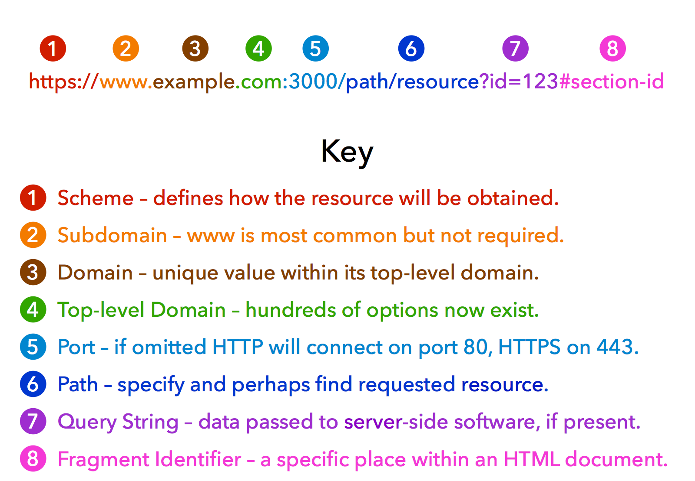
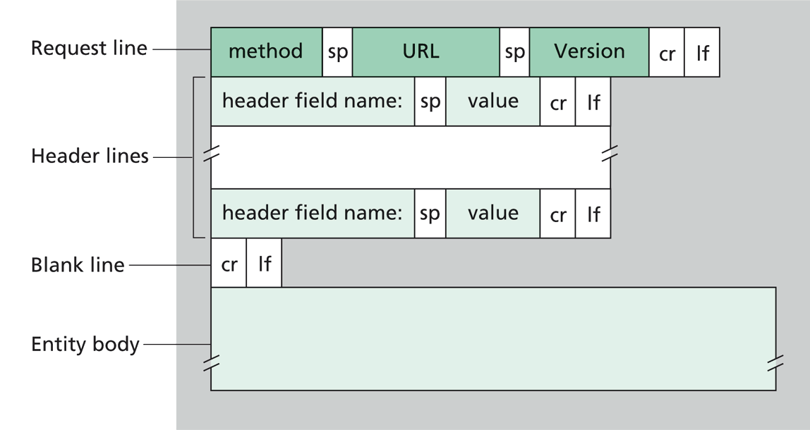
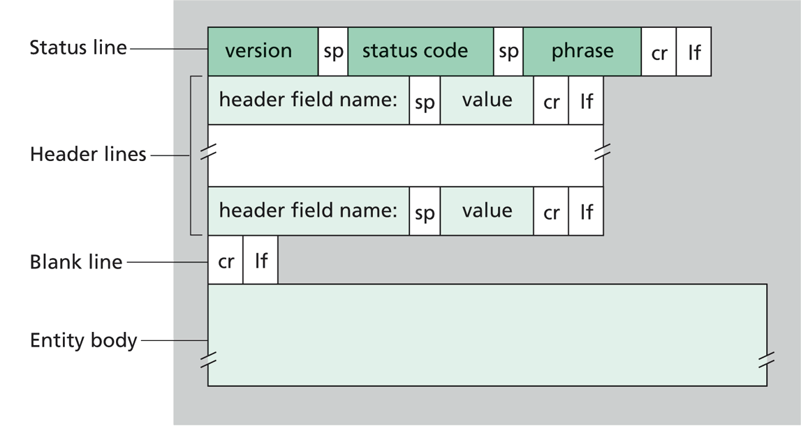
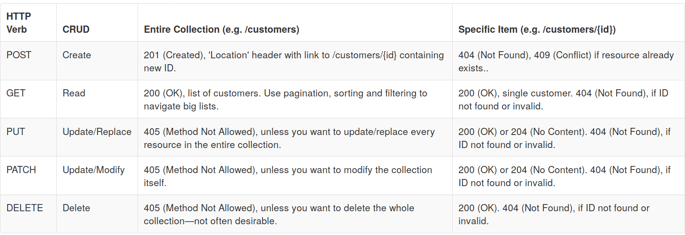
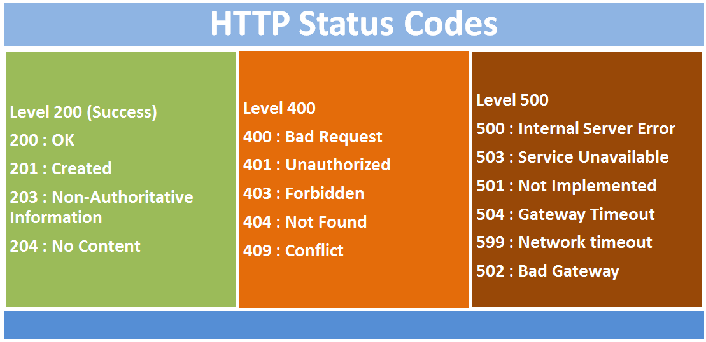
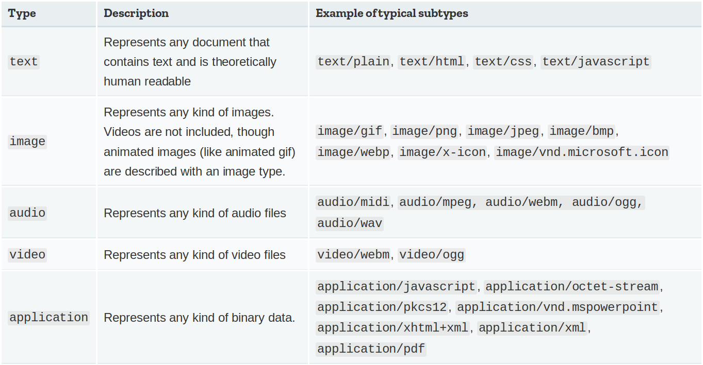
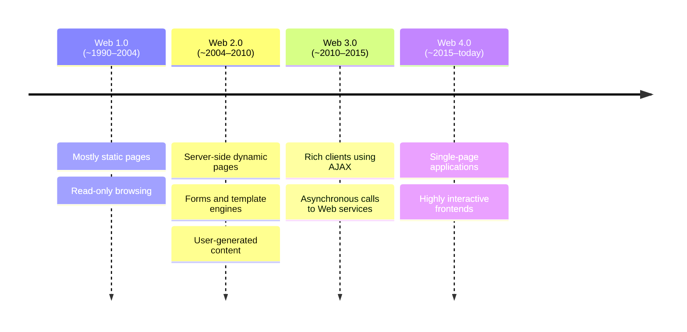
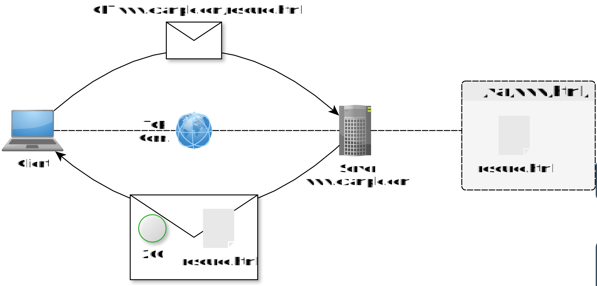

+++

title = "Web, ReST, and Web Services"
description = "Web Services and RESTful APIs"
outputs = ["Reveal"]

+++

# Web Services and RESTful APIs

{}

<!-- ## TOC

1. What is the Web
    + Web $\approx$
        - a distributed hypermedia information system
        - a collection of resources (documents, data, services) accessible via the Internet and linked by hyper links
        - an infrastructure for distributed systems based on the HTTP protocol
    + URLs
    + HTTP protocol
        1. messages (requests and responses)
        2. methods (GET, POST, PUT, DELETE, etc.)
        3. status codes (200, 404, 500, etc.)
    + HTML (structure + content), JavaScript (behaviour), and CSS (styling)
    + Hypermedia, hypertext, (links)
2. History of the Web in a nutshell
    1. Web 1.0: static pages, read-only
    2. Web 2.0: dynamically generated pages + template engines
    3. Web 3.0: dynamic pages using AJAX to contact Web Services
    4. Web 4.0: single pages applications (SPA)
3. What are Web Services
    + a sort of Distributed object with an HTTP interface, accessible over the Web, encapsulating functionalities and data, and reusable by different clients
    + API of a Web Service: end points + input parameters and data formats + output data formats + status codes
4. Web Services as the Backbone of Modern Distributed Systems
    + Web mechanisms are simple to understand, yet incredibly flexible and versatile
    + Web is pervasive (and highly optimized)
    + Web is highly compatible with virtually any programming language and platform
    + Web has very low entry barrier (HTTP is simple, widely supported, and firewall-friendly)
    + ReST architectural style makes Web the best technological stack for most DS
    + WS may easily wrap legacy software in order to:
        - expose it to the Web hence turning concentrated software into distributed software
        - allow interoperability among heterogeneous software components
5. The "ReST" Architecture Style
    1. client–server architecture (servers host resources, clients access them, possibly via proxies)
    2. representational state transfer (only representations of (states of) resources are transferred between client and server)
    3. uniform interface (resources are identified by URLs, and manipulated through a fixed set of operations, e.g., HTTP methods)
    4. stateless interactions (each request from client to server must contain all the information needed to understand and process the request, and cannot rely on any stored context on the server)
    5. cacheable responses (clients can cache responses to improve performance)
    6. layered system (a client cannot ordinarily tell whether it is connected directly to the end server, or to an intermediary along the way)
    7. code on demand (servers can temporarily extend or customize the functionality of a client by transferring executable code)
6. ReSTful APIs in Practice
    1. Think the system in terms of i. collections of resources, ii. resources, iii. operations admissible onto resources
    2. Devise Web APIs, e.g. via OpenAI specification (OAS)
        1. identify end points and their parametric URLs
        2. identify admissible HTTP operations
        2. identify input parameters and data formats
        3. optionally identify input HEADERs
    3. Implement Web APIs server side, e.g. via Flask, FastAPI, Spring Boot, etc.
    4. Implement frontend so to leverage Web APIs, e.g. via React, Angular, Vue, etc.
7. Anatomy a Web Project (backend + static JS)
    - simple flask project with HTML templates and static JS, CSS, and media files
    - let the students reflect on the fact that the project organization is poor, most likely there will be tests only for the backend
8. Anatomy a Web Project (frontend + backend + API gateway)
    - Python project for backend + JS project for frontend + API gateway (e.g., Nginx)
    - better suited for SPA
    - frontend can have its own testing
    - integration tests are necessary
    - possibly each sub-project may have its own versioning and release cycle
-->

---

# What is the Web?

The Web is, at the same time:

- a __distributed__ _hypermedia_ information system
- a collection of __linked__ _resources_ accessible via the _Internet_ (in particular, via _HTTP_)
- an _infrastructure_ for __distributed systems__ based on _HTTP_

{}

In practice, the Web revolves around:

- resources __identified__ by _URLs_
- interactions __mediated__ by _HTTP_
- documents and applications __built__ with _HTML_, _CSS_, and _JavaScript_
- _hyperlinks_ __connecting__ information and behaviour

{}

---

## Hyper-links, hyper-text, and hyper-media

- __hyper-links__ are _references_ from one resource to another, enabling navigation and discovery
- __hyper-text__ is text that contains links to other text
- __hyper-media__ generalizes the concept to include links in images, audio, video, forms, etc.
- the Web's success is largely due to its ability to connect resources through links
    + in the user's perspective, the Web is something to _navigate_ and _explore_ through links...
    + ... not just a collection of isolated documents

---

## URLs identify resources

<!--  -->

<br>

- a URL tells the client where a resource is and how to reach it
- different parts of the URL may identify host, port, path, query parameters, or fragment
- in ReSTful systems, URLs should identify resources rather than actions
    + e.g. WRONG URL: `https://example.com/getCustomer?id=123`
    + e.g. RIGHT URL: `https://example.com/customers/123`

---

{}

## HTTP is the Web's application protocol

__Hyper-Text Transfer Protocol__ (_HTTP_) standardizes how clients and servers exchange messages:



1. _clients_ acting on behalf of users or applications
0. _servers_ hosting resources or providing functionalities
0. _requests_ from client to server
0. _responses_ from server to client
0. _methods_ describing the intended operation
0. _status codes_ describing the outcome
0. _headers_ and _bodies_ carrying metadata and content

---

## Example of simple HTTP interaction (read)

1. Client wants to remotely _read_ volume of a speaker (id: `123`), hosted by server at `https://example.com`
2. Server allows users to _read_/change volume of speakers, by speaker ID, through HTTP
3. To read the volume, client sends an HTTP _request_ to URL `https://example.com/speakers/123/volume`
    - method: `GET` ["I want to read some information about the resource"]
    - headers:
        * `Accept: text/html` ["I want the response to be an HTML page describing the volume"]
        * `Authorization: <auth token here>` ["I am authorized to access this resource, here is my token"]
    - body: (empty)
4. Server processes the request, reads the actual volume value, and produces a Web page describing that speaker's volume, sending back an HTTP _response_
    - status code: `200 OK` ["The request was successful, here is the information you asked for"]
    - headers:
        * `Content-Type: text/html` ["The body of this response is an HTML document"]
        * `Cache-Control: no-cache` ["Don't cache this response, it may change frequently"]
    - body: `<html><body><h1>Speaker 123</h1><p>Volume: 75%</p></body></html>` ["Here is the HTML page describing the speaker's volume"]

---

## Example of simple HTTP interaction (write)

1. Client wants to remotely _increase_ volume of a speaker (id: `123`), hosted by server at `https://example.com`
2. Server allows users to read/_change_ volume of speakers, by speaker ID, through HTTP
3. To increase the volume, client sends an HTTP _request_ to URL `https://example.com/speakers/123/volume`
    - method: `POST` ["I want to change some information about the resource"]
    - headers:
        * `Content-Type: application/json` ["The body of this request is a JSON document describing the change I want to make"]
        * `Authorization: <auth token here>` ["I am authorized to access this resource, here is my token"]
    - body: `{"change": "+10%"}` ["I want to increase the volume by 10%"]
4. Server processes the request, updates the actual volume value, and sends back an HTTP _response_
    - status code: `204 No Content` ["The request was successful, but there is no content to return in the body"]
    - headers: (none)
    - body: (empty)

{}

---

## HTTP request messages

<!--  -->


- __Method__: what to do on the resource (e.g., GET, POST, PUT, DELETE)
- __URL__: what resource to access and where (e.g., https://example.com/speakers/123/volume)
- __Headers__: metadata about the request (e.g., format of the body, authentication token, requested response format, etc.)
- __Body__: optional content sent to the server (e.g., requested changes to the resource, etc.)
- \[Protocol\] __Version__: necessary to let older and newer client/servers interoperate

---

## HTTP response messages

<!--  -->


- __Status code__: numeric code identifying the success or failure of the request (e.g., 200, 404, 500)
- __Reason phrase__: human-readable description of the status code (e.g., "OK", "Not Found", "Internal Server Error")
- __Headers__: metadata about the response (e.g., format of the body, caching directives, etc.)
- __Body__: optional content sent to the client (e.g., requested information, error message, etc.)
- \[Protocol\] __Version__: necessary to let older and newer client/servers interoperate

---

## About HTTP methods

_Standard_ set of admissible operations that clients may request on resources:

- main ones: `GET`, `POST`, `PUT`, `PATCH`, `DELETE`

    

- many more are supported, for example `HEAD`, `OPTIONS`, `CONNECT`, `TRACE`, etc.
    * see https://developer.mozilla.org/docs/Web/HTTP/Methods for a complete list

---

## About HTTP status codes

<!--  -->


- 3-digit, positive integer numbers, the most significant digit identifying the class of the response:
    + `1xx`: informational responses (e.g., "time to swap to another protocol")
    + `2xx`: successful responses (e.g. "successfully processed the request with/without body being returned")
    + `3xx`: redirection messages (e.g. "the resource has moved, here is the new URL")
    + `4xx`: client-side error responses (e.g. "cannot process the request due to client's mistake")
    + `5xx`: server-side error responses (e.g. "cannot process the request due to server's mistake")

- most common status codes are in the picture:
    + see https://developer.mozilla.org/docs/Web/HTTP/Status for a complete list

---

## About HTTP headers

Key–value pairs that carry metadata about the request or response, for example:

- `Content-Type`: specifies the media type of the body content \[both in reqs and resps\]
- `Authorization`: contains credentials for authenticating the client \[commonly in reqs\]
- `Cache-Control`: provides directives for caching mechanisms \[commonly in resps\]
- `Accept`: indicates the media types that the client can process \[commonly in reqs\]
- `Set-Cookie`: instructs the client to store a cookie \[commonly in resps\]
- `User-Agent`: identifies the client software making the request \[commonly in reqs\]
- `Location`: indicates the URL of a newly created resource or a redirection target \[commonly in resps\]
- full list of standard headers: https://developer.mozilla.org/docs/Web/HTTP/Headers

{}

> Server designers may "invent" _custom headers_, but it's best to stick to standard ones when possible for better interoperability
- custom headers should be prefixed with `X-` to avoid conflicts with standard headers
    + but this convention is being deprecated in favor of using a custom namespace (e.g., `MyApp-`) for non-standard headers.

{}

---

## Content format ("type") negotiation

Clients and servers may automatically _negotiate_ the format of the data being exchanged

- Assumtion:
    1. the server may represent resources in various formats (e.g., HTML, JSON, XML, etc.)
    2. the client may prefer certain formats over others (e.g., a browser may prefer HTML, while an API client may prefer JSON)
- Mechanism:
    1. client sends an `Accept` header listing the media types it can process, possibly with quality values (e.g., `Accept: text/html, application/json;q=0.9, */*;q=0.8`)
    2. server selects the best format it can produce based on the client's preferences and its own capabilities
    3. server sends the response with the selected format and a `Content-Type` header indicating the media type of the body (e.g., `Content-Type: application/json`)
    4. client processes the response according to the specified format
- "Formats" are expressed as _media types_ (also known as __MIME types__), which are standardized identifiers for data formats (e.g., `text/html`, `application/json`, `image/png`, etc.)

---

## About MIME types

1. MIME stands for "Multipurpose Internet Mail Extensions", but it is used far beyond email to identify media types in HTTP and other protocols

2. A MIME type consists of a type and a subtype, separated by a slash (e.g., `text/html`, `application/json`, `image/png`)

3. Full list is available at https://developer.mozilla.org/docs/Web/HTTP/Guides/MIME_types/Common_types

4. Most common MIME types are in the table below:

    <!--  -->
    

---

{}

## Most common Web content types (pt. 1)

- [Hypertext Markup Language](https://html.spec.whatwg.org/) (_HTML_): `text/html` (for Web pages) should describe the content of a Web page, with no stylistic or behavioural information
    + "the page" usually represents some resource (physical, digital, or virtual) that exists on the server-side, in a human-friendly way
    + it may contain links to other resources (e.g. media, other pages, scripts, etc.)
    + it may contain forms to let users interact with the server (e.g. submit data, trigger actions, etc.)
    + it may contain identifiers (e.g. `id` attributes) and classes for page contents (e.g. paragraphs, buttons, etc)
        * so that CSS and JavaScript can refer to them for styling and behaviour purposes
    + underlying assumption is that the client knows how to render HTML pages...
        * ... after downloading and interpreting all the resources linked from the page (e.g. CSS, JS, media, etc.)

    + example of HTML page describing a speaker resource:

    ```html
    <html>
        <body>
            <h1>Speaker 123</h1>
            <p>Volume: 75%</p>
            <button id="increase-btn">Increase Volume</button>
        </body>
    </html>

---

## Most common Web content types (pt. 2)

- [Cascading Style Sheets](https://www.w3.org/Style/CSS/specs.en.html) (_CSS_): `text/css` (for stylesheets) should describe the styling of a Web page, with no content or behaviour information
    + it may contain rules about how to depict individual elements or groups of elements of the page (as identified by their tag, id, class, etc.)
    + these rules are interpreted by the client to determine how to render the page (e.g. colors, fonts, layout, etc.)

    + example of CSS stylesheet describing the styling of a speaker page:

    ```css
    /* file styles.css */
    body { font-family: Arial, sans-serif; background-color: #f0f0f0; }
    h1 { color: #333; }
    p { font-size: 18px; }
    #increase-btn { background-color: #4CAF50; color: white; padding: 10px 20px; border: none; cursor: pointer; }
    #increase-btn:hover { background-color: #45a049; }
    ```

---

## Most common Web content types (pt. 3)

- [JavaScript](https://developer.mozilla.org/docs/Web/JavaScript) (_JS_): `application/javascript` (for scripts) should describe the behaviour of a Web page, with no content or styling information
    + it may contain instructions to manipulate the content and styling of the page (e.g. by adding, removing, or changing elements, classes, attributes, etc.)
    + such instructions may be triggered by events occurring after the page has been shown to the user (e.g. button clicks, form submissions, etc.)
    + such instructions are provided by the server, along with the page, to let the client know how to "animate" the page and make it interactive

    + example of JavaScript code reloading the page when the "Increase Volume" button is clicked:

    ```javascript
    // file script.js
    document.getElementById('increase-btn').addEventListener('click', function() {
        location.reload();
    });

---

## Most common Web content types (pt. 4)

__Wrap-up:__ most commonly the HTML pages contains references to the CSS and JS files that describe the styling and behaviour of the page, respectively, and the client is responsible for downloading and interpreting all these resources to render the page correctly:

```html
<html>
    <head>
        <link rel="stylesheet" type="text/css" href="styles.css"> <!-- reference to CSS stylesheet -->
        <script src="script.js"></script>                         <!-- reference to JavaScript file -->
    </head>
    <body>
        <h1>Speaker 123</h1>
        <p>Volume: 75%</p>
        <button id="increase-btn">Increase Volume</button>
    </body>
</html>
```

---

## Most common Web content types (pt. 4)

- [JavaScript Object Notation](https://www.json.org/) (_JSON_): `application/json` (for data exchange) should describe the content of a resource in a machine-friendly way, with no styling or behaviour information
    + it may contain structured data representing the state of a resource, or the result of an operation on a resource, etc.
    + \[[AJAX](https://en.wikipedia.org/wiki/Ajax_(programming))\] sometimes the JS code may contact the server to get some tiny piece of information in JSON format, rather than the entire HTML page, in order to update the page dynamically without reloading it
    + other times, the client is not a browser, but some software component that just needs data in machine-friendly format

    + example of JSON document describing a speaker resource:

    ```json
    {
        "id": 123,
        "name": "Living Room Speaker",
        "volume": 75,
        "status": "on"
    }
    ```

    + example of JavaScript code exploiting AJAX to contact the server and update the page dynamically:

    ```javascript
    document.getElementById('increase-btn').addEventListener('click', function() {
        // Send an AJAX request to the server to increase the volume
        fetch('/speakers/123/volume', {
            method: 'POST',
            headers: { 'Content-Type': 'application/json' },
            body: JSON.stringify({ change: '+10%' })
        }).then(response => {
            if (response.ok) {
                // If the request was successful, update the volume displayed on the page
                let volumeElement = document.querySelector('p');
                let currentVolume = parseInt(volumeElement.textContent.split(': ')[1]);
                volumeElement.textContent = `Volume: ${currentVolume + 10}%`;
            } else {
                alert('Failed to increase volume');
            }
        });
    });
    ```

---

## Most common Web content types (pt. 3)

- other common formats, conceptually equivalent to JSON, include:
    + __eXtensible Markup Language__ (_XML_): `application/xml` (for data exchange) a sort of generalization of HTML, with custom tags and no predefined semantics:

    ```xml
    <speaker>
        <id>123</id>
        <name>Living Room Speaker</name>
        <volume>75</volume>
        <status>on</status>
    </speaker>
    ```

    + __YAML Ain't Markup Language__ (_YAML_): `application/x-yaml` (for data exchange) a sort of generalization of JSON, with more human-friendly syntax (easier to read and write):

    ```yaml
    id: 123
    name: Living Room Speaker
    volume: 75
    status: on
    ```

{}

---

{}

## History of the Web in a nutshell

1. Web 1.0: mostly _static pages_, read-only browsing
2. Web 2.0: server-side _dynamic pages_, forms, _template_ engines, user-generated content
3. Web 3.0: rich clients using _AJAX_ to talk to __Web services__ asynchronously
4. Web 4.0: _single-page applications_ (SPAs) with highly interactive frontends



---

## Web 1.0: static pages, read-only

- Web Servers are essentially wrappers for folders of static files (HTML, CSS, JS, media, etc.)
    * servers have a public IP address and a domain name (e.g., `example.com`)
    * server have a root folder (e.g., `/var/www/html`) where the static files are stored
    * clients may access the files by sending HTTP requests to the server, specifying the path to the file in the URL (e.g., `https://example.com/index.html`)
        + file paths are mapped to URL paths (e.g., `/var/www/html/index.html` is accessible at `https://example.com/index.html`)

<!--  -->


---

## Web 2.0: dynamically generated pages + template engines (pt. 1)

<!-- mention CGIs -->

- Web Servers are now able to generate dynamic pages upon request, via [Common Gateway Interface](https://it.wikipedia.org/wiki/Common_Gateway_Interface) (CGI), that populates __HTML templates__ with data from databases or other sources
    * [PHP](https://it.wikipedia.org/wiki/PHP), [JSP](https://it.wikipedia.org/wiki/JavaServer_Pages), [ASP](https://it.wikipedia.org/wiki/Active_Server_Pages), etc. are examples of server-side scripting languages used for this purpose
    * upon receiving an HTTP request for _reading_ a page, the server:
        1. looks for the corresponding CGI script (e.g., `index.php`)
        2. executes the script via some template engine, which may query a database or perform other operations to gather data
        3. the script then populates an HTML template with the gathered data and returns the generated HTML page as the HTTP response
        4. it is now possible for clients to access dynamic content (e.g. user-personalized pages)
    * upon receiving an HTTP request for _writing_ (e.g., form submission), the server:
        1. looks for the corresponding CGI script (e.g., `submit.php`)
        2. executes the script, which processes the submitted data (e.g., by storing it in a database) and then generates an appropriate response (commonly: a redirection to the same page or another)
        3. it is now possible for clients to update the server-side state (e.g. by submitting forms)
            + updates commonly imply reloading the entire page (which is slow for the user and inefficient for the server)



---

## Web 2.0: dynamically generated pages + template engines (pt. 2)

- Example of PHP script generating a dynamic page for a speaker resource:

    ```php
    <?php
    // index.php
    $speaker_id = $_GET['id']; // get speaker ID from query parameter
    // query database to get speaker information (this is just a placeholder, actual DB code would be needed)
    $speaker_info = getSpeakerInfoFromDatabase($speaker_id);
    ?>
    <!DOCTYPE html>
    <html>
    <head>
        <title>Speaker <?php echo $speaker_info['name']; ?></title>
    </head>
    <body>
        <h1>Speaker <?php echo $speaker_info['name']; ?></h1>
        <p>Volume: <?php echo $speaker_info['volume']; ?>%</p>
        <form action="update_volume.php" method="POST">
            <input type="hidden" name="id" value="<?php echo $speaker_id; ?>">
            <input type="number" name="change" value="10"> <!-- change in volume -->
            <button type="submit">Increase Volume</button>
        </form>
    </body>
    </html>
    ```
    * submitting a form to `update_volume.php` would trigger a server-side script that updates the speaker's volume in the database and then redirects back to `index.php` to show the updated information

- Software engineering remarks:
    * this approach _mixes_ content, styling, and behaviour in a single file, which is a __bad practice__ for maintainability and separation of concerns
    * also __testability is poor__, as it is difficult to test input–output logic separately from its presentation, and there are __no clear interfaces__ for _unit testing_
    * the situation where the client is <u>not</u> a human-driven browser – but some automated software which just needs data in _machine-friendly_ format (e.g., JSON) – is _poorly supported_ by this approach, as it is primarily designed for generating human-friendly HTML pages

---

## Web 3.0: dynamic pages using AJAX to contact Web Services (WS) pt. 1

> __Intuition 1__: WS are a sort of distributed objects with an HTTP interface, letting clients send requests to produce remote operations and get remote data, without caring about the underlying implementation

> __Intuition 2__: WS may be useful not only to allow visiting Web pages, but in general to build distributed systems where clients and servers exchange data via request–response interactions over HTTP

> __Intuition 3__: clients may not necessarily be browsers, but also other software components (e.g., mobile apps, backend services, etc.) that need to exchange data and functionality over the Web

---

## Web 3.0: dynamic pages using AJAX to contact Web Services (WS) pt. 2

- Web Services are __software components__ that expose _data_ and _functionality_ through an _HTTP interface_, allowing clients to interact with them over the Web
    * in a sense, they bring _object-oriented_ programming to the Web, by letting clients interact with _remote objects_ (__resources__) through a well-defined interface (API)
    * they are often designed to be _reusable_ by different clients (e.g., browsers, mobile apps, other backend services, etc.)
    * they typically _encapsulate_ some __server-side logic and data__, and provide _programming-language-agnostic API_ for clients to access them
    * when the client is a _browser_, it can use _AJAX_ to send HTTP requests to the Web Service and _update_ the page dynamically
        * but the service supports other kinds of clients as well, not just browsers...
        * ... so the service commonly supports multiple content formats (e.g., HTML for browsers, JSON for API clients, etc.) and lets clients negotiate the format they prefer



---

## Web 3.0: dynamic pages using AJAX to contact Web Services (WS) pt. 3

- Software engineering remarks:
    * _separation of concerns_ is now improved: servers may generate data in machine-friendly ways, and can be _tested separately_ from HTML views
    * engineers may now design the backend server in a _reusable_ way: Web- and mobile-frontends, may now be designed to leverage the same WS

---

## Web 4.0: single-page applications (SPA) pt. 1

- [Single-page applications](https://developer.mozilla.org/en-US/docs/Glossary/SPA) (SPAs) are Web applications that load a single HTML page and dynamically update it as the user interacts with the app, _without reloading the entire page_
    * they rely heavily on _JS_ to manage the _application's state_ and to communicate with _backend WSs_ via _AJAX_
    * they provide a more _fluid_ and _responsive_ user experience, as they can update only parts of the page instead of reloading everything at every update

- On the _server-side_, the SPA architecture typically involves 3 components:
    1. a __backend server__ that hosts WSs for data and functionalities (e.g., implemented with [Flask](https://flask.palletsprojects.com/), [FastAPI](https://fastapi.tiangolo.com/), [Spring Boot](https://spring.io/projects/spring-boot), etc.)
        * $\approx$ encapsulating the _model_ of a Model-View-Controller (MVC) architecture
    2. a __frontend server__ that runs serves HTML, CSS, and JavaScript to the browser (e.g., implemented with [React](https://reactjs.org/), [Angular](https://angular.io/), [Vue](https://vuejs.org/), etc.)
        * $\approx$ encapsulating the _view_ and _controller_ of a MVC architecture
        * notice that in the end, the frontend is an initially static page, which comes with JS code to update itself dynamically by contacting the backend WSs via AJAX
    3. an __API gateway__ (e.g., [Nginx](https://nginx.org/)) that makes the backend and frontend servers available to clients, as if they were a single server, by routing requests to the appropriate component based on the URL path or other criteria



{}

---

## Web Service (WS) vs. Application Programming Interface (API)

* Roughly speaking, a WS is:
    - a distributed software component exposing an HTTP interface
    - accessible over the network by heterogeneous clients
    - designed to encapsulate data and functionality behind a stable API consisting of admissible HTTP requests and their expected responses

> WS are nowadays often referred to as "APIs". __This is imprecise__, as API is a more general concept.
- APIs are provided by any software component to allow other software components being written to interact with it
    * if the software is _object-oriented_, API consist of the _public methods of its classes_
    * if the software is a _command-line application_, API consist of the _(sub-)commands and their parameters_
    * if the software is a _WS_, API consist of the admissible _HTTP requests and their expected responses_
- Some people may say that they are exploiting "APIs provided by company X"...
    * ... what they actually mean is that they "are writing some software which acts as the client for some WS provided by company X, and thas WS has a well-defined HTTP API that they are exploiting"

---

## Why WS dominate distributed systems

WS have nowadays become the backbone of most distributed systems because:

- Web metaphors and mechanisms are _simple_ (to understand and engineer) yet very _flexible_ and _general_
- HTTP is pervasive and highly optimized, so using it for novel projects is often sufficient and convenient
- the Web stack is programming-language- and _platform-independent_, so WS are _enablers_ of __interoperability__ and _integration_ across _heterogeneous_ systems
- HTTP is _widely supported_ and usually __firewall-friendly__, which usually implies less networking issues and better accessibility for clients
    + and therefore less engineering effort to make the system work in real-world conditions 
        * (as opposed to using some custom protocol or other Internet protocols)

- WS allow for __wrapping__ _pre-existing_ software so as to:
    - expose __legacy__ software on the Web (in case the legacy software was not distributed and should be made available to remote clients)
        * "legacy" means "old by still operational" (and "to be changed as little as possible")
    - let __heterogeneous__ software components interoperate (in case they are implemented in different languages or platforms, yet they need to interoperate)
        * "heterogeneous" means "different in terms of programming language, platform, or other technical aspects"

---

## The ReST architectural style

- Regardless of implementation technologies, WS can be designed according to different __architectural styles__
    * mostly concerning the shape of the HTTP API and the default data formats
- the _most common_ architectural style for WS is __ReST__ ([Representational State Transfer](https://en.wikipedia.org/wiki/REST)), as introduced by Roy Fielding in his [PhD thesis](https://roy.gbiv.com/pubs/dissertation/fielding_dissertation.pdf)
    * Fielding's principles have then been translated in practical guidelines, that you can find documented in many places (e.g., <https://restfulapi.net>)


{}

### ReST principles in a nutshell

ReST is an architertural style for hypermedia systems, which imposes the following constraints on the design of WS:

1. __client-server__: _clients_ consume _resources_, _servers_ host them
2. __representation-oriented__: only _representations_ of (_states_ of) resources are exchanged, <u>not</u> the resources themselves 
    * this is the meaning of "representational state transfer": clients inspect and manipulate the state of resources by exchanging representation with servers
        + HTML pages, JSON documents, XML documents, etc. are all examples of _representations_ of resources
3. __uniform interface__: resources are located/identified by _URLs_ and manipulated via standard _HTTP methods_
4. __stateless__: each request contains all the information needed to process it
5. __cacheable__: responses may marked as _cacheable_ by servers, and clients may cache them to _improve performance_
6. __layered__: _proxies_, gateways, and _intermediaries_ can be inserted transparently between clients and servers
    * e.g. to provide load balancing, caching, security, etc.
7. __code on-demand__: optional transfer of executable code from servers to clients, to expand clients' functionalities, e.g. JS

{}

---

## ReSTful APIs in practice (pt. 1)

ReSTful \[Web\] __APIs__ are the set of HTTP requests that a WS (adhering to ReST style) is designed to accept, there including:
- the __endpoints__ (i.e., _URLs_) that identify the resources managed by the WS
    - the admissible __HTTP methods__ for each endpoint (i.e., the operations that clients can perform on the resources)
        - the admissible __input parameters__, __body formats__, and __headers__ each method may accept for each endpoint
            - the expected and exceptional __status codes__ and __response formats__ and for each method

- Designing the Web API is important, and it is commonly performed before implementing either the client or the server, 
    * as it defines the _contract_ between them and guides the implementation of both sides

- Formal _languages_ and _tools_ exist to help designing and documenting Web APIs
    * for example the [OpenAPI Specification](https://www.openapis.org/) (formerly known as _Swagger_), 
        + it allows to formally _describe_ the API in a _machine-readable_ format (either YAML or JSON)...
        + ... and then _generate_ documentation Web pages, client/server _code skeletons_, etc. from it
            - generated code skeletons let developers save time by providing a starting point for the implementation of the client and server, with the API contract already defined and implemented in the code structure

- Useful references:
    * OpenAPI Specification: <https://swagger.io/specification/>
    * "Swagger Editor", Online editor for OpenAPI: <https://editor.swagger.io/>
    * "SwaggerHub", Online platform for designing, documenting, and sharing APIs: <https://app.swaggerhub.com/>

---

## ReSTful APIs in practice (pt. 2)

### Example (full example [here](https://app.swaggerhub.com/apis-docs/PIKA-lab/E-commerce/1.0.1), sources available [here](https://app.swaggerhub.com/apis/PIKA-lab/E-commerce/1.0.1), editable via [Swagger Editor](https://editor.swagger.io/)):
- Endpoint: `/products` \[whatever precedes the path component of the URL is omitted for brevity, e.g. `https://example.com`\]
    - `GET` _method_ to read the list of products
        * _query_ parameters: `?category=electronics&max_price=100`
        * _responses_: 
            1. JSON array of product objects, if status is `200 OK`
            2. JSON object with error message, if status is `400 Bad Request` (e.g., if query parameters are invalid)
    - `POST` _method_ to create a new product
        * _body_: JSON object describing the new product (e.g., name, price, category, etc.)
        * _responses_: 
            1. `201 Created` with a `Location` header pointing to the URL of the newly created product (e.g., `https://example.com/products/123`)
            2. JSON object with error message, if status is `400 Bad Request` (e.g., if body format is invalid)
- Endpoint: `/products/{id}`
    - where `{id}` is a _path parameter_, i.e. a placeholder for the product ID identifying a specific product by its ID
    - `GET` _method_ to read a specific product by its ID
        * _responses_: 
            1. JSON object describing the product, if status is `200 OK`
            2. JSON object with error message, if status is `404 Not Found` (e.g., if no product with the specified ID exists)
    - `PUT` _method_ to update a specific product (e.g. price, description, quantity available) by its ID
        * _body_: JSON object describing the updated product information
        * _responses_: 
            1. `204 No Content` if the update was successful (with no body in the response)
            2. JSON object with error message, if status is `400 Bad Request` (e.g., if body format is invalid)
            3. JSON object with error message, if status is `404 Not Found` (e.g., if no product with the specified ID exists)
    - `DELETE` _method_ to delete a specific product by its ID
        * _responses_: 
            1. `204 No Content` if the deletion was successful (with no body in the response)
            2. JSON object with error message, if status is `404 Not Found` (e.g., if no product with the specified ID exists)

---

## ReSTful APIs in practice (pt. 3)

### Badly designed APIs

- \[BAD PRACTICE\] put verbs/actions in the URL, which implies resources are not being modelled:
    * `POST /increase_volume` ["I want to increase the volume, here is the change I want to apply"]
        * more correct would be `POST /speakers/123/volume` with body object representing the desired change

- \[BAD PRACTICE\] use the same endpoint for different resources, and distinguish them by query parameters:
    * `GET /course/view.php?id=79314` (BTW this is how UniBO's Moodle work, unfortunately...)
        * more correct would be `GET /courses/{academic_year}/{id_or_name}` 

- \[BAD PRACTICE\] reveal implementation details in the API design, resources names after DB tables
    * `GET /table_users` (implies that the server is using a table named "users" in its database)
        * more correct would be `GET /users` (which is more abstract and does not reveal implementation details)

- \[BAD PRACTICE\] put actions in URL, and abuse meaning of HTTP methods
    * `GET /delete_user?id=123` (implies that the server is using a GET request to perform a delete operation, which is semantically incorrect and may cause issues with caching and other HTTP features)
        * more correct would be `DELETE /users/123` (which uses the appropriate HTTP method for the intended action)

---

## ReSTful APIs in practice (pt. 4)

- Most commonly, Web APIs are _designed_ by service _providers_, documented, and publicly described on the Web so that developers may _use_ them to build custom clients
    + it's much more frequent for developers to consume APIs provided by others, rather than designing and implementing their own APIs from scratch
    + examples of notable Web APIs: [OpenAI](https://developers.openai.com/api/reference/overview), [GitHub](https://docs.github.com/rest), [YouTube](https://developers.google.com/youtube/v3), etc.

- If you're working on the _provider_ side, remember:
    + _unlikely_ to have some long-term benefit from keeping your APIs _secret_, as they will be _reverse-engineered_ by clients anyway, so better to design them _public_
    + well-engineered, documented, and stable APIs are a _great asset_ for your service, as they _attract_ more developers to use it and build on top of it, which in turn _increases the value_ of your service

- There are many ways to control access to APIs, which are there both for cybersecurity and business reasons 
    + __authentication__: verifying the _identity_ of the client (e.g., via API keys, OAuth tokens, etc.)
    + __authorization__: determining what the authenticated client is _allowed_ to do (e.g., via role-based access control, permissions, etc.)
    + __rate limitation__: WS may _limit_ the number of requests per _time unit_, depending on user _identity_, role, _premiumship_, etc. (implies authentication)
        - there is often some default _per-IP-address rate limitation_ (preventing [DoS attacks](https://it.wikipedia.org/wiki/Denial_of_service) and _incentivising_ registration/premiumship)
    + __monetization__: WS may charge clients based on their API usage (e.g., via _subscription_ plans, _pay-per-use_, etc.)
        - there is often some _free tier_ with limited usage, to let developers try the API before committing to a paid plan

- ReST APIs are so much "de-facto standards" that many __monitoring__ and __analytics__ tools exist to support developers and providers
    + e.g. [Postman](https://www.postman.com/) for testing APIs
    + e.g. [Prometheus](https://prometheus.io/) for monitoring APIs and collecting metrics about their usage
    + e.g. [Graphana](https://grafana.com/) for visualizing metrics collected by Prometheus and other monitoring tools into management-ready dashboards

---

## From API design to implementation

1. devise the API, for example with OpenAPI Specification
2. identify endpoints and parametric URLs
3. identify admissible HTTP operations
4. identify input parameters and body formats
5. optionally define relevant headers
6. define response formats and status codes

Then implement:

- the server side with frameworks such as Flask, FastAPI, or Spring Boot
- the frontend side with frameworks such as React, Angular, or Vue


---

{}

## Check your understanding (pt. 1)

- What does it mean to say that the Web is a distributed hypermedia information system?
- What is the role of a URL in Web communication?
- Which parts make up an HTTP request? And an HTTP response?
- What is the difference between an HTTP method and an HTTP status code?
- What are HTML, CSS, and JavaScript responsible for in a Web application?
- What is the difference between hypertext and hypermedia?
- How did the Web evolve from static pages to single-page applications?
- What is a Web service, and how is its API usually described?
- Why are Web services so effective for distributed systems integration?
- What are the main constraints of the ReST architectural style?
- What does it mean for a ReST interaction to be stateless?
- How would you model a simple domain in terms of collections, resources, and operations?

{}

---

{}