## Tracking changes

Did you ever need to *roll back* some project or assignment to a previous version?

How did you track the *history* of the project?

### Classic way

1. find a naming convention for files/folders
2. make a copy every time there is some relevant progress
3. make a copy every time an ambitious but risky development begins

**Inefficient!**
* Consumes a lot of resources
* Requires time
* How to tell what was in some previous releases?
* How to cherry-pick some changes?

---

## Fostering collaborative workflows

Did you ever need to develop some project or assignment *as a team*?

How did you organize the work to *maximize the productivity*?

### Classic ways

* *One screen, many heads*
  * a.k.a. one works, the other ones sleep
* *Locks*: "please do not touch section 2, I'm working on that"
  * probability of arising conflicts close to 100%
* *Realtime-sharing* (like google docs or overleaf)
  * okay in many cases for text documents (but with a risk of frankestein-ization)
  * disruptive with code (inconsistencies are much less tolerable in formal languages)

---

## Version control systems

Tools meant to support the development of projects by:
* Tracking the project *history*
* Allowing *roll-backs*
* Collecting *meta-information* on the changes
  * Authors, dates, notes...
* *Merging* information produced at different stages
* (in some cases) *facilitate parallel workflows*
* Also called Source Content Management (SCM)

**Distributed**: *Every copy* of the repository contains
(i.e., every developer locally have)
*the entire history*.

**Centralized**: A *reference copy* of the repository contains the whole history;
developers work on a subset of such history


---

## Short history

* **Concurrent Versioning System (CVS)** (1986): client-server (*centralized* model, the truth is on the server), operates on single files or repository-level, history stored in a hidden directory, uses delta compression to save space.
* **Apache Subversion (SVN)** (2000): successor to CVS, still largely used (especially in businesses that struggle to renovate their processes). *Centralized* model (similar to CVS). Improved binary file management. Improved concurrency for the operation, still cumbersome for parallel workflows.
* **Mercurial** and **Git** (both April 2005): *decentralized* version control systems (DVCSs), no "special" copy of the repository, each client stores the whole history. Highly scalable. Foster parallel work by allowing easy branching and merging. Very similar conceptually (when two succesful tools emerge at the same time with a similar model independently, it is an indication that the underlying model is "the right one" for the context).

**Git** is now the dominant DVCS (although Mercurial is still in use, e.g., for Python, Java, Facebook).

---

## Google trends to today

<!-- write-here "shared-slides/git/git-trends.md" -->

<!-- end-write -->

---

## Intuition: the history of a project

1. Create a new project
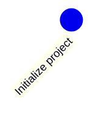

---

2. Make some changes

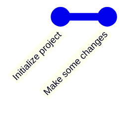

---

3. Then more and more, until the project is ready

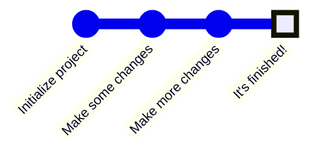

At a first glance, the history of a project *looks like* a **line**.

---

## Except that, in the real world...

> Anything that can go wrong will go wrong
> <br><cite>$1^{st}$ Murphy's law</cite>

> If anything simply cannot go wrong, it will anyway
> <cite>$5^{th}$ Murphy's law</cite>

---

# ...things go wrong

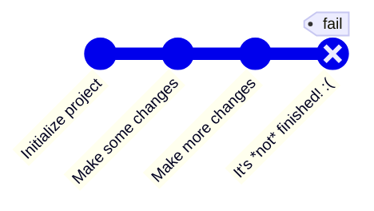

---

## Rolling back changes

Go *back in time* to a previous state where things work

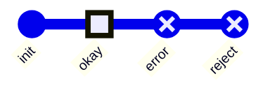

---

## Get the previous version and fix

Then fix the mistake

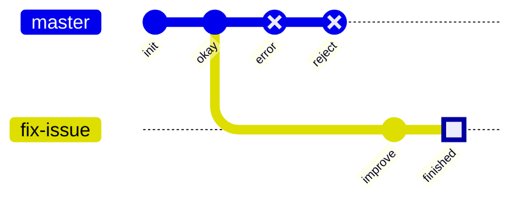

If you consider rollbacks, history is a **tree**!

---

# Collaboration: diverging

Alice and Bob work together for some time, then they go home and work separately, in parallel

They have a *diverging history*!

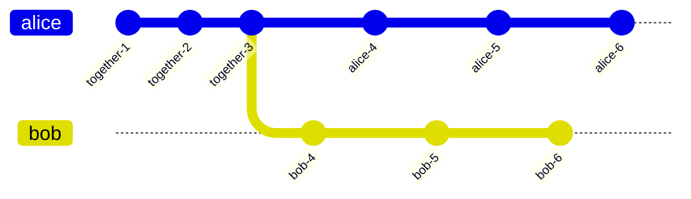

---

# Collaboration: reconciling

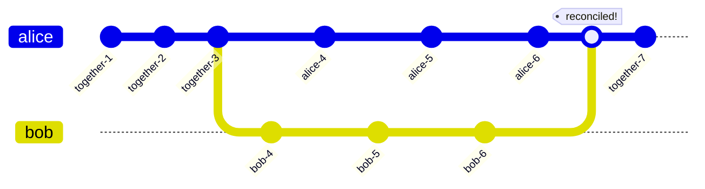

If you have the possibility to *reconcile diverging developments*, the history becomes a **graph**!

Reconciling diverging developments is usually referred to as **merge**

---

## DVCS concepts and terminology: *Repository*

Project **meta-data**. Includes the whole project history
* information on how to *roll back* changes 
* *authors* of changes
* *dates*
* *differences* between different points in time
* and so on

Usually, stored in a hidden folder in the *root folder* of the project

---

## DVCS concepts and terminology: *Working Tree*

(or *worktree*, or *working directory*)

the collection of **files** (usually, inside a *root folder*) that constitute the project,
excluding the *meta-data*.

---

## DVCS concepts and terminology: *Commit*

A **saved status** of the project.
* Collects the *changes* required to transform the previous (*parent*) commit into the current (*differential tracking*)
* Creates a *snapshot* of the status of the worktree (snapshotting).
* Records metadata: *parent commit*, *author*, *date*, a *message* summarizing the changes, and a *unique identifier*.
* A commit with no parent is an *initial commit*.
* A commit with multiple parents is a *merge commit*.

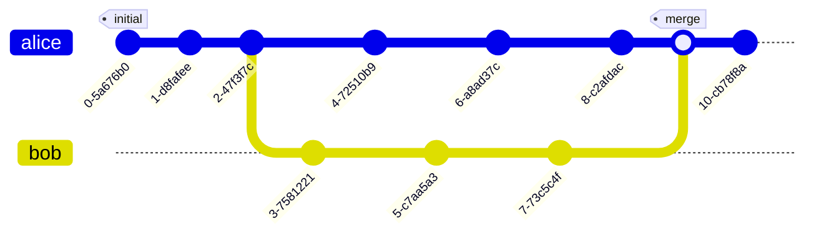

---

## DVCS concepts and terminology: *Branch*

A **named sequence of commits**

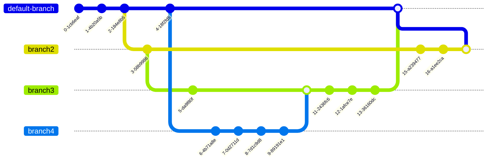

If no branch has been created at the first commit, a default name is used.

---

## DVCS concepts and terminology: *Commit references*

To be able to go *back in time* or *change branch*, we need to **refer to commits**
* Commit references are also referred to as `tree-ish`es
* Every commit has a **unique identifier**, which is a valid reference
* A **branch name** is a valid commit reference (points to the *last commit of that branch*)


---

2. second commit

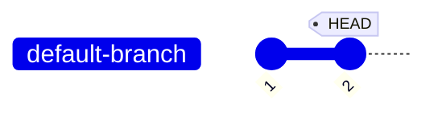

---


---

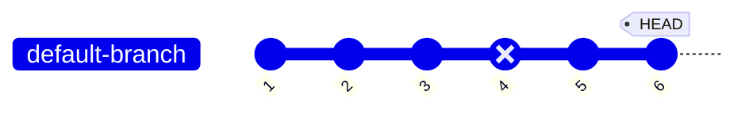

Oh, no, there was a mistake in commit `4`! We need to roll back!

---

## *checkout of C4*

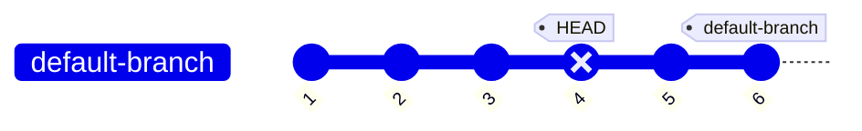

* No information is lost, we can get back to `6` whenever we want to.
* what if we commit now?

---

## Branching!


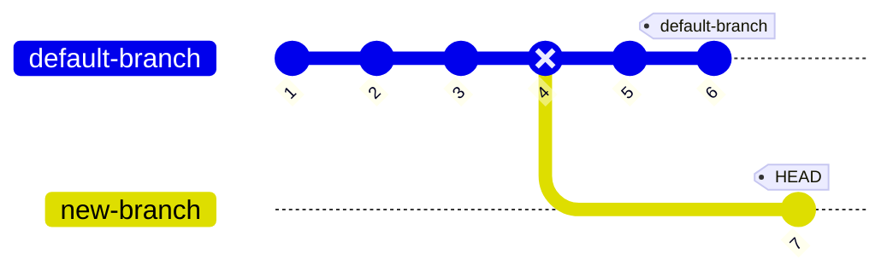

* Okay, but there was useful stuff in `4`, I'd like to have it into `new-branch`

---

## Merging!

<!-- ```mermaid
%%{init: { 'gitGraph': { 'mainBranchName': 'default-branch', 'showCommitLabel': true}} }%%
gitGraph
  commit id: "1"
  commit id: "2"
  commit id: "3"
  commit id: "4" type: REVERSE
  branch new-branch
  checkout default-branch
  commit id: "5"
  checkout new-branch
  commit id: "7"
  merge default-branch id: "8" tag: "HEAD"
  checkout default-branch
  commit id: "6" tag: "default-branch"
  checkout new-branch
``` -->



**Notice that:**
* we have two branches
* `8` is a merge commit, as it has two parents: `7` and `5`
* the situation is the same regardless that is a *single developer going back on the development* or *multiple developers working in parallel*!
* this is possible because *every copy of the repository contains the entire history*!
